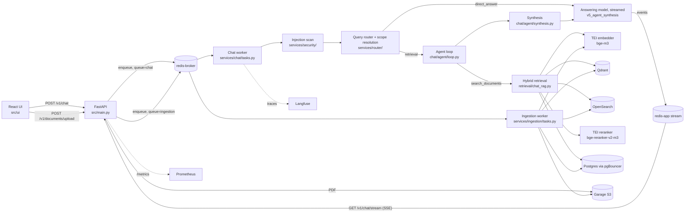

# AI Financial Copilot

A chat application for questions about financial filings. Users upload PDFs (annual reports,
10-Ks, 10-Qs), the ingestion worker parses, chunks and indexes them, and the chat answers
questions with inline `[S1]`-style citations that open the cited page. Retrieval questions
go through an agent loop. A small tool-calling model searches the user's documents and
records conclusions tied to the excerpts it read. Plain Python, not the model, decides when
the run has covered every company or sub-question it set out to answer. A separate answering
model then writes the reply from those conclusions and only the excerpts they cite.

## Key capabilities

| Capability | Where it lives |
|---|---|
| PDF parsing with Docling: OCR, tables, picture classification, a page-memory hook that keeps peak RSS bounded on long filings, garbled-text detection | `src/services/ingestion/docling_parser.py`, `docling_pipeline.py`, `text_quality.py` |
| LLM summaries for table chunks and descriptions for charts and pictures, before embedding | `src/services/ingestion/table_summarizer.py`, `picture_enricher.py` |
| Hybrid retrieval: Qdrant dense search and OpenSearch BM25, fused with reciprocal rank fusion, then a cross-encoder reranker. Each backend fails open and the UI shows a degraded-retrieval badge | `src/services/retrieval/` |
| Query routing: an LLM picks `direct_answer`, `retrieval` or `out_of_scope`, and a query shape (`extraction`, `comparison`, `analytical`) | `src/services/router/router.py`, `prompts/query_router_v5.yaml` |
| Scope resolution: pg_trgm finds candidate companies for each name in the question, and an LLM disambiguator picks among them from a per-request enum of company IDs. When the match is unclear, the chat shows a clarification card instead of guessing | `src/services/router/scope_resolver.py`, `entity_resolver.py`, `disambiguator.py` |
| Agent loop with plan-based termination, a dollar budget, a run deadline and a tool-model fallback chain | `src/services/chat/agent/loop.py`, `state.py` |
| Grounded synthesis: only cited excerpts reach the answering model. Code converts figures to a common currency, checks each one against its excerpt, and computes period-over-period changes so the model doesn't do the arithmetic | `src/services/chat/agent/synthesis.py`, `processor.py`, `number_grounding.py` |
| Streaming answers over SSE with citation spans, an evidence panel and a confidence badge | `src/services/chat/tasks.py`, `citation_parser.py`, `confidence.py`, `src/ui/components/EvidencePanel.tsx` |
| Follow-up questions ("show that in EUR") answered from the previous run's findings without searching again | `tasks.py`, `prompts/system_v5_agent_synthesis.yaml` |
| Pattern-based prompt-injection scanning on user input, retrieved excerpts, and text the tool model writes into findings | `src/services/security/injection_detector.py` |
| Thumbs up/down feedback, stored as `MessageFeedback` and posted to Langfuse as a score | `src/api/routers/feedback.py` |

## Architecture



A chat request is a Celery task. The API writes the user message, enqueues `process_chat`,
and the UI opens an SSE stream that relays events the worker writes to a Redis stream:
activity rows for each agent turn, answer deltas, citation spans, references, usage and the
confidence badge.

Ingestion runs on its own queue: download from Garage, Docling parse, picture descriptions,
chunking, table summaries, embedding, then upserts to Qdrant and OpenSearch. Chunk text and
metadata live in Postgres; the retrievers return IDs and scores, and a hydration step reads
the text.

### The agent

The agent package is `src/services/chat/agent/`. The chat worker and the offline eval both
call its one entry point, `run_agent()`.

**Two tools.** The tool model (`AGENT_TOOL_MODEL`, `gpt-5-mini` in `.env.example`) can call
`search_documents` and `report_findings`. A search carries a semantic `query` for the
embedder and reranker, and separate `keywords` for BM25. A report records a claim, the
excerpt labels that support it, and for numeric answers the figures with metric, unit,
currency and period end date.

**Two paths, one schema.** The router's `query_shape` picks a `ShapeConfig` once per run:

| | Extraction / comparison | Analytical ("why did X happen") |
|---|---|---|
| Tool-model prompt | `prompts/system_v4_agent.yaml` | `prompts/system_v6_agent_analytical.yaml` |
| Plan | One item per company in scope, seeded before turn 1 | Opened by the model: each search's `sub_question` becomes an `A1`, `A2`, ... key minted by the loop |
| Report schema | Findings with `figures` | Same schema without `figures` |
| Turn cap | `AGENT_MAX_ITERATIONS` (5) | `AGENT_MAX_ITERATIONS_ANALYTICAL` (7) |

Both paths parse, store, check and render findings the same way.

**No terminal tool.** Reporting doesn't end the run. The loop stops with `covered` when every
plan key has a grounded finding, or on the iteration cap, the USD budget
(`AGENT_COST_BUDGET_USD`), the run deadline, two turns with no new evidence, or a search
outage. Each unfinished key reaches the answer as an explicit "Not resolved" or "Could not
be checked" line, and the findings block says the run is partial.

**Three state stores.** What the model reads is kept apart from what the system knows:

- `Transcript` (`transcript.py`) is the message list sent to the tool model. It is
  append-only, so earlier turns stay in the provider's prompt cache and every label the model
  can cite stays readable.
- `EvidenceLedger` (`evidence.py`) holds every chunk any search returned and the `S`-label
  each rendered chunk got. Report citations resolve through it to chunk UUIDs.
- `FindingsLedger` (`findings.py`) holds conclusions keyed by plan key. A positive claim is
  stored only if at least one citation resolves to a chunk in the EvidenceLedger, and the
  ledger runs the injection scan on its text first. The ledger accepts a "the documents
  don't say" negative only for a key an earlier turn searched.

After the loop, synthesis keeps only the cited chunks, relabels them `S1..Sk`, renders a
`[FINDINGS]` block (with FX conversion, `⚠ UNVERIFIED` markers for figures not found in their
excerpts, and computed change lines), and hands it to the answering model the user picked.

The full walkthrough, with worked examples and every stop reason, is in
[agent_design.md](docs/prod_docs/agent_design.md).

## Tech stack

| Area | Components |
|---|---|
| App tier | FastAPI, Uvicorn, Celery (Redis broker, `chat` and `ingestion` queues), SQLAlchemy 2.0 async with asyncpg, Pydantic v2, PyJWT |
| Frontend | React 19, TypeScript, Vite, Tailwind CSS, react-pdf-viewer; served by nginx in the container image |
| LLM providers | OpenAI and Gemini adapters, vLLM through the OpenAI-compatible API; models, prices, capabilities and fallbacks in `infra/config/models.yaml` |
| Ingestion | Docling 2.111.0 (pinned), EasyOCR |
| Retrieval | Qdrant 1.16 (dense), OpenSearch 2.19 (BM25), RRF fusion, Hugging Face Text Embeddings Inference serving `BAAI/bge-m3` and `BAAI/bge-reranker-v2-m3` |
| Storage | PostgreSQL 16 with pg_trgm, pgBouncer, Redis 7.2 (separate app and broker instances), Garage (S3-compatible) |
| Observability | Langfuse 3 with ClickHouse, Prometheus, Grafana, Fluent Bit, Elasticsearch |
| Eval | `src/eval/`: deterministic scorers, LLM-as-judge, retrieval metrics, run comparison, Postgres persistence |
| Load testing | Locust (`infra/loadtest/`) |
| CI | GitHub Actions, ruff, pyright, pytest with coverage, gitleaks, pip-audit, semgrep, hadolint, Trivy, Dependabot |
| Deployment | Docker Compose (`infra/docker/`); Kustomize manifests for a local kind cluster (`infra/k8s/`) |

## Evaluation

`src/eval/run_agent.py` runs a question set through `src/eval/pipeline_agent.py`, which calls
the router, scope resolution and `run_agent()` the same way the chat worker does. It calls
`route_query` directly, so clarification cards never show; ambiguous names run on the top
candidate. The harness scores each question four ways:

| Metric | How |
|---|---|
| Correctness | Deterministic, by answer kind: `number` (within 1%), `boolean`, `name`, `names`. A gold answer of `N/A` passes only if the model declines |
| LLM judge | `src/eval/prompts/judge_system.yaml`, default model `gpt-4o-mini` (`EVAL_JUDGE_MODEL`). Scores faithfulness, relevance, citation accuracy and completeness from 1 to 5, and lists unsupported claims |
| Hallucination rate | Unsupported claims divided by citation spans in the answer |
| Retrieval | precision@k, recall@k, nDCG@k and MRR over (document, page) keys, with a ±2 page tolerance |

The run also reports agent metrics by query shape (iterations, stop reasons, plan coverage),
scope outcomes, and, where questions carry a gold `query_shape`, the router's
misclassification rate.

`src/eval/compare.py` flags a question as a regression when it goes from correct to wrong,
when any judge score drops by more than 1, when it gains unsupported claims, or when a
relevant page drops out of the top 5.

**Coverage.** The committed fixture, `src/eval/fixtures/canary_eval.json`, has 13 questions
about single companies: 9 `number`, 2 `boolean`, 2 `names`. Three expect `N/A`. None carries
a `query_shape` label, and none is a comparison or an analytical question. The `drivers`
kind used for analytical questions has no scorer in `run_agent`
(`score_correctness` returns `no_scorer_for_kind`), so the agent's analytical path is
measured only by the judge.

Entity resolution has its own eval, `src/eval/run_entity_resolution.py`, over 25 cases in
`src/eval/fixtures/entity_resolution_eval.json`.

Both need a user whose library already holds the referenced filings. The PDFs are not in the
repository.

```bash
.venv/bin/python -m src.eval.run_agent \
    --test-set src/eval/fixtures/canary_eval.json \
    --user-id <uuid> \
    --compare src/eval/fixtures/runs/canary_baseline.json

.venv/bin/python -m src.eval.run_entity_resolution --user-id <uuid>
```

**Canary.** `.github/workflows/canary.yml` is a manual `workflow_dispatch` job on a
self-hosted runner next to a seeded eval environment (connection details come from secrets
in the `eval` GitHub environment). It runs `run_agent` on the canary fixture with real LLM
calls, compares against the committed `src/eval/fixtures/runs/canary_baseline.json`, persists
the run to the `canary_runs` and `canary_run_results` tables (`--persist-db`), and fails if
the comparison finds a regression. The Grafana "Eval / Canary" dashboard reads those tables.

## Observability

| Signal | Where | What it shows |
|---|---|---|
| LLM traces | Langfuse (`localhost:3003`) | One trace per chat request: `route_query` with `resolve_scope` and its candidate and disambiguator spans, then `agent_loop` with an `agent_turn_N` span per turn (status line in, tool calls and results out, state after), each search's retrieval spans, and every LLM generation with tokens and cost. Scores: `agent_plan_coverage`, `agent_uncited_claim_rate`, `uncited_fact_share`, `ungrounded_claims`, and user feedback |
| Metrics | Prometheus (`localhost:9090`) | Scrapes `api:8000/metrics`, `worker-chat:9100` and `worker-ingestion:9101`. Agent iterations, tool-call counts and latency, tool-model latency by turn kind, LLM tokens, cache hits and cost, dropped citation refs. Metric definitions are in `src/observability/metrics.py` |
| Dashboards | Grafana (`localhost:3004`) | Six provisioned dashboards: API Overview, Agentic RAG, Cost & Tokens, Worker Health, Logs Explorer, Eval / Canary. Data sources: Prometheus, the app Postgres database, Elasticsearch |
| Logs | Fluent Bit → Elasticsearch (`copilot-logs` index) | App containers write JSON to stdout; Docker's fluentd log driver ships it to Fluent Bit, which parses and forwards it |
| Request records | Postgres `llm_requests` | One row per LLM call, including every tool-model turn and disambiguator call, with tokens, cost, latency, status and `scope_outcome` |

**Correlating logs with traces.** The Langfuse trace ID is the request UUID in hex
(`UUID(request_id).hex`). The chat worker stamps the same value as `trace_id` on every log line
(`src/api/logging.py::worker_request_context`), and the Logs Explorer dashboard turns the
`trace_id` column into an "Open in Langfuse" link.

## CI/CD

`.github/workflows/ci.yml` runs on every pull request and on pushes to `master`. Seven jobs
run in parallel, and a `ci-success` job that needs all seven gates the merge.

| Job | Runs |
|---|---|
| `lint` | `make lint`: ruff check, ruff format check, and checks that the Kubernetes copies of the DB init scripts, ES bootstrap, Grafana dashboards and load-test files match their sources |
| `typecheck` | `make typecheck` (pyright) |
| `unit-tests` | pytest on `tests/unit/` with coverage; uploads the HTML report as an artifact |
| `integration-tests` | starts Postgres, pgBouncer, both Redis instances, Qdrant and OpenSearch, then `make test-integration` |
| `security` | gitleaks, pip-audit, semgrep (`p/python`, `p/secrets`) |
| `docker` | `docker compose config`, hadolint on the three Dockerfiles, Trivy config scan. No image builds |
| `frontend-typecheck` | `npm ci` and `tsc --noEmit` in `src/ui` |

The canary eval is not part of PR checks. It makes paid LLM calls against a seeded
environment, so someone has to start it by hand. [Evaluation](#evaluation) describes it. Dependabot opens
weekly grouped PRs for GitHub Actions and npm. Pre-commit hooks run ruff, pyright and
gitleaks locally.

## Getting started

### Prerequisites

- Linux with an NVIDIA GPU. The `tei` reranker, `tei-embedder` and `worker-ingestion`
  containers request the GPU through CDI (`nvidia.com/gpu=all`). Install the NVIDIA driver
  and the NVIDIA Container Toolkit, and generate a CDI spec.
  `infra/docker/docker-compose-pc.yml` is a variant for Blackwell GPUs that uses the
  `120-1.9` TEI image and the `nvidia` device driver.
- Docker with Compose v2
- Python 3.12 and [uv](https://docs.astral.sh/uv/)
- Node.js 20 (the version CI uses)
- An OpenAI API key. The default router, tool and answering models are OpenAI models.

### 1. Install dependencies

```bash
uv sync --group dev --group llm-engine
cd src/ui && npm ci && cd ../..
```

The OpenAI and Gemini SDKs are in the `llm-engine` group, which the Docker images also install.

### 2. Configure the environment

```bash
cp .env.example .env
```

Fill in at least `OPENAI_API_KEY`, `JWT_SECRET`, `REDIS_PASSWORD` and `GRAFANA_PASS`.
`.env.example` documents every other setting with working local defaults.

Generate the Garage S3 key and the Langfuse secrets:

```bash
cd infra/docker
docker compose --env-file ../../.env run --rm garage-bootstrap
docker compose --env-file ../../.env run --rm langfuse-secrets
```

Copy `AWS_ACCESS_KEY_ID` and `AWS_SECRET_ACCESS_KEY` from
`infra/docker/garage/secrets/garage_s3_creds` into `.env`. Then copy every line of
`infra/docker/langfuse/secrets/langfuse_secrets` into `.env` and fill in
`LANGFUSE_INIT_USER_EMAIL` and `LANGFUSE_INIT_USER_NAME`.

Always pass `--env-file ../../.env` to `docker compose`; the compose file reads its variables
from the repo-root `.env`.

### 3. Start the stack

**Option A: everything in containers.** From `infra/docker`:

```bash
docker compose --env-file ../../.env up -d --build
```

This builds and starts the API, both workers and the frontend along with the infrastructure.
On its first start, Postgres runs `infra/scripts/db_init/` and creates the schema.

**Option B: app processes on the host, with hot reload.** Start only the infrastructure from
`infra/docker`:

```bash
docker compose --env-file ../../.env up -d \
  postgres pgbouncer redis-app redis-broker qdrant opensearch tei tei-embedder garage
# optional: tracing, metrics, dashboards and log shipping
docker compose --env-file ../../.env up -d \
  langfuse-web langfuse-worker prometheus grafana elasticsearch fluent-bit
```

Then from the repo root:

```bash
make dev    # API on :8000, chat worker, ingestion worker, Vite dev server on :3000
```

`make api`, `make worker`, `make worker-ingestion` and `make ui` start the four processes
one at a time. Prometheus scrapes the container hostnames, so host processes' metrics are not
collected in this mode.

| Service | URL |
|---|---|
| Web UI | http://localhost:3000 |
| API | http://localhost:8000 |
| Langfuse | http://localhost:3003 |
| Grafana | http://localhost:3004 |
| Prometheus | http://localhost:9090 |

### 4. Upload a document and ask a question

1. Open http://localhost:3000 and register an account.
2. Upload a PDF filing and set its company name and year. Scope resolution matches the
   companies a question names against the company stored on each document, so a document
   without one can't be found by name. The upload endpoint is
   `POST /v1/documents/upload` (multipart: `file`, `company`, `year`, `type`).
3. Wait for the document to reach `ready`. The upload dialog streams progress from
   `GET /v1/documents/{id}/stream`.
4. Ask a question that names the company, for example "What was <company>'s total revenue in
   <year>?". The activity rows show each agent turn and search; the answer streams with `[S1]`
   citations that open the cited page in the evidence panel.

### Tests

```bash
make lint
make typecheck
make test-unit
make test-integration   # needs the Docker infrastructure services
make test-cov           # unit tests with an HTML coverage report
```

## Project structure

```
.
├── src/
│   ├── main.py              FastAPI app factory
│   ├── celery_app.py        Celery configuration and queue routing
│   ├── workers/             chat and ingestion worker entry points
│   ├── api/routers/         auth, chat, conversations, documents, feedback, models
│   ├── services/
│   │   ├── chat/            chat task, SSE events, citation parser, confidence badge
│   │   │   └── agent/       the agent loop (below)
│   │   ├── router/          query router, scope resolution, entity disambiguator
│   │   ├── retrieval/       Qdrant and OpenSearch retrievers, RRF, reranker, context assembly
│   │   ├── ingestion/       Docling parsing, enrichment, chunking, embedding, indexing
│   │   ├── security/        prompt-injection detector
│   │   ├── context/         conversation history and per-model history budgets
│   │   ├── llm_adapters/    OpenAI and Gemini adapters, a fake adapter for tests
│   │   ├── llm_runtime/     provider error mapping and retries
│   │   └── prompts/         prompt loader and Jinja2 renderer
│   ├── models/              SQLAlchemy models
│   ├── repository/          async data access
│   ├── schemas/             Pydantic request, response and agent schemas
│   ├── observability/       Prometheus metrics, Langfuse helpers
│   ├── eval/                offline eval harness, fixtures, judge prompts
│   └── ui/                  React frontend
├── prompts/                 versioned prompt templates ({name}_{version}.yaml)
├── infra/
│   ├── config/              models.yaml, error maps, vLLM configs
│   ├── docker/              docker-compose.yml, Dockerfiles, Prometheus, Grafana, Fluent Bit, ES config
│   ├── k8s/                 Kustomize base and kind overlays, load-test job
│   ├── loadtest/            Locust load test
│   └── scripts/             DB init, Garage and Langfuse bootstrap
├── tests/                   unit/ and integration/
└── .github/workflows/       ci.yml, canary.yml
```

The agent package:

```
src/services/chat/agent/
├── __init__.py          run_agent(): run_loop() then run_synthesis(); the only public entry
├── loop.py              tool-calling loop, search execution, report handling, stop decision
├── state.py             AgentSettings, ShapeConfig, AgentRunState, status line, trace snapshot
├── transcript.py        Transcript: the tool model's append-only message list
├── evidence.py          EvidenceLedger: every retrieved chunk and its S-label
├── findings.py          FindingsLedger: grounded conclusions keyed by plan key
├── tools.py             tool JSON schemas generated from Pydantic models
├── synthesis.py         run_synthesis(): loop output to the answering model's context
├── processor.py         FX conversion, ranking, change lines, findings block rendering
└── number_grounding.py  checks that a reported figure appears in its cited excerpt
```

## Documentation

| Document | Covers |
|---|---|
| [agent_design.md](docs/prod_docs/agent_design.md) | The agent loop end to end: query shapes, the plan, one turn in detail, the three state stores, stop reasons, synthesis, citations, follow-ups, observability, configuration, worked examples, failure modes |
| [scope_resolution.md](docs/prod_docs/scope_resolution.md) | How a question's company names become document IDs: the UI scope, pg_trgm candidates, the disambiguator, the company limit, clarification cards and per-conversation bindings |
| [number_grounding.md](docs/prod_docs/number_grounding.md) | The figure check against cited excerpts, change lines, the uncited-fact metric, and which numeric errors each mechanism catches and misses |

## Roadmap and known limitations

- **Kubernetes.** Kustomize manifests for a local kind cluster with GPU passthrough exist in
  `infra/k8s/`, driven by `make k8s-up`, `make k8s-deploy` and related targets, and the load
  tests in `infra/k8s/loadtest/` run against it. Helm charts and an EKS deployment are
  planned and not started.
- **Eval coverage.** The canary set has 13 single-company questions. There are no comparison
  or analytical fixtures, and analytical (`drivers`) answers have no correctness scorer.
- **Grounding is a membership check.** A finding is kept if it cites a chunk the run
  retrieved; nothing checks that the chunk says what the claim says. The number check is
  advisory and matches a figure anywhere in the excerpt, so a real number from the wrong row
  or year passes.
- **Five companies per question.** `SCOPE_MAX_COMPANIES` caps how many companies one question
  can cover; broader questions get a card asking the user to narrow the scope.
- **No run checkpointing.** If a chat worker dies mid-run, Celery redelivers the task and the
  agent starts over.
- **GPU required.** The compose stack has no CPU variant for the TEI embedder and reranker or
  the ingestion worker.
- **Gemini has no tool calling yet.** `gemini-3.7-flash` can answer but cannot run the agent
  loop (`tool_calling: false` in `models.yaml`).
