# Agent design

How the agentic RAG loop answers a document question, from the moment the router sends a
request its way to the moment the answer is persisted. The code lives in
`src/services/chat/agent/`. Everything here was checked against that code as of
2026-10-08. If the code and this doc disagree, the code wins, so fix the doc.

Read sections 1 to 6 in order the first time. They build the vocabulary everything else
uses. Sections 7 onward are reference material you can jump into when you need them.

For a critical review of this design (weak spots, failure modes and a prioritized list of
changes), see [agent-design-audit.md](agent-design-audit.md). How numbers are checked and
how changes between periods are computed is in [number_grounding.md](number_grounding.md).

## Contents

1. [The short version](#1-the-short-version)
2. [Where the agent sits in the chat pipeline](#2-where-the-agent-sits-in-the-chat-pipeline)
3. [Three models, three jobs](#3-three-models-three-jobs)
4. [The package](#4-the-package)
5. [Two query shapes](#5-two-query-shapes)
6. [State: the view and the record](#6-state-the-view-and-the-record)
7. [The plan: how the loop knows when it is done](#7-the-plan-how-the-loop-knows-when-it-is-done)
8. [Anatomy of one turn](#8-anatomy-of-one-turn)
9. [Executing a search](#9-executing-a-search)
10. [EvidenceLedger: chunks and S-labels](#10-evidenceledger-chunks-and-s-labels)
11. [Transcript: history and the append-only run](#11-transcript-history-and-the-append-only-run)
12. [Handling a report call](#12-handling-a-report-call)
13. [FindingsLedger: the store of conclusions](#13-findingsledger-the-store-of-conclusions)
14. [Why a run stops](#14-why-a-run-stops)
15. [Synthesis: turning loop output into answer context](#15-synthesis-turning-loop-output-into-answer-context)
16. [Citations end to end](#16-citations-end-to-end)
17. [After the agent: answering, persisting, follow-ups](#17-after-the-agent-answering-persisting-follow-ups)
18. [Observability](#18-observability)
19. [Configuration](#19-configuration)
20. [Worked example: an analytical question](#20-worked-example-an-analytical-question)
21. [Worked example: a comparison question](#21-worked-example-a-comparison-question)
22. [Failure modes and how they surface](#22-failure-modes-and-how-they-surface)
23. [Design decisions and the reasons behind them](#23-design-decisions-and-the-reasons-behind-them)
24. [Known quirks](#24-known-quirks)
25. [Quick reference](#25-quick-reference)

---

## 1. The short version

A small, cheap "tool model" runs in a loop. On each turn it can call two tools:

- `search_documents` runs hybrid retrieval over the user's documents and returns excerpts
  labelled `S1`, `S2`, and so on.
- `report_findings` records a conclusion, the excerpt labels that back it and, for a
  numeric answer, the figures it states.

Reporting does not end the run. The loop keeps a **plan**, a list of things that need an
answer. For a comparison that list is the companies in scope. For an analytical question
the model opens items itself by attaching a `sub_question` to its searches. The loop stops
on its own when every plan item has a grounded finding, or when it hits a budget.

After the loop, a synthesis step picks only the excerpts the findings actually cite,
renders a structured findings block on top of them, and hands both to a separate, stronger
answering model. That model writes the prose the user sees, with `[S1]`-style citations.

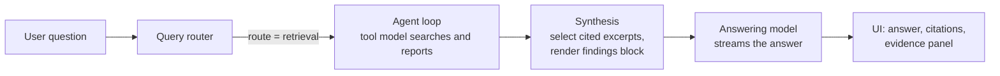

Three ideas carry most of the design. Keep them in mind as you read:

1. **The loop decides when to stop, not the model.** No tool call ends the run.
2. **What the model sees is separate from what the system knows.** The transcript is text
   for the tool model to read; the ledgers hold the same facts keyed by id, for code to
   check and for the answering model, which never sees the transcript.
3. **Nothing reaches the answer without a citation that resolves to a real chunk.** The
   only exception is an explicit "the documents don't say" negative.

---

## 2. Where the agent sits in the chat pipeline

A chat request is a Celery task, `process_chat` in `src/services/chat/tasks.py`. The
pipeline stages before the agent are: load and validate the request, build conversation
context, scan the user message for prompt injection, then route the query.

The router (`src/services/router/`) returns a `RouterOutput` with three fields the agent
cares about:

| Field | Values | Used for |
|---|---|---|
| `route` | `direct_answer`, `retrieval`, `out_of_scope` | Whether the agent runs at all |
| `query_shape` | `extraction`, `comparison`, `analytical`, or `None` | Which prompt, tools and budgets the agent uses |
| `requested_currency` | e.g. `"EUR"` or `None` | FX conversion target at synthesis |

It also returns a `DocumentScopeResult` from scope resolution, which
[scope_resolution.md](scope_resolution.md) covers in full. The agent reads three fields:

- `doc_ids`, every document the run may search. For a retrieval question it is always an
  explicit list. `[]` means "match nothing": both retrievers return no results without
  querying Qdrant or OpenSearch. `None` ("no filter") survives only as the retrievers'
  contract for callers that build a scope themselves.
- `per_entity_doc_ids`, each covered company's documents, keyed by the company name stored
  on its documents (not the router's spelling). A question that names no company covers
  every company in the UI scope. An entity that matched nothing stays in the map under the
  router's name with an empty list, and is listed in `unresolved_entities`.
- `entity_manifest`, each covered company's documents with their fiscal years, and
  `mentioned_as`: the question's names for the company when they differ from its own. "PFH"
  lands there when the user picked Alcoa Corporation for it on a clarification card. "RWE"
  for RWE AG doesn't, because the two normalize to the same name.
  `DocumentScopeResult.mentions()` turns it into the map the agent and synthesis read.

When every named entity fails to match, `source` is `"unresolved"`; `"all"` means the
question named no entity and the UI scope was all documents. When the router call fails
(model missing, timeout, unparseable output), `route_query` still resolves scope on the
fallback route, with no entities, so a UI selection or filter still applies.

Scope resolution can also end the request before the agent runs. A company name that is
ambiguous, matches nothing, or sits outside the UI selection gets a clarification card,
and so does a question covering more than `SCOPE_MAX_COMPANIES` companies (default 5). With
clarification off (eval, API clients sending `allow_clarification: false`), a too-broad
question gets a fixed "narrow the scope" reply and the other cases go ahead: an ambiguous
name runs on its most likely company, and the rest are planned as not found.

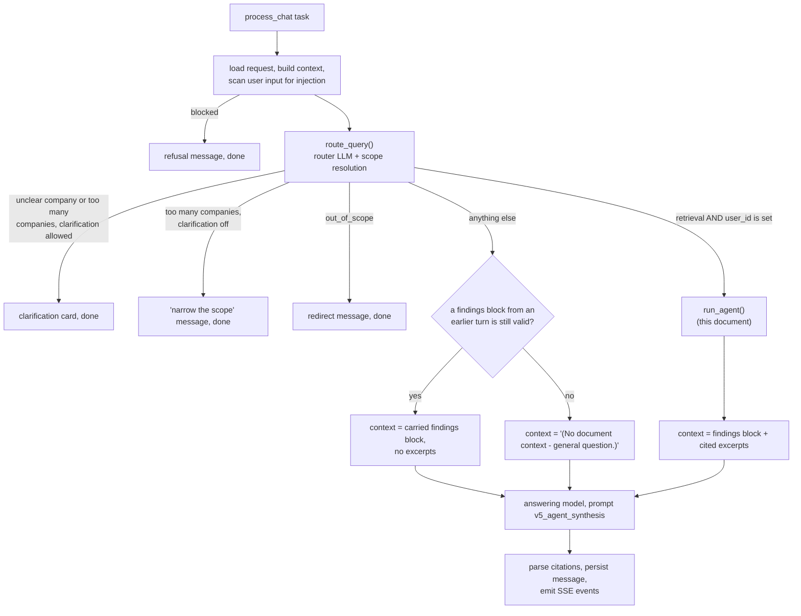

Two things to note:

- **There is no separate "classic RAG" path.** Every retrieval-routed request from a
  logged-in user goes through the agent. The one exception is a request whose
  `LLMRequest.user_id` is `NULL`. The agent can't search without a user id, so that
  request falls to the no-retrieval branch.
- **The same answering prompt serves every branch.** `v5_agent_synthesis` knows how to
  handle a `[FINDINGS]` block, a carried block with no excerpts, and no context at all.

The tool model is `AGENT_TOOL_MODEL` (default `gpt-4o-mini`).
`loop.py::tool_model_chain` resolves it together with its `fallback_model` from
`infra/config/models.yaml`, keeping only models with `tool_calling: true`, and refuses to
start the loop if the tool model itself lacks it. `tasks.py` and the eval pipeline both call
it, then pass the fallbacks to `run_agent(..., fallbacks=...)`.

---

## 3. Three models, three jobs

It helps to think of the run as three roles.

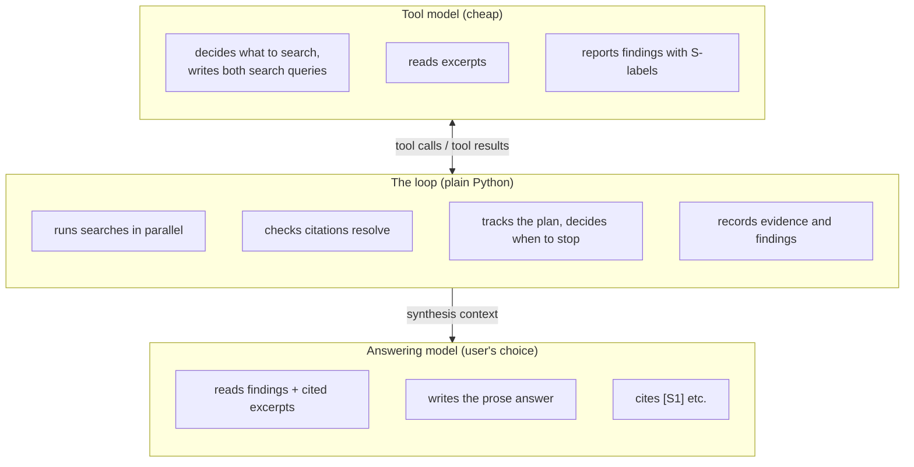

- The **tool model** never talks to the user. Its prompts
  (`prompts/system_v4_agent.yaml`, `prompts/system_v6_agent_analytical.yaml`) say "Your only
  output is tool calls."
- The **loop** is deterministic code. It owns every decision that matters for correctness:
  whether a citation is real, whether a plan item is done, when to stop.
- The **answering model** is whatever model the user picked in the UI. It never sees the
  agent's transcript. It sees only the synthesis context.

No other model sits between the tool model and retrieval. Each `search_documents` call
carries a `query` for semantic search and `keywords` for BM25, and the loop passes both to
retrieval as written. See [section 9](#9-executing-a-search).

---

## 4. The package

```
src/services/chat/agent/
├── __init__.py          run_agent(): run_loop() then run_synthesis(). The only public entry.
├── loop.py              the tool-calling loop, search execution, report handling
├── state.py             AgentSettings, ShapeConfig, AgentRunState, AgentLoopMeta,
│                        open_aspects(), render_status(), snapshot(), build_meta()
├── evidence.py          EvidenceLedger: every retrieved chunk, S-label allocation
├── findings.py          FindingsLedger: keyed conclusions, grounding filter, projection
├── transcript.py        Transcript: the model's append-only message list
├── tools.py             tool JSON schemas, generated from Pydantic models; the analytical
│                        report schema is the same one with `figures` removed
├── synthesis.py         run_synthesis(): loop output -> AgentRunResult
├── processor.py         FX normalization, ranking, findings block rendering
└── number_grounding.py  checks that a reported number appears in its cited excerpt
```

The finding schemas themselves (`Figure`, `Finding`, `FindingsReport`, `AgentFindings`)
live in `src/schemas/agent_findings.py`.

Two callers use `run_agent()`, with identical arguments:

- `src/services/chat/tasks.py`, the production Celery chat worker
- `src/eval/pipeline_agent.py`, the offline eval harness (`src.eval.run_agent`) and the
  canary workflow

Because both go through the same function, the eval measures what production serves.

```python
# src/services/chat/agent/__init__.py
async def run_agent(state, llm, session, redis_app, request_id, reranker, session_factory):
    evidence, findings, meta = await run_loop(
        state, llm, session, redis_app, request_id, reranker, session_factory
    )
    requested_currency = getattr(state.router_output, "requested_currency", None)
    return await run_synthesis(
        evidence, findings, meta, requested_currency,
        max_chunks_per_entity=get_agent_settings().max_chunks_per_entity,
    )
```

Module dependencies point one way. `transcript.py` depends on nothing else in the package.

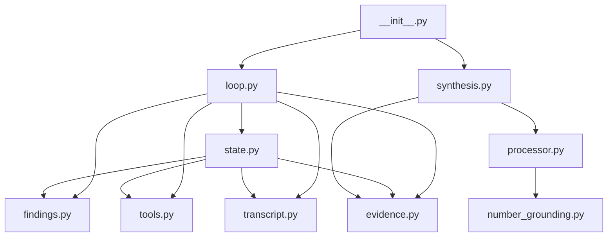

---

## 5. Two query shapes

The router's `query_shape` splits the agent into two modes: `extraction` and `comparison`
share one, `analytical` gets the other, and a `None` shape counts as extraction. The modes
differ in how they search and plan, and in whether the report tool offers `figures`. They
never differ in how a conclusion is parsed, stored, checked or shown. Everything that
differs is one frozen record, resolved once per run:

```python
@dataclass(frozen=True)
class ShapeConfig:
    prompt: str                      # "v4_agent" | "v6_agent_analytical"
    search_takes_sub_question: bool  # picks the search schema
    report_takes_figures: bool       # picks the report schema
    seed_plan_from_entities: bool
    max_iterations: int

    @property
    def tools(self) -> list[dict]:   # [search schema, report schema] for this shape
        ...

shape = shape_config(query_shape, settings)
```

The prompt and the tool pool come from the same record, so a prompt can never mention a
tool the model wasn't given.

The shape is fixed before the first turn, and the loop can't change it. The router prompt
(`query_router_v5`) routes `analytical` only on causal language ("why", "what drove",
"explain"). "How did X change from A to B" asks for one value per period, so it routes
`comparison`, where one finding carries a figure per period; adding "and what drove it"
makes it `analytical`.

| | Extraction / comparison | Analytical |
|---|---|---|
| Example question | "What was Acme's FY2023 revenue?" / "Which of Acme and Globex had higher revenue?" / "How did Acme's revenue change from FY2022 to FY2023?" | "Why did Acme's operating margin fall in FY2023?" |
| Tool-model prompt | `v4_agent` | `v6_agent_analytical` |
| Search tool args | `entity`, `query`, `keywords` | `entity`, `query`, `keywords`, `sub_question` |
| Report tool schema | `REPORT_FINDINGS_TOOL`: each finding has `figures` | `REPORT_ANALYTICAL_TOOL`: no `figures`, numbers go in `claim` |
| Plan keys | Entity names, seeded before turn 1 | `A1`, `A2`, …, minted from `sub_question`s |
| A search's key | The seeded entity it names | The aspect its `sub_question` mints |
| Turn cap | `AGENT_MAX_ITERATIONS` (5) | `AGENT_MAX_ITERATIONS_ANALYTICAL` (7) |
| Extra setup message | "Entities to search (you MUST call search_documents for each…)" plus years and the question's name for the company if it differs, or "not found in your documents" for an unmatched entity | "Available document years…", plus a "Not found in your documents" line for unmatched entities |

And what both share:

| | Both shapes |
|---|---|
| Search queries | The tool model writes `query` (embedder and reranker) and `keywords` (BM25); no second model rewrites them |
| Report tool | `report_findings(findings, comparison_op, conclusion)`, parsed by `FindingsReport` |
| Finding schema | `Finding`, with optional `figures` (always empty on analytical runs) |
| Unreported plan key | One "Not searched" / "Not resolved" / "Could not be checked" line |
| Synthesis | FX, ranking, number grounding and change lines on rows with figures |
| Findings block | `[FINDINGS]` |

Analytical runs get a report schema without `figures`. `tools.py::_without_figures` copies
`REPORT_FINDINGS_TOOL` and deletes the field and the `Figure` definition from the copy.
Offered both, the analytical model wrote every number twice, once in `claim` and once as a
figure. The same `FindingsReport` still parses every call, so an analytical finding arrives
with `figures=[]`. Nothing downstream depends on the shape. A yes/no extraction answer is a
`Finding` with no figures too, and the renderer prints no figure rows for either.

Every other limit is the same for both modes. The loop reads limits from one frozen
`AgentSettings` object on `state.settings`, and keeps the shape's turn cap on
`state.max_iterations`.

---

## 6. State: the view and the record

This is the idea the rest of the design hangs on. Everything the loop holds is one of two
kinds.

**The view** is `Transcript`, the list of chat messages sent to the tool model on its next
turn. It is plain text in chat order. Prior conversation is capped once when the run starts;
after that the loop only appends to it.

**The record** is everything the system actually knows:

- `EvidenceLedger`: every chunk any search returned, and which S-label it got
- `FindingsLedger`: every conclusion that passed the grounding check
- the plan fields on `AgentRunState` (`plan`, `aspect_stats`)
- bookkeeping (`spend`, `degraded_capabilities`, …)

The record is keyed by stable ids (chunk UUIDs, plan keys) and never trimmed.

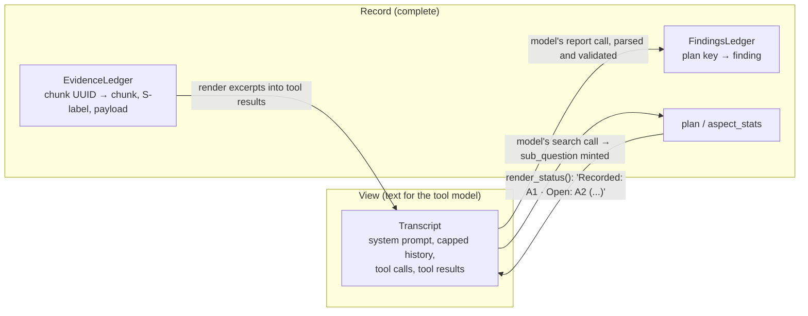

Facts flow **record → view** by rendering: excerpts become XML in a tool result, coverage
becomes a status line. Model output flows **view → record** by parsing: a tool call's JSON
becomes a Pydantic object, the loop checks it, then folds it into a ledger.

Why split them, when the transcript already contains every excerpt? Because the transcript
is prose for a model, and the loop's decisions need structured lookups it can't safely get
by parsing that prose:

- **Resolving citations.** A report cites `S7`; the ledger turns it into a chunk UUID, so a
  finding points at a real document and page, not at a string.
- **Numbering and dedup.** Parallel searches share one label sequence, and a chunk keeps
  its label for the run. "Already shown above: S3 …" and the progress check both need the
  set of chunks already labelled.
- **Grounding.** The findings check that a cited chunk exists, and number grounding checks
  that a reported figure appears in the cited chunk's text.
- **Handoff to the answer.** The answering model never sees the transcript. Synthesis builds
  its context from the findings plus the cited chunks' cached, already-scanned payloads,
  with no second DB read.

The FindingsLedger carries the conclusions forward; the EvidenceLedger carries the source
text those conclusions cite.

### `AgentRunState`

One dataclass in `state.py` holds the whole run. Its fields are grouped by role:

```python
@dataclass
class AgentRunState:
    # input, read-only during the run
    settings: AgentSettings           # frozen; every limit the loop enforces
    max_iterations: int               # ShapeConfig.max_iterations

    # the view, append-only
    transcript: Transcript

    # the record
    evidence: EvidenceLedger
    findings: FindingsLedger
    sealed_by_coverage: bool          # set only by Stop("covered"); read `sealed` instead
    degraded_capabilities: set[str]   # "dense" / "keyword" / "rerank" that failed at least once
    scores_are_rerank: bool           # False once any search returned fusion scores
    spend: dict[str, TokenSpend]      # tokens and cost per model id

    # the plan
    plan: dict[str, str]              # key -> sub-question (or entity name), in mint order
    aspect_stats: dict[str, AspectStats]  # per key: searches, errored, new chunks

    # control
    iteration: int
    empty_rounds: int
    tool_calls_total: int
    convergence_reason: ConvergenceReason   # defaults to "iteration_cap"
    deadline_at: float | None         # event-loop time the run deadline fires

    # instrumentation
    report_calls_total: int
    turns_to_first_report: int | None
    unknown_aspect_keys: int
    unsearched_negatives: int
    search_arg_errors: int
    report_parse_failures: int
    last_turn_input_tokens: int       # input of the latest tool-model call
```

Two derived properties matter more than any stored field:

```python
@property
def addressed(self) -> set[str]:
    return self.findings.keys()

@property
def sealed(self) -> bool:
    return not self.plan or self.sealed_by_coverage
```

Both are covered in the next section.

`AgentRunState` never leaves the package. Callers see only what `run_loop` returns: the
`EvidenceLedger`, a findings projection, and a flat `AgentLoopMeta` summary.

### Who writes what

| Store | Written by | Read by |
|---|---|---|
| `Transcript` | `_run_turn` (appends only) | the tool model, `snapshot()` |
| `EvidenceLedger` | `fold_searches` (`admit`, `assign_labels`) | `fold_searches` (`shown_before`), `_apply_report` (`resolve_refs`), `FindingsLedger` (grounding), synthesis |
| `FindingsLedger` | `_apply_report` (`ingest`) | coverage checks, synthesis |
| `plan` | `_mint` (analytical), `run_loop` setup (extraction) | coverage checks, `render_status` |
| `aspect_stats` | `fold_searches`, under the key `_search_key` gave each search | `unresolved_lines`, the stated-negative check |

All writes happen on the loop's own task, never inside the concurrent search coroutines.
Search functions return plain data and the loop folds it in afterwards, one result at a
time, in call order. This **single-writer** rule is why S-label
numbering is deterministic even though searches run in parallel.

---

## 7. The plan: how the loop knows when it is done

There is no "I'm finished" tool. The loop tracks a plan and stops when the plan is covered.

### Where plan items come from

**Extraction and comparison.** Before the first turn, `run_loop` seeds one plan item per
key of `per_entity_doc_ids`, that is, per company in scope:

```python
if shape.seed_plan_from_entities:
    for name in sorted(expected_entities):
        state.plan[name] = name
```

So for "Compare Acme and Globex revenue", with documents stored under "Acme Corp" and
"Globex", the plan is `{"Acme Corp": "Acme Corp", "Globex": "Globex"}`. Keys are the
company names stored on the documents, whatever the question called them, and the model
must report on both, spelled exactly as given. A question that names no company ("which
company had the higher margin?") seeds every company in the UI scope, up to
`SCOPE_MAX_COMPANIES`.

An entity the resolver couldn't match is seeded too, under the router's name. Its search
closes it with a negative (see [Stated negatives](#stated-negatives)), so the answer says
the company isn't in the library instead of leaving it out. With clarification on, a
company name that matched nothing normally gets a clarification card before the agent
runs, so this happens only when clarification is off, when the entity isn't a company (a
person or product), or when the user answered a card with "Keep selection".

**Analytical.** The plan starts empty. The model opens items by attaching a `sub_question`
to a search. The loop turns each new sub-question into a short id:

```python
def _mint(plan, sub_question, max_plan_items):
    q = " ".join((sub_question or "").split())      # collapse whitespace
    if not q:
        return None                                  # no sub_question: search runs untracked
    norm = q.lower()
    for aid, existing in plan.items():
        if " ".join(existing.lower().split()) == norm:
            return aid                               # same wording: reuse the id
    if len(plan) >= max_plan_items:
        return None                                  # plan full: search runs untracked
    aid = f"A{len(plan) + 1}"
    plan[aid] = q
    return aid
```

The search's tool result is then prefixed with the id, e.g. `[A2] <retrieved_excerpt ...>`.
When the model reports, it copies `A2` from the result it just read. An extraction search
is keyed the same way by the seeded entity it names (`[Acme Corp] <retrieved_excerpt ...>`);
a name that isn't a plan key gets no prefix and no stats. `_search_key` picks between the
two from `ShapeConfig.search_takes_sub_question`.

Why does the loop mint ids instead of letting the model name aspects? A small model that
calls something `input_costs` on turn 1 and `input_cost_inflation` on turn 3 creates two
keys for one idea, and the first one never closes. Copying a two-character token from the
adjacent text is a much easier instruction to follow. Matching is exact (after lowercasing
and whitespace collapsing). A near-duplicate sub-question mints a second id. That costs one
extra plan item, capped by `AGENT_MAX_PLAN_ITEMS` (default 6).

### "Addressed" and "open"

A plan key is **addressed** when it has a finding in `FindingsLedger` that passed the
grounding check. A stated negative (`supported=false`) counts, once an earlier turn has
searched the key. Nothing else closes a key, so coverage (`addressed`, and `plan_covered` in the trace) can be read at
any point in the run and gives the same answer.

`open_aspects(state)` returns plan keys that are not addressed, in mint order. After each
turn's reports are folded in, the loop checks:

```python
if state.plan and not open_aspects(state):
    state.sealed_by_coverage = True
    return Stop("covered")
```

This is the normal, successful end of a run.

"Reported" is not the same as "addressed". A report can name `A2` and still record nothing,
because every citation failed to resolve, or because the finding claimed support but cited
nothing. The loop leaves `A2` open. The tool result tells the model the report didn't land, so it can re-cite or report a negative.

### Lifecycle of one plan item

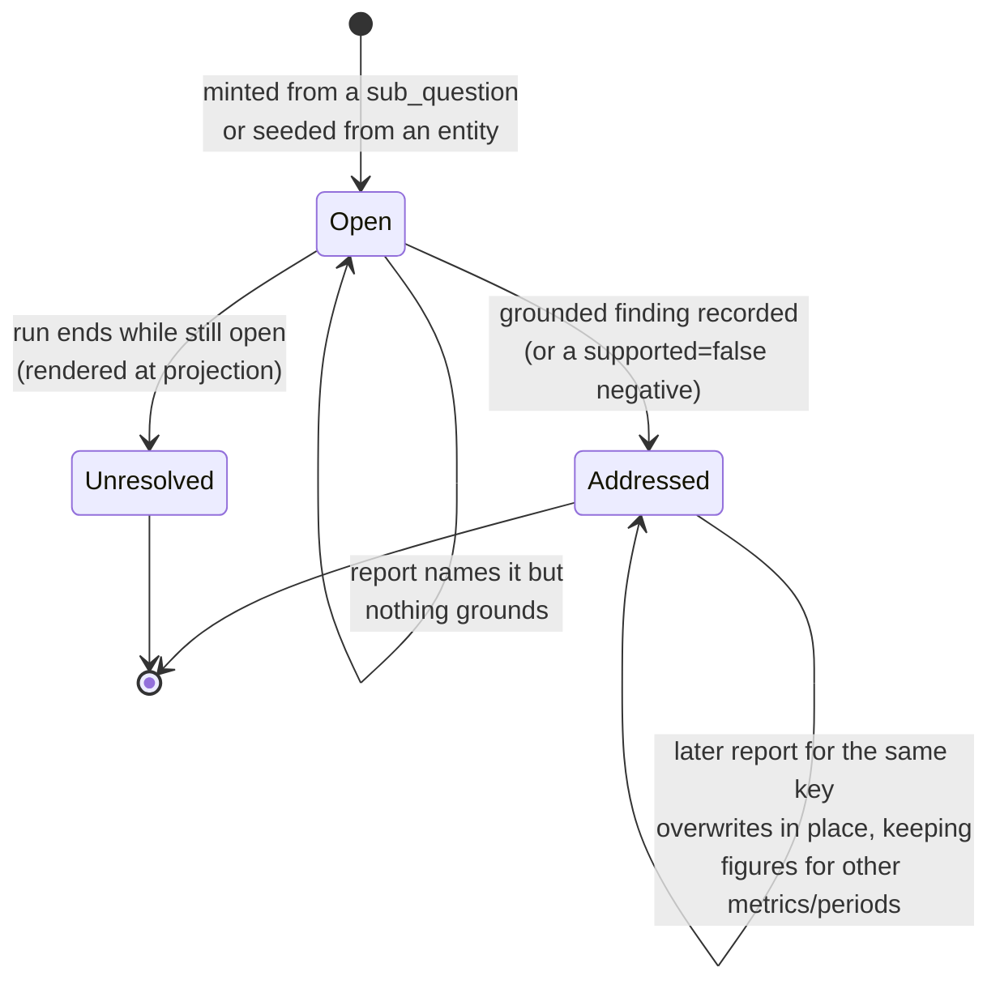

An unresolved key stays open in the state. It only becomes a line of text in the served
findings ("Not searched: …", "Not resolved: …" or "Could not be checked: …"), written by the
projection. Only a
real finding can close a key, so `Stop("covered")` and `sealed` always mean every key
produced output.

### `sealed`

`sealed` answers "did this run finish what it set out to cover?" It is:

- `True` if `Stop("covered")` fired, or
- `True` if the plan was empty the whole time, or
- `False` otherwise.

An empty plan is legitimate in two cases. An extraction question whose scope holds no
companies, such as a metadata filter that matches no documents, has nothing to seed
(unmatched entities don't count: they are seeded as not-found keys). An analytical run whose searches all carried
`sub_question: null` never minted anything. Neither case is a failure to finish, so neither
should get a "did not converge" caveat.

`sealed` decides three things downstream:

- whether the findings projection is marked **degraded** (an extra caveat line in
  `unresolved`)
- whether the findings block is saved for follow-up questions (unsealed blocks aren't)
- the `agent_findings_sealed` flag persisted on the message

### What the model sees about coverage: `render_status`

Before every LLM call the loop computes a status line and appends it as the last user
message. It is never stored in the transcript, so it can't go stale or pile up:

```
Recorded: A1, A3 · Open: A2 (Did pricing actions offset the cost increases?), A4 (Did FX movements affect gross margin?)
```

It can add two more parts:

- after a turn that found no new evidence (`empty_rounds > 0`), a nudge to reformulate
  toward footnotes, reconciliations or segment tables
- on the last allowed turn, a "Final turn, no further searches will run" notice asking the
  model to report every open key, using `supported: false` where the evidence doesn't
  support one

`render_status` returns `None` when the plan is empty, so no status message is sent.

It shows keys and sub-questions only, never claim text. An earlier design re-injected full
claims every turn. The only effect was giving the model text to copy, so it was removed.

A "you have evidence but recorded nothing" nudge was also tried and reverted. On turn 1 of a
healthy analytical run nothing is recorded yet because the model is about to drill down.
The nudge pushed it into reporting early and halved the number of searches.

---

## 8. Anatomy of one turn

`run_loop` calls `_iterate(state, deps, tools)` inside one
`asyncio.timeout(AGENT_DEADLINE_SECONDS)`. `_iterate` runs
`for iteration in range(max_iterations)`, and each iteration calls
`_run_turn(state, deps, tools)`, which runs the whole turn inside one `agent_turn_N`
Langfuse span and returns `Continue()` or `Stop(reason)`.

<a id="the-run-deadline"></a>**The run deadline.** `run_loop` stores when it fires on
`state.deadline_at`, and every tool-model call is budgeted from what is left of it.
`_call_budget` gives a call `min(AGENT_TURN_TIMEOUT_CAP_SECONDS, time left -
AGENT_DEADLINE_RESERVE_SECONDS)`, recomputed per call, so a fallback model gets only what
the failed attempt left. The reserve makes the call's own timeout fire before the deadline
does. The call then stops as `timeout`, with an `llm_requests` row and a latency sample, and
the loop still has time to serve what it gathered. Before each turn `_iterate` checks the
budget. With none left it stops as `deadline` without calling the model, since that call
could only be cut off.

The deadline itself still cancels whatever the current turn is awaiting when it fires. In
practice that is a search fan-out or an SSE event, because calls are budgeted to end
first. `run_loop` then records `deadline`. The cancelled turn loses only its in-flight
results, and earlier turns are already in the ledgers. So the run ends at
`AGENT_DEADLINE_SECONDS`, plus at most the time to write one `llm_requests` row. Those row
writes are the one await that runs to completion first (`_finish_despite_cancel`), because
a write cut off mid-commit would lose the row.

`deps` is a frozen `RunDeps`, built once in `run_loop`: everything that is fixed for the
run (the tool-model chain, the chat pipeline state, the DB session and session factory, the
reranker, Redis, the request id, the shape, the search semaphore and the search function).

The turn's state changes live in three synchronous functions with no awaits and no I/O, so
they can be unit-tested without an event loop or an LLM (`test_agent_turn_folds.py`):

| Function | Does | Returns |
|---|---|---|
| `fold_searches(state, searches, results, keys)` | admits chunks, assigns S-labels in call order, names chunks already shown, updates `aspect_stats` and spend | tool-result text per call id, new labels per search |
| `fold_reports(state, reports, request_id)` | runs `_apply_report` per report, in call order, before this turn's searches | tool-result text per call id, plan keys closed this turn |
| `decide(state, facts)` | the termination checks below; writes only `sealed_by_coverage` and `empty_rounds` | `Continue()` or `Stop(reason)` |

`_run_turn` does the async work around them: the LLM call (`_call_tool_model`) and its spend
logging (`_record_turn_spend`), the concurrent searches (`_guarded_search`), SSE activity
events, and appending the transcript messages.

<a id="tool-model-errors"></a>**Tool-model errors.** `_call_tool_model` tries `deps.llms` in
order: the tool model, then its fallbacks. A provider error (`LLMError`: rate limit, 5xx,
content filter, ...) logs `agent_tool_model_fallback` and moves the same turn to the next
model; spend is recorded under the model that answered. The last model's error propagates
to `run_loop`. If the run has gathered anything (an admitted chunk or a recorded finding),
it stops as `llm_error` and serves that, degraded like any other unsealed run. If it has
gathered nothing, the error propagates and the request fails, because there is nothing to
serve. A call that runs past its budget does not fall back. It stops the run as `timeout`.

<a id="token-cap"></a>**Token cap.** A reasoning model can spend its whole completion-token
cap thinking and return no tool call. The adapter passes the provider's `finish_reason` on
`AssistantTurnResult`, and a turn with no tool calls and `finish_reason == "length"` stops
as `truncated`, not `natural`. The loop logs `agent_tool_model_truncated` with the output
and reasoning token counts, marks the turn span WARNING in Langfuse, and writes the
sub-request row with `status="truncated"`. A truncated turn that still emitted tool calls
carries on, but its row and latency sample are tagged `length` too.

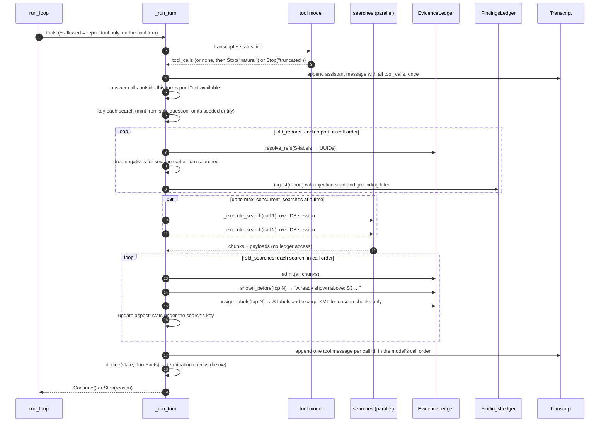

### Rules the turn follows

**The assistant message goes in once, verbatim.** Every OpenAI-compatible API requires each
`tool_call_id` in an assistant message to have exactly one matching `role=tool` message.
The loop appends the assistant message before doing anything else, and at the end appends
exactly one tool message per call id, in the order the model emitted them. A missing or
extra tool message is an HTTP 400 on the next call.

<a id="the-dispatch-rule"></a>**The pool is the dispatch rule.** The turn partitions the
model's calls against the tools it was offered *this turn*. A call to any other tool gets
the result `Tool '<name>' is not available. Available: ...` and is never parsed or run. This
covers a tool name the run never offered (a hallucinated or retired one) and a search
emitted on the final turn, when only the report tool was allowed. Such a call adds nothing
and closes nothing, so on its own it counts as an empty round.

**Reports are folded before this turn's searches run.** The model wrote this turn's report
calls before it saw this turn's search results, so a report is judged against the state the
previous turn left. It can cite only labels from earlier turns, and a stated negative counts
as searched only if an earlier turn searched its key (see
[stated negatives](#stated-negatives)). Reports fold after minting, so a key minted this
turn is known, not unknown.

So the model reports on turn N from evidence shown on turns 1 to N-1, and a search's
results can be reported on no earlier than the next turn. Each plan item therefore takes at
least two turns: search, then report. A typical turn mixes both: it reports on aspects it
already has evidence for and searches for the rest. This is also why a report-only turn
that closes a key counts as progress, and why the final turn can allow only the report
tool.

**Keying happens before execution.** The tool result needs to echo the key.

**Each concurrent search gets its own `AsyncSession`** from `session_factory`. SQLAlchemy's
`AsyncSession` is not safe to share across `asyncio.gather`. The loop never writes on the
pipeline's `session` either. Each tool-model call's `llm_requests` row goes through
`_write_tool_call_row`, which opens a short-lived session, commits at once and returns the
connection to pgbouncer before the next LLM call. A failed write is logged
(`agent_tool_call_row_failed`) and stays in that session. Rolling back the shared session
instead would expire every object the pipeline holds and discard its pending changes.

**Each search is bounded by `AGENT_SEARCH_TIMEOUT_SECONDS`** (default 60). A search that
times out becomes a `backend_failed` result with an error message, not an exception. The
time spent waiting for the semaphore counts toward that timeout.

### Termination checks, in order

`decide` reads the run state plus a `TurnFacts` summary of the turn: how many searches ran,
how many of them had `backend_failed`, how many new labels were shown to the model, and
which plan keys closed.

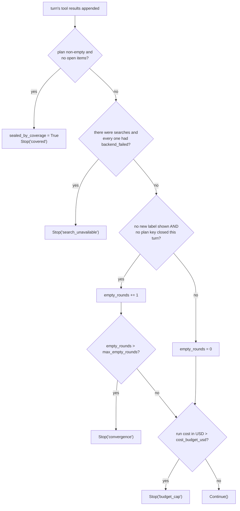

Order matters in two places:

- The coverage check runs after minting. So a turn that closes the last open item and opens
  a new one keeps going, rather than stopping and throwing the new thread away.
- "Progress" means a new label shown **or** a newly closed plan key. A turn that settles an
  aspect from evidence already in hand, with no new search, is real progress. Without this
  rule the loop would often stop one turn before it finished covering the plan.
- A new label is a chunk rendered for the first time, not a chunk admitted. A search admits
  its whole result but renders only the top `AGENT_MAX_CHUNKS_PER_ENTITY`, so a near-repeat
  search that admits one stray chunk below that cut shows the model nothing new, and counts
  as an empty round.

Both modes tolerate `AGENT_MAX_EMPTY_ROUNDS` (default 1) consecutive empty rounds. The
tolerance matters most for a report-only turn whose reports all fail grounding: it admits
nothing and closes nothing, and the model only reads the "was not recorded" feedback on the
next turn. With no tolerance the run would stop before the model could re-report.

### The final turn

On the last allowed iteration the model may call only the report tool, so this turn goes to
writing up evidence it already has. `render_status` adds a notice explaining this. The mode
stays `"auto"`, so if the model answers with prose instead, the turn ends with
`Stop("natural")` and whatever was recorded still gets served.

How the restriction is applied depends on the model's `allowed_tools` capability in
`models.yaml`:

- **With it** (the OpenAI models), the request still carries the full tool list and sets
  `tool_choice={"type": "allowed_tools", "allowed_tools": {"mode": "auto", "tools": [report]}}`.
  The tool definitions sit at the front of the prompt, so keeping them identical keeps the
  provider's cached prefix: the final turn, the longest prompt of the run, is read mostly
  from cache. The API enforces the restriction, so the model can't emit a search at all.
- **Without it** (e.g. vLLM), the search tools are dropped from the request. That changes the
  prompt prefix, so the final turn misses the cache. A search the model emits anyway is
  answered "not available" and doesn't run.

In Langfuse, the final turn's `llm.complete_with_tools` generation lists every tool under
`metadata.tools` and the callable subset under `metadata.allowed_tools`.

The final-turn notice nudges the model toward `supported: false` rather than toward closing
everything. A forced positive claim that cites a real but irrelevant excerpt would pass
grounding, close its key, and mark a budget-capped run as fully covered.

### When the model returns no tool calls

`Stop("natural")`. This is a normal exit. The findings recorded so far still get served,
with one line per key still open. If the call hit its token cap instead, the stop is
`truncated` (see [token cap](#token-cap)). It serves the same way but counts as a failed
stop. Only when nothing was ever reported and no key is open is
the projection `None`, and synthesis falls back to raw excerpts (see
[section 15](#15-synthesis-turning-loop-output-into-answer-context)).

---

## 9. Executing a search

`_execute_search` in `loop.py` runs one `search_documents` call. It is a pure function of
its inputs: it never touches the ledgers or the run state.

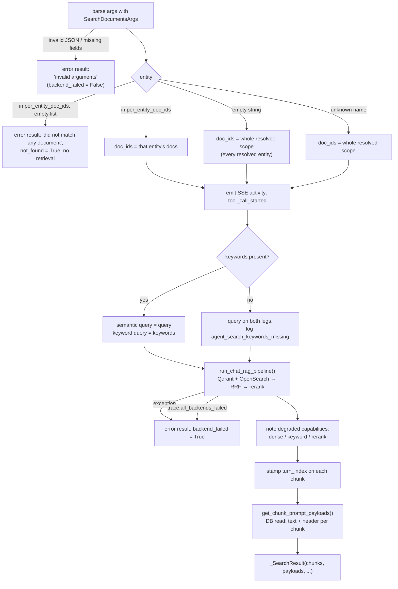

A few details worth knowing:

- **Two queries, one per retriever.** `query` is a short phrase in the filing's wording. The
  embedder and the reranker use it. `keywords` is 3-8 terms likely to appear verbatim in the
  filing, with filing synonyms (revenue / net sales), and goes to BM25. The tool schema
  requires `keywords`. The parser doesn't, so a call that leaves it out still searches with
  `query` on both legs.
- **Two different failure kinds.** `backend_failed=True` means the search infrastructure
  failed: an exception, a timeout, or every retrieval backend down. It feeds
  `Stop("search_unavailable")` and the "could not be checked" gap text. Bad arguments from
  the model are an error too, but not a backend failure, because the corpus wasn't the
  problem.
- **An outage usually doesn't raise.** The retrieval pipeline fails open: one dead backend
  returns `[]` so the other can still serve. An empty list can't tell "the index is down"
  from "the corpus has nothing on this", so `run_chat_rag_pipeline` also returns
  `RetrievalTrace.all_backends_failed`. It is set only when every enabled backend failed.
- **Partial degradation is tracked separately.** If dense search, keyword search or the
  reranker failed but results still came back, the capability name goes into
  `state.degraded_capabilities`. The UI shows it as a degraded-retrieval badge.
- **Score scale.** When reranking was skipped, chunk scores are RRF fusion scores, about an
  order of magnitude smaller than cross-encoder scores. `state.scores_are_rerank` flips to
  `False` so the confidence badge doesn't apply rerank thresholds to fusion scores.
- **`entity=""`** searches the resolved scope (`scope_result.doc_ids`), the union of every
  resolved entity's documents. The SSE label and trace span carry the entity name only when
  exactly one entity is in scope. The analytical prompt still asks the model to pass an
  explicit company name.
- **An unmatched entity never reaches retrieval.** Its list in `per_entity_doc_ids` is
  empty, so the search returns the error "'Tesla' did not match any document in your
  library" with `not_found=True`. The retrievers would return nothing for an empty list
  anyway. The check exists so the model reads why, and closes the key with a negative
  instead of searching it again with other wording.
- **`RetrievedChunk` carries no text.** It has the chunk id, document id, scores, page
  range and heading trail. Text comes from the payload hydration step, which builds a
  `ChunkPromptPayload` whose `prompt_text` is
  `"[__REF__ | Doc name | p.42 | Section > Subsection]\n<chunk text>"`. The `__REF__`
  placeholder becomes a real S-label later, in the ledger.

---

## 10. EvidenceLedger: chunks and S-labels

`evidence.py`. One ledger per run. It owns every chunk any search returned and the S-label
each rendered chunk got. The transcript is append-only, so every labelled chunk is still on
screen; the ledger never has to track what the model can currently see.

```python
self._records:      dict[UUID, EvidenceRecord]      # every admitted chunk + its label, search and rank once rendered
self._ref_registry: dict[str, UUID]                 # "S7" -> chunk UUID (reverse of the label)
self._payloads:     dict[UUID, ChunkPromptPayload]  # sanitized text, cached for synthesis
self._next_ref:     int                             # next S-number; never resets
self._searches:     int                             # assign_labels calls so far = search order
```

### Admit everything, render the top few

For each search result, `fold_searches` makes three calls:

```python
entity_new = state.evidence.admit(result.chunks)                # all of them
top = result.chunks[: state.settings.max_chunks_per_entity]      # top 5 by default
shown = state.evidence.shown_before(top)                         # labelled by an earlier search
ctx = state.evidence.assign_labels(top, result.payloads)        # the rest
```

`admit` records every chunk the search returned, so the record is complete. A chunk seen
before is left as it was, including the score from the search that first returned it. A
chunk is labelled when its record has a `ref_id`; there is no separate set of rendered
chunks. The admitted count feeds `aspect_stats`, not the
progress check. A chunk admitted but never labelled has no S-label, so the model never
sees it and can't cite it, and synthesis never uses it. It shows up only in `aspect_stats`
and logs.

`assign_labels` renders only the top N into the tool result. Uncapped search results were
once the largest per-turn token cost (about 106k characters in one measured turn). Capping
at render time, not after the loop, means no turn ever has to read a whole parallel batch.
`len(ctx.items)`, the number of chunks rendered for the first time, is the search's
contribution to the progress check.

### What happens to each chunk in the top N

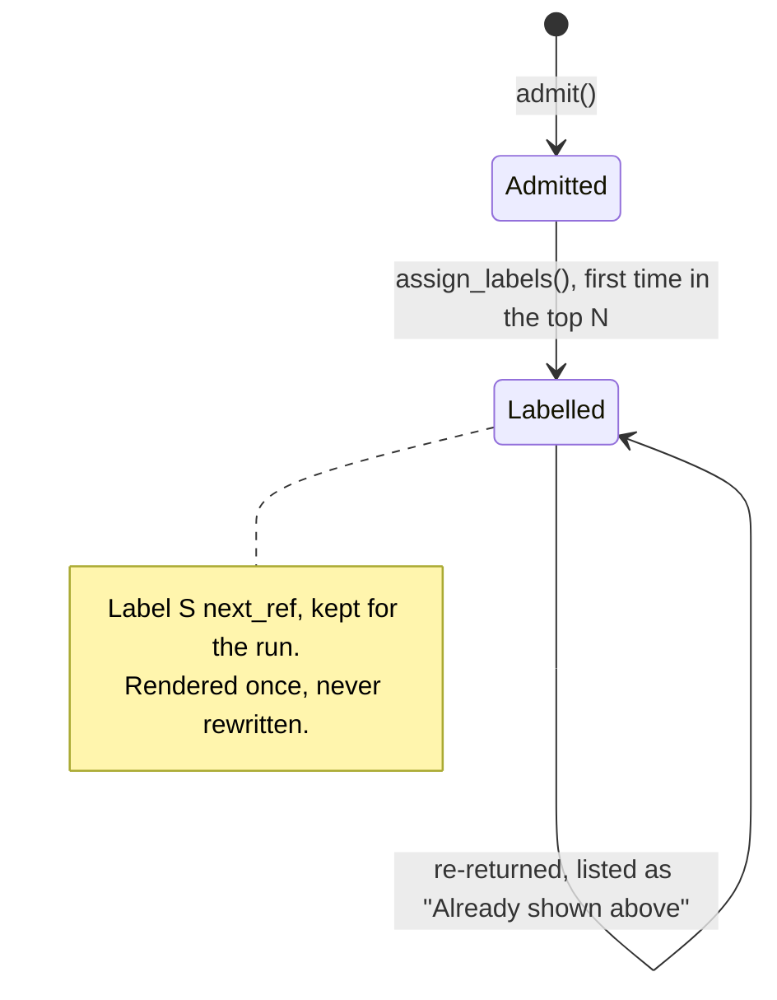

- **Fresh chunk.** It goes through `assemble_rag_context(..., ref_start=next_ref)`. That
  function runs the prompt-injection scan on the chunk body, drops "block"-severity chunks,
  marks "flag"-severity ones with `flagged="true"`, replaces `__REF__` with the new label
  and wraps the text in XML:

  ```xml
  <retrieved_excerpt id="S7" source_doc="Acme 10-K FY2023" flagged="false">
  [S7 | Acme 10-K FY2023 | p.34 | MD&A > Cost of Revenue]
  Cost of goods sold increased primarily due to raw material inflation...
  </retrieved_excerpt>
  ```

  The ledger stores the label and the sanitized payload.
- **Already labelled.** Not rendered again: one chunk has one label and one rendering for
  the whole run. `shown_before` names it instead, with the last entry of its heading trail
  cut to `AGENT_SHOWN_HEADING_CHARS` (default 40), and the tool result ends with
  `Already shown above: S3 Consolidated Statements of Operations · S7 Results of Operations`.

A search whose chunks were all shown before returns only that line. `(no results)` is
reserved for a search that returned nothing renderable, so the model isn't told a search
found nothing when it found text already on screen.

### Other methods

| Method | Returns | Used by |
|---|---|---|
| `resolve_refs(refs)` | `(resolved_uuid_strings, unresolved)`. Accepts `S`-labels (case-insensitive) or UUID strings; resolved refs are always canonical `str(UUID)`. | `_resolve_refs` |
| `shown_before(chunks)` | `"Sn heading"` for each chunk an earlier search labelled | `fold_searches` |
| `payloads_for(chunk_ids)` | cached sanitized payloads | synthesis (context reassembly and the number-grounding texts), so it needs no DB read |
| `labelled_chunks()` | every chunk the model was shown, highest first-seen score first — exactly the chunks with a cached payload | synthesis (cited pool) |
| `fallback_chunks(limit)` | up to `limit` shown chunks, round-robin across searches (`(rank, search)` order) | synthesis fallback |
| `len(ledger)`, `uuid in ledger` | count / membership of admitted chunks | grounding check, logs |

A chunk the injection scan blocked is admitted but never labelled, so it has no cached
payload. Synthesis filters it out.

---

## 11. Transcript: history and the append-only run

`transcript.py`. A thin wrapper around `list[ChatMessage]` with `append` and
`append_tool_calls`. Nothing in it rewrites or removes a message.

### What the transcript starts with

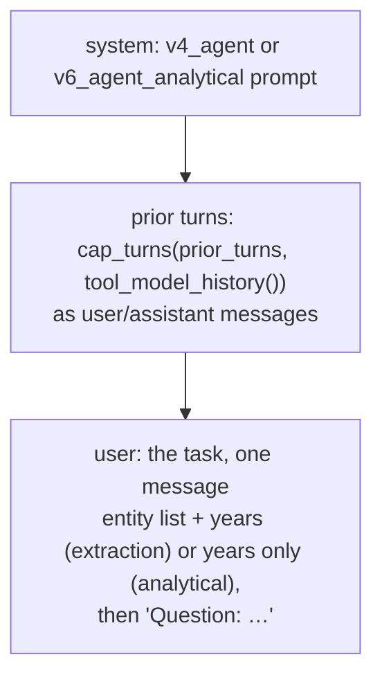

When there are no entities or years to state, the task message is just the question.

The prior turns come from the shared conversation history described below.
`agent_history` (in `loop.py`) does two things to them:

- A prior answer produced from a carried findings block (see
  [section 17](#17-after-the-agent-answering-persisting-follow-ups)) becomes the stub
  `"[prior turn: restated earlier results in a different format]"`. Its prose restates
  numbers the agent has no evidence for in this run. The stub is applied before capping, so
  the budget counts what is actually sent.
- `cap_turns(…, tool_model_history())` keeps the most recent whole turns within
  `AGENT_HISTORY_BUDGET_TOKENS` (default 4,000), with each answer cut to
  `AGENT_HISTORY_MAX_ANSWER_TOKENS` (default 800).

The years come from the scope's `entity_manifest`, built by scope resolution. They exist so the model uses
fiscal years that actually exist in the documents instead of inventing them.

The manifest also gives the question's name for a company when it isn't the company's own:

```text
Entities to search (you MUST call search_documents for each before report_findings).
Use ONLY the listed years in your search queries — do not guess or invent fiscal years:
- Alcoa Corporation (the question calls it "PFH") (available years: 2022)
- RWE AG (available years: 2022)

Question: compare RWE, PFH in revenues
```

Without that line the tool model sees "PFH" in the question and "Alcoa Corporation" in the
plan, with nothing linking them.

### Conversation history for all three models

The router, the tool model and the answering model all read prior conversation. All three
get it from one function, `prior_turns()` in `src/services/context/turns.py`, called once
in `tasks.py` right after the chat tail is loaded and the current question is scanned. The
result is stored on `ChatPipelineState.prior_turns`; each model then caps and formats it
itself.

The chat tail holds only two kinds of message: `user` (the question as typed) and
`assistant` (the final answer the user saw, or a refusal). Nothing from inside a run is
written to it: not the agent's tool calls, not the search results and their excerpts, not
report calls or their acknowledgements, and not status lines. Those exist only in memory
for the run, and afterwards in Langfuse and the `llm_requests` rows. The assistant message
also carries two side fields, `turn_summary` (for the router's session index) and
`findings_block` (reaching models only through the explicit channels below), but neither
is part of a turn's text. So "history" for every model means earlier questions and final
answers, nothing else; a follow-up that needs earlier evidence has to search for it again.

```python
class Turn(BaseModel):            # src/schemas/chat.py, frozen
    index: int                    # position in the loaded tail, counting dropped turns
    question: str                 # sanitized
    answer: str | None            # None when the turn produced no answer
    from_carryover: bool
    summary: TurnSummary | None   # what the router resolved, for the session index
```

`prior_turns` applies the rules every consumer needs, so none can skip one:

- **Turns, not messages.** `user` and `assistant` messages are paired into question/answer
  turns first, so every window starts at a question. An answer with no question before it
  (the tail was cut mid-pair) is dropped. Any other role is ignored, and `Turn` has no
  field for tool calls or tool output.
- **The current question is split off here.** No caller slices the tail.
- **Every prior question is scanned.** Questions are written to the tail raw at the API
  layer, and the worker's own scan covers only the current one. A prior question the scan
  blocks is dropped **together with its answer**, so no model reads a refusal with no
  question before it, and no model reads the blocked text.
- **`content`, never `raw_content`.** The stream parser strips `[Sn]` markers into
  `content`; only `raw_content` keeps them. A prior run's labels in history would collide
  with this run's S1…Sn, and a copied label could resolve to a different chunk and pass
  grounding.
- **No field for a findings block.** `Turn` can't carry one, so a carried block can't
  reach any model through history (Contract F1). The router and the answering model get the
  block only through their own explicit channels.

#### Budgets

These budgets count and cut only prior questions and answers. They do not apply to the
current run's own messages: the agent transcript (this run's tool calls and results) has no
token budget of its own (see [How the transcript grows](#how-the-transcript-grows)).

Each model caps the turns with its own `HistoryBudget`, built from config on every request
by `router_history()`, `tool_model_history()` and `answer_history()` in `turns.py`. The
values below are the defaults; each comes from its own env var (getters in
`src/utils/config.py`). A per-answer cap of 0 means whole answers, and a step below 1 is
rejected.

| | Router | Tool model | Answering model |
|---|---|---|---|
| Built by | `router_history()` | `tool_model_history()` | `answer_history()` |
| Recent turns, `budget_tokens` | 2,000 (`ROUTER_HISTORY_BUDGET_TOKENS`) | 4,000 (`AGENT_HISTORY_BUDGET_TOKENS`) | 12,000 (`ANSWER_HISTORY_BUDGET_TOKENS`) |
| `max_answer_tokens` | 400 (`ROUTER_HISTORY_MAX_ANSWER_TOKENS`) | 800 (`AGENT_HISTORY_MAX_ANSWER_TOKENS`) | 0, whole turns (`ANSWER_HISTORY_MAX_ANSWER_TOKENS`) |
| Window `step` | 1 (`ROUTER_HISTORY_STEP`) | 1 (`AGENT_HISTORY_STEP`) | 5 (`ANSWER_HISTORY_STEP`) |
| Session index | yes | no | no |
| Carried-over answers | kept | stubbed | kept |
| Format | text inside its one user message | messages | messages |

- **Router, 400 tokens per answer.** It resolves "the second one" or "that company", and the
  thing referred to is usually a list or table further into the answer.
- **Tool model, 4,000.** The task message carries the resolved entities and years, so older
  answers add little.
- **Answering model, whole turns.** A per-answer cap cuts the end of a long answer, which is
  where conclusions and table totals sit. A turn is either kept or dropped.
- **Truncation marker.** A cut answer ends with ` […truncated]`, so a model doesn't read a
  cut-off table as complete.

`cap_turns` keeps the most recent whole turns whose summed size (`approx_tokens`, 4
characters per token) fits the budget. If even the latest turn alone is over the budget,
it is kept with its answer cut to what's left, so the turn a follow-up refers to is never
lost.

#### Stepped window

A plain sliding window drops the oldest turn on every request once the budget is full.
That changes everything after the system prompt, so the provider's prompt cache misses on
every turn of a long session. With `ANSWER_HISTORY_STEP=5` the window may start only at a
turn index that is a multiple of 5, and `cap_turns` picks the earliest such start whose
turns fit. The start moves once every five turns, and the cached prefix holds in between.
The cost is that right after a move the window holds up to `step − 1` fewer turns than the
budget allows. That matters only when few turns fit: with ~2,000-token turns, 6 fit in
12k and a move can leave 2. Setting the step to 1 turns the stepping off.
Only the answering model steps: it gets the largest history and is the most expensive
model.

`index` counts positions in the loaded tail, which holds up to `CHAT_TAIL_MAX_MESSAGES`
(70) messages. A session longer than 35 turns slides the tail itself, so past that point
the start can move on every turn.

#### Session index (router)

No recent-turns window covers "go back to the Siemens comparison" in a 30-turn session.
The router also gets a one-line-per-turn index of every prior turn, placed before the
recent turns:

```
Session:
T5  retrieval/comparison  ABB Ltd, Siemens AG  docs: 4  "How did their operating margins compare?"
T7  retrieval/analytical  Siemens AG  docs: 2  "What drove Siemens' margin decline?"
T8  direct_answer  Siemens AG  "Put the drivers in a table"
T9  retrieval/comparison  ABB Ltd, Siemens AG, Volvo AB  docs: 6  "Which company had the highest margin?"
```

Each line comes from the answer's stored `turn_summary` (route, query shape, the keys of
the turn's `per_entity_doc_ids`, the number of documents in scope) and the user's own
question, cut to `ROUTER_SESSION_INDEX_QUESTION_CHARS` (default 80). The entities are the
covered companies plus any unmatched names, so a question that named no company lists
every company it covered. A line contains no model-written prose and needs no LLM call. A
turn saved before summaries existed shows only its number and question. The router prompt
(`query_router_v5`) tells the model what the list is for.

There is no LLM summarization of older turns. It would add a call and latency to save
tokens that are cheap and mostly cached, and a summary is uncited model-written text that
rewrites numbers and loses their provenance.

### How the transcript grows

```text
system      v4_agent | v6_agent_analytical
...         prior turns, as messages
user        task: scope + "Question: …"
assistant   turn 0 tool calls
tool        results, each chunk rendered once
...         appended, never rewritten
user        status line   (added to each call, never stored)
```

Each turn appends one assistant message carrying all the turn's tool calls (with
`content=None`), then one `role=tool` message per call. Search results look like
`[A2] <retrieved_excerpt ...>...` or `[Acme Corp] <retrieved_excerpt ...>...` (the prefix
only when the search maps to a plan key), followed by an `Already shown above: …` line when the search re-returned
chunks from earlier ([section 10](#10-evidenceledger-chunks-and-s-labels)). Report results
are plain text; see [section 12](#12-handling-a-report-call). The status line is added to
each LLM call but never stored.

The transcript is **append-only**:

- **No earlier message is rewritten.** The provider caches the whole prefix, so each turn
  pays the cached-input rate for everything before its own new messages.
- **Every label the model can cite stays on screen.** A claim can only be grounded on text
  the model can still read, and there is no state where a label resolves but its text is
  gone.
- **Nothing states coverage except the status line.** Report results say only what landed
  ([section 12](#12-handling-a-report-call)), so nothing stored can go stale.

Nothing is evicted. The USD budget (`AGENT_COST_BUDGET_USD`) and the iteration cap bound
the run. Input per call grows with each turn: the longest run on record (7 turns, 14
searches) is estimated at about 17k input tokens on its last call. With the prefix cached,
that costs less than rewriting the transcript every turn, which broke the cache and paid
for re-shown text twice.

`last_turn_input_tokens` on `AgentLoopMeta`, and the `agent_last_turn_input_tokens`
histogram, record how large the last call's input got. They are the signal for adding an
overflow valve. That valve is not built. If runs approach a size limit, the planned rule is:
above a soft limit, replace a search result with a label-plus-heading line when every label
in it belongs only to keys already addressed. Elision is one-way, with no revival.

### Worked example: what each model sees

One conversation, two questions, both real analytical runs against one Alcoa Corporation
10-K (FY2022). Token counts are the provider's own.

#### What survives between requests

After a request finishes, only the chat tail carries anything forward:

```text
user       "analyze the main factors influencing the revenue changes of Alcoa form year to year"
assistant  content:        the final answer, [Sn] markers stripped     (2,023 chars)
           findings_block: the [FINDINGS] block synthesis rendered     (separate field)
           turn_summary:   route=retrieval, shape=analytical, entities=[Alcoa Corporation]
```

The agent's transcript (its tool calls, the search results with their excerpts, the report
call and its acknowledgement) and the status lines are not stored there. They exist in
memory for the run and afterwards only in Langfuse and the `llm_requests` rows. No later
request reads them, so a follow-up that needs evidence searches for it again.

#### Question 1: no history

Six LLM calls. Every call is billed for its full input, so the 66k total counts the agent's
growing prefix once per turn.

| # | Call | Model | Input | of which cached | Output | Total |
|---|---|---|---|---|---|---|
| 1 | Router | gpt-4o-mini | 3,409 | 0 | 88 | 3,497 |
| 2 | Tool model, turn 0 | gpt-5-mini | 3,620 | 2,560 | 965 | 4,585 |
| 3 | Tool model, turn 1 | gpt-5-mini | 18,953 | 3,456 | 1,937 | 20,890 |
| 4 | Tool model, turn 2 | gpt-5-mini | 23,744 | 17,920 | 3,771 | 27,515 |
| 5 | Answering model | gpt-4o-mini | 9,044 | 0 | 485 | 9,529 |
| 6 | Conversation title | gpt-4o-mini | 66 | 0 | 9 | 75 |
| | | | | | | **66,091** |

**Router (call 1).** Two messages. The user message has no scope, findings or history
blocks because there is nothing before this question.

```text
system  query_router_v4                                             ~12k chars
user    User query: analyze the main factors influencing the revenue changes of Alcoa form year to year
```

**Tool model (calls 2–4).** One transcript, appended to on every turn. A turn's output
(its tool calls) and their results enter the transcript after that turn, so they appear in
the *next* turn's input. The status line goes last on each call once the plan has items,
and is never stored.

```text
INPUT of each call                                                turn 0    turn 1    turn 2
[tools]    search_documents, report_findings definitions            ✓         ✓         ✓
system     v6_agent_analytical (~12k chars)                         ✓         ✓         ✓
user       task: "Available document years …                        ✓         ✓         ✓
           Question: analyze the main factors …"
assistant  turn 0's calls: 6 × search_documents (A1–A6)                       ✓         ✓
tool ×6    their results: excerpts S1–S21 (≈81k chars)                        ✓         ✓
assistant  turn 1's calls: 3 × search_documents (A4–A6 again)                           ✓
tool ×3    their results: new excerpts S22–S28, the rest                                ✓
           as "Already shown above: …"
user       status: "Open: A1 (…), A2 (…), … A6 (…)"                           ✓         ✓
           (+ final-turn notice, on the last allowed turn only)
                                                    input tokens  3,620     18,953    23,744

OUTPUT of each call                                               6×search  3×search  1×report
```

- **Turn 0** reads only the fixed prefix: tools, system prompt and task. The plan is still
  empty (turn 0's own searches mint A1–A6), and `render_status` returns nothing for an
  empty plan, so there is no status line. 2,560 of its tokens were already cached by an earlier
  run with the same prompt. It emits six searches, one per plan item.
- **Turn 1** reads about 15.3k more tokens, almost all of it turn 0's six search results,
  each showing at most `AGENT_MAX_CHUNKS_PER_ENTITY` (5) excerpts. Searches in the same
  turn overlap too: a chunk the first search rendered appears in the second as an
  "Already shown above" line, which is why six searches rendered 21 chunks, not 30. It
  emits three more searches for A4–A6.
- **Turn 2** reads about 4.8k more: turn 1's three searches rendered only seven new chunks,
  and chunks already on screen appear as one-line references. 17,920 tokens come from
  cache: nearly all of turn 1's prompt, which turn 2 repeats unchanged up to turn 1's
  status line. It emits one `report_findings` call covering all six items, and the run
  stops with `covered`. That report and its acknowledgement are never read by any model,
  because no turn follows.

**Answering model (call 5).** It never sees the agent's transcript. It gets its own system
prompt and one user message holding the findings block and only the excerpts the findings
cite, relabelled from S1:

```text
system  v5_agent_synthesis                                          ~9k chars
user    **Retrieved Document Chunks**:
        [FINDINGS]
        1. [high confidence] Average realized primary aluminum price increased to $3,457/mt …
           | evidence: [S1] [S2] [S3]
           - average realized price per metric ton of primary aluminum (FY2022): USD 3,457.0
           …
        4. [not disclosed] The filings do not quantify any foreign exchange translation impact …
        …
        [END FINDINGS]

        <retrieved_excerpt id="S1" source_doc="Alcoa Corporation.pdf" …> … </retrieved_excerpt>
        … S2–S9: the 9 cited chunks, out of the 28 the agent was shown

        **Question**: analyze the main factors influencing the revenue changes of Alcoa …
```

That is why its input is 9k tokens while the agent's last call was 24k.

#### Question 2: a follow-up

The user then asked *"Which of these factors had the biggest effect on revenue?"*.
`prior_turns` builds one turn from the tail: question 1 (83 chars) and its stored answer
(2,023 chars, about 506 tokens by the 4-chars heuristic). Each model caps that turn with its
own budget:

| | Router | Tool model | Answering model |
|---|---|---|---|
| Per-answer cap | 400 tokens (1,600 chars) | 800 tokens (3,200 chars) | none |
| Answer 1 as sent | cut at 1,600 chars + ` […truncated]` | whole | whole |
| Turn fits the total budget? | yes (2,000) | yes (4,000) | yes (12,000) |
| Findings block from question 1 | digest, cut at 1,500 chars | never | only on the `direct_answer` path |

Four LLM calls this time (the title is generated only for a conversation's first message):

| # | Call | Model | Input | of which cached | Output | Total |
|---|---|---|---|---|---|---|
| 1 | Router | gpt-4o-mini | 4,241 | 0 | 106 | 4,347 |
| 2 | Tool model, turn 0 | gpt-5-mini | 4,088 | 2,560 | 647 | 4,735 |
| 3 | Tool model, turn 1 | gpt-5-mini | 16,717 | 3,968 | 5,420 | 22,137 |
| 4 | Answering model | gpt-4o-mini | 9,587 | 0 | 320 | 9,907 |
| | | | | | | **41,126** |

**Router (call 1).** Still two messages. Everything from earlier turns is packed into the
one user message, in this order:

```text
system  query_router_v4                                             ~12k chars
user    Data already retrieved in this conversation (available without new retrieval):
        1. [high confidence] Average realized primary aluminum price increased to $3,457/mt in
        2022 from $2,879/mt in 2021 and average realized alumina price increased to $384/mt …
        - average realized price per metric ton of primary aluminum (FY2022): USD 3,457.0
        - average realized price per metric ton of primary aluminum (FY2021): USD 2,879.0
        …
        5. [medium confidence] Alcoa sold its investment in MRN on April 30, 2022 …
        6. [high confidence] Provisional pricin

        Session:
        T1  retrieval/analytical  Alcoa Corporation  docs: 1  "analyze the main factors influencing the revenue changes of Alcoa form year to y…"

        Recent conversation:
        user: analyze the main factors influencing the revenue changes of Alcoa form year to year
        assistant: Alcoa's revenue changes from 2021 to 2022 were influenced by several key factors:

        1. **Price Increases**: The average realized prices for both primary aluminum and …
        …
        5. **Impairment and Divestiture**: Alcoa sold its investment in MRN for proceeds of $10
        and recorded a $58 impairment related to this divestiture. However, the […truncated]

        User query: Which of these factors had the biggest effect on revenue?
```

- **Findings digest.** Question 1's findings block with the `| evidence: [S1] …` tails
  removed. It is cut at 1,500 characters wherever that falls, here mid-word in finding 6.
- **Session index.** One line for T1, built from its stored `turn_summary`; the question is
  cut at 80 characters.
- **Recent conversation.** The answer is cut at 1,600 characters, so the router sees
  factors 1–4 and the start of 5.

These blocks add about 830 tokens over question 1's router call. Even with the digest in
front of it, the router chose `retrieval` / `analytical` again ("requires analysis of the
factors rather than just retrieval of numbers").

**Tool model (calls 2–3).** The prior turn goes in as real messages between the system
prompt and the task:

```text
INPUT of each call                                                turn 0    turn 1
[tools]    search_documents, report_findings definitions            ✓         ✓
system     v6_agent_analytical (~12k chars)                         ✓         ✓
user       analyze the main factors influencing the revenue …       ✓         ✓
assistant  Alcoa's revenue changes from 2021 to 2022 were …         ✓         ✓
           (answer 1, whole: 2,023 chars)
user       task: "Available document years …                        ✓         ✓
           Question: Which of these factors had the biggest …"
assistant  turn 0's calls: 5 × search_documents (A1–A5)                       ✓
tool ×5    their results: excerpts S1–S20                                     ✓
user       status: "Open: A1 (How much did changes in average                 ✓
           realized prices contribute …), A2 (…), … A5 (…)"
                                                    input tokens  4,088     16,717

OUTPUT of each call                                               5×search  1×report
```

- **None of question 1's agent work is here.** Not its searches, excerpts, plan or report.
  The model sees only the prose answer. Its plan is new (A1–A5, worded around measuring
  each factor's size) and its labels start again at S1.
- **Turn 0** reads 468 tokens more than question 1's turn 0: the prior turn, offset a
  little by a shorter question. Its 2,560 cached tokens are the same as question 1's, because
  the cache can only match the tools and system prompt; the history messages that follow
  them are new to this request.
- **Turn 1** reads turn 0's five search results (20 rendered chunks out of 28 admitted).
  4,088 − 3,968 = 120 tokens of turn 0's prompt were not cached. The model then reported all
  five items in one call and the run stopped with `covered` after two turns.
- **Output dominates.** Turn 1 produced 5,420 output tokens, mostly reasoning while it
  compared the factors. At gpt-5-mini prices that is about three quarters of this call's
  cost.

**Answering model (call 4).** Prior turns go in as messages, then this run's findings and
the excerpts they cite:

```text
system     v5_agent_synthesis                                       ~9k chars
user       analyze the main factors influencing the revenue changes of Alcoa form year to year
assistant  Alcoa's revenue changes from 2021 to 2022 were influenced by …   (answer 1, whole)
user       **Retrieved Document Chunks**:
           [FINDINGS]
           1. [high confidence] Higher average realized prices materially increased reported
              sales: primary aluminum average realized price rose $578/mt … | evidence: [S5] [S6] [S9] [S2]
           2. [medium confidence] Lower shipment volumes reduced revenue: …
           …
           [END FINDINGS]

           <retrieved_excerpt id="S1" …> … </retrieved_excerpt>
           … S2–S10: the 10 cited chunks, out of the 20 the agent was shown

           **Question**: Which of these factors had the biggest effect on revenue?
```

Answer 1 is here whole (the 12k budget holds it with room to spare). Question 1's findings
block is not: on the retrieval path the answering model gets only this run's findings. Had
the router chosen `direct_answer` instead, no agent would run, and question 1's findings
block, if still valid for the current scope, would replace `[FINDINGS]` plus excerpts as
the only grounding.

#### What bounds each part

| Part of the input | Bounded by |
|---|---|
| System prompts, tool definitions | fixed per prompt version |
| Prior turns | each model's `HistoryBudget` (tokens estimated at 4 chars each) |
| Router findings digest | 1,500 chars |
| Agent transcript for this run | no token limit; indirectly by `AGENT_MAX_ITERATIONS[_ANALYTICAL]`, 5 excerpts per search, `AGENT_COST_BUDGET_USD` (tool model only, checked after each turn) and the deadline |
| Answering model excerpts | the chunks the findings cite, or up to `AGENT_FALLBACK_MAX_CHUNKS` shown chunks, round-robin across searches, as a fallback |

---

## 12. Handling a report call

`_apply_report` in `loop.py` runs once per report tool call. Its rule is **partial
acceptance, never rejection**. Whatever grounds is kept. Whatever doesn't is reported back
to the model. Nothing is ever rolled back.

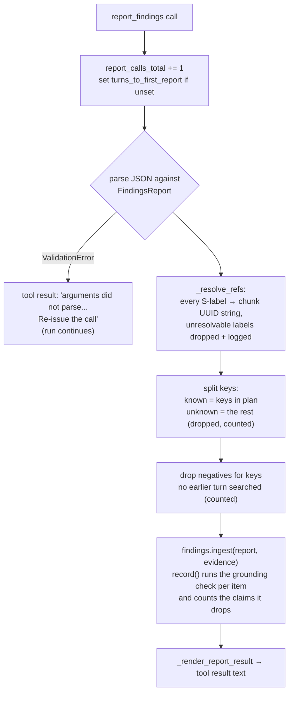

### Grounding rules

After label resolution, every citation is a chunk UUID string. `FindingsLedger.record`
accepts an item only if it is grounded:

| Item | Grounded when |
|---|---|
| `Finding(supported=True)` | at least one `evidence` UUID is in the EvidenceLedger |
| `Finding(supported=False)` | always (a "not in the documents" negative needs no citation; see [stated negatives](#stated-negatives) for the search requirement) |

An item that fails is dropped and counted toward `FindingsLedger.uncited_claim_rate()`
(dropped positive claims ÷ positive claims recorded). It does not overwrite an earlier good
entry for the same key. A positive claim that cites nothing fails the same check, so it
needs no separate filter. Stated negatives always pass and are not claims for the rate.

A contradiction between excerpts is stated in `claim`, with both sides cited in
`evidence`. There is no separate field for contradicting evidence.

This check is the only correctness filter between the tool model and the answer. It is a
membership check:
does the cited chunk exist in this run? Whether the chunk actually says what the claim says
is only checked for numbers, and only as an advisory (see
[section 15](#number-grounding)).

### Injection scan on model-written text

The findings block reaches the answering model outside any `<retrieved_excerpt>` tag, so an
instruction the tool model paraphrased out of an excerpt would arrive unmarked. The ledger
therefore runs `scan_retrieved_chunk`, with the excerpt thresholds, on every free-text string
the model wrote before storing it: `claim`, each figure's `metric` and `fiscal_label`, and
`conclusion`.

| Severity | Finding text (`claim`, figure `metric` / `fiscal_label`) | `conclusion` |
|---|---|---|
| clean | stored unchanged | stored unchanged |
| flag | stored as `[flagged] ` + sanitized text | stored as `[flagged] ` + sanitized text |
| block | the item is dropped; `record` returns `False`, any earlier entry for the key stays | treated as omitted, so the earlier value stays |

A blocked item leaves its key open, and the tool result reports it like an ungrounded one.
Hits are logged as `agent_finding_injection` and counted in `screened()`. The synthesis
prompt tells the answering model that the findings block is data derived from the
excerpts, not instructions, and that `[flagged]` text is usable only where the cited excerpts
confirm it. The scan runs whatever `INJECTION_SCAN_CHUNKS` says: findings text is short, and
the patterns don't occur in financial prose.

### Stated negatives

When the model searched a key and found nothing, it reports:

```json
{"key": "A4", "claim": "The filings do not quantify any FX impact on gross margin.",
 "supported": false, "evidence": [], "confidence": "high"}
```

This is a real entry under `A4`. It closes the key like any other finding. If a later turn
finds real evidence, the new finding overwrites it in place.

A negative cites nothing, so the loop checks the one thing it can: that the key was searched
before the report was written. `_apply_report` drops a negative whose key has no search in
an earlier turn (`aspect_stats[key].searches == 0`, for an aspect and an entity alike). It
counts the drop in `unsearched_negatives`, and the tool result says
`A4 was not recorded as absent — no earlier search covered it. Search first, then report
what the results show.` Because reports fold before the same turn's searches, a negative
written alongside the search that mints its key is refused too. Without this, a model pushed
to cover the plan could close aspects it never looked at, and the user would read "the
filings do not disclose X" as a checked statement.

One negative is written by the loop, not the model. When a search on a seeded entity comes
back `not_found` (section 9), `fold_searches` records
`"No document for <entity> was found in the user's library."` with `supported=false` under
that entity's key, and the turn counts the key as closed. The model can't produce evidence
for a company it has no documents for, so without this the key would stay open and the run
would continue until convergence or the budget stopped it.

The report tool has no free-text gap field. A gap with no key would never close anything,
so the loop would keep searching something the model had given up on, and it couldn't be
retracted, so an answer could state a number and then say the number was never found.
`unresolved` exists only on the served `AgentFindings`, not on the tool's `FindingsReport`:
every line in it is written by the loop and tied to a key.

### What the model reads back

`_render_report_result` builds the tool result from what actually landed:

```text
Recorded A1, A4. A2 was not recorded — its findings cited no chunk from the evidence you
retrieved. Re-report citing chunk labels from a search result, or, if the documents do not
support it, report it with supported: false. 'margin_trend' is not an open key and was not
recorded. Use the key shown in brackets in a search result.
```

Possible parts, in order:

1. `Recorded …` for known keys now addressed
2. `… was not recorded as absent …` for negatives on keys no earlier turn searched
3. `… was not recorded …` for known keys that didn't ground
4. `… is not an open key …` for keys the plan doesn't have
5. `Nothing was recorded — no known key was reported.` if none of the above applies

The result never lists what is still open. It stays in the transcript for the rest of the
run, so an open list there would go stale; the status line, recomputed on every call, is the
only view of coverage.

---

## 13. FindingsLedger: the store of conclusions

`findings.py`. A dictionary of conclusions keyed by plan key, plus the two report-envelope
fields synthesis needs.

The schemas (`src/schemas/agent_findings.py`):

```python
class Figure(BaseModel):
    metric: str                               # as the question names it, e.g. "revenue"
    amount: float                             # as printed, in the document's scale
    unit: Literal["", "K", "M", "B"] | None   # None: scale not stated; never read as millions
    currency: str | None                      # ISO 4217
    period_end: str | None                    # YYYY-MM-DD from the column header, never inferred
    fiscal_label: str | None                  # as printed: "FY2023", "52 weeks ended 30 Sep 2023"

class Finding(BaseModel):
    key: str                                  # plan key, copied from brackets
    claim: str                                # one sentence, one claim
    supported: bool                           # False: searched, and the documents don't say
    evidence: list[str]                       # S-labels; chunk UUIDs once resolved
    confidence: Literal["high", "medium", "low"]
    figures: list[Figure] = []                # numeric answers only; not offered on analytical runs

class FindingsReport(BaseModel):              # report_findings arguments
    findings: tuple[Finding, ...]
    comparison_op: Literal["argmin", "argmax", "list", "none"] | None
    conclusion: str | None

class AgentFindings(FindingsReport):          # what a run serves
    unresolved: tuple[str, ...] = ()          # loop-written, one line per open key
```

`period_end` is copied from the column header, never derived from a year: "bare year → Dec
31" is wrong for every non-calendar fiscal year, and FX uses the date.

```python
_entries:       dict[str, Finding]        # key -> latest finding
_reported:      bool                      # any record/ingest yet?
_comparison_op, _conclusion               # envelope, last write wins (null-safe)
_claims, _uncited                         # positive claims seen / dropped by grounding
_screened:      dict[str, int]            # model-written strings flagged / blocked by the injection scan
```

| Method | What it does |
|---|---|
| `record(key, finding, evidence)` | Injection-scan the finding's text, then insert or overwrite in place, keeping earlier figures (below). Returns `False` without changing anything if the scan blocks the finding or it fails grounding. |
| `ingest(report, evidence)` | Fold a whole report in: update the envelope fields, then `record()` each finding. Never removes anything. A key the report doesn't mention is left alone. |
| `keys()` | The addressed keys; the only coverage input |
| `get(key)` | The finding recorded for a key, or `None` |
| `uncited_claim_rate()` | Dropped positive claims ÷ positive claims recorded |
| `screened()` | `{"flag": n, "block": n}`: model-written strings the injection scan caught |
| `projection(degraded=..., unresolved=...)` | Build `AgentFindings` for synthesis, adding one line per open key |

**Figures accumulate per `(metric, period)`.** "How did Acme's revenue change from FY2022
to FY2023?" needs two numbers under one key. When a supported finding is recorded over a
supported entry, its figures are added to the ones already held, keyed by metric
(case-insensitive) and `period_end` (or `fiscal_label` when there is no date). A restated
figure replaces its own row, a new metric or period adds one, and the earlier evidence is
kept so every figure can still be checked against the excerpt it came from. Claim and
confidence are the latest report's. A negative replaces the entry outright.

**Why never prune.** Reports are incremental. The model reports `A3` once it settles and
never mentions it again. Leaving a key out of a later report carries no information.

### Projection

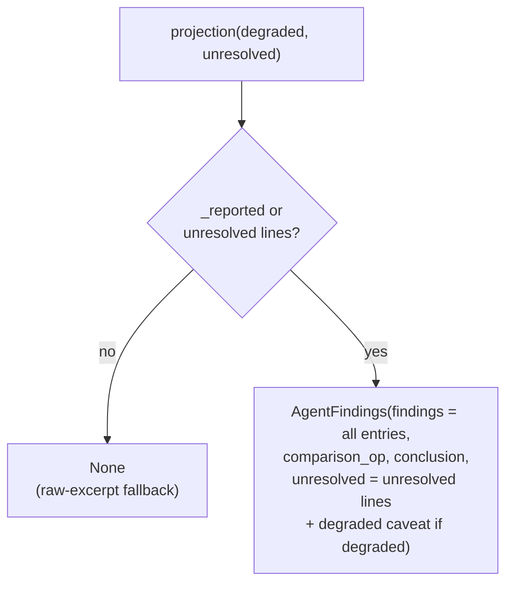

A run where every search failed and nothing was reported still serves the unresolved lines
that say why, instead of falling back to raw excerpts. A report whose findings were all
dropped by grounding still counts as attempted: synthesis gets the empty envelope, not
`None`.

When `degraded=True`, the projection appends: *"The search did not fully converge; these
findings are partial and may be incomplete."*

---

## 14. Why a run stops

```python
ConvergenceReason = Literal[
    "natural", "convergence", "iteration_cap", "budget_cap",
    "timeout", "covered", "search_unavailable", "deadline", "llm_error", "truncated",
]
```

| Reason | Trigger | Typical meaning | `sealed`? |
|---|---|---|---|
| `covered` | Every plan key addressed after a turn | Normal success | yes |
| `natural` | Model returned no tool calls | Model thinks it's done, or ignored the report-only final turn | only if plan is empty |
| `convergence` | No new label shown and nothing closed, `max_empty_rounds + 1` times in a row | Searches keep returning what's already known | only if plan is empty |
| `search_unavailable` | Every search in a turn had `backend_failed` | Retrieval infrastructure is down | only if plan is empty |
| `budget_cap` | Run cost across all models > `AGENT_COST_BUDGET_USD` | Long, expensive run | only if plan is empty |
| `deadline` | The `asyncio.timeout(AGENT_DEADLINE_SECONDS)` around the loop expired and cancelled the turn in flight, or a turn was about to start with no call budget left ([run deadline](#the-run-deadline)) | Slow searches, or earlier turns used up the run | only if plan is empty |
| `timeout` | One tool-model call ran past its budget: `AGENT_TURN_TIMEOUT_CAP_SECONDS`, or less when little run time is left | LLM provider stalled, or a slow call late in the run | only if plan is empty |
| `llm_error` | Every model in the tool-model chain raised a provider error, after something was gathered ([tool-model errors](#tool-model-errors)) | Provider outage or rate limit mid-run | only if plan is empty |
| `truncated` | No tool calls and `finish_reason == "length"` ([token cap](#token-cap)) | Reasoning used the whole completion-token cap | only if plan is empty |
| `iteration_cap` | Loop ran out of iterations (the default value of the field) | Model kept working until the last turn | only if plan is empty |

The budget is in dollars, summed over every tool-model call in the run, fallback models
included (`state.cost_usd_total()`). Each call's `cost_usd` comes from the adapter's pricing in
`models.yaml`: input at the input rate, cached input at the cached rate, and output, reasoning
included, at the output rate. Reasoning is what makes a token budget wrong here: on
gpt-5-mini a turn with 8k input and 4k reasoning spends $0.002 on input and $0.008 on output.
Dollars also track the prompt cache, so a long run whose earlier messages are cached is
charged for what it actually costs. A model with no pricing entry adds $0, so for it only the
iteration cap and the deadline bound the run.

The check runs after each turn, so a run can go over the budget by at most one turn (about
$0.002–0.01 on gpt-5-mini).

### After the loop exits

Whatever the reason, `run_loop` then does two things:

```python
# 1. Summaries for the caller and for Langfuse.
meta = build_meta(state, iterations_run)
lf.update_current_span(metadata={"final_state": snapshot(state)})

# 2. Serve what accumulated, marked degraded if the plan wasn't covered, with one
#    stated limitation per key still open.
findings = state.findings.projection(
    degraded=not state.sealed, unresolved=unresolved_lines(state)
)
return state.evidence, findings, meta
```

`unresolved_lines(state)` writes one line per open key, in plan order:

```python
for key in open_aspects(state):
    stats = state.aspect_stats.get(key)
    if stats is None or stats.searches == 0:
        line = f"Not searched: {state.plan[key]}"
    elif stats.errored == stats.searches:
        line = f"Could not be checked — document search was unavailable: {state.plan[key]}"
    else:
        line = f"Not resolved: {state.plan[key]}"
```

Only a seeded entity can be unsearched; an aspect exists because a search minted it.

It only reads the state. Open keys stay open, so `plan_covered` in `AgentLoopMeta` counts
real findings.

`AspectStats` (`searches`, `errored`, `new_chunks` per key) exists for this choice. A search
that failed or found nothing admits no chunks, so the EvidenceLedger has no trace of it.
`aspect_stats` is the only record that lets the loop say "never searched" or "the search
backend was down" rather than "the documents don't cover this". Telling a user their
documents lack something when the index was just unreachable would be confidently wrong.

The line uses the plan label (the sub-question or the entity name), not the key. `"A2 was
not found"` means nothing to a user.

An entity in a comparison that nobody reported is an open key like any other, so it
reaches the answer as one of these lines. Without that, a two-company comparison would
quietly become a one-company ranking. The answer then marks only that company `N/A` and
keeps the rest (see [partial answers](#partial-answers)).

---

## 15. Synthesis: turning loop output into answer context

`synthesis.py::run_synthesis` converts the loop's output into one `AgentRunResult`:

```python
@dataclass(frozen=True)
class AgentRunResult:
    rag_context: RAGContext              # the excerpts the answering model sees, freshly labelled
    synthesis_context: str               # findings block + "\n\n" + excerpts text
    findings: AgentFindings | None
    processed: ProcessedFindings | None  # figures FX-normalized, ranked, number-checked
    meta: AgentLoopMeta
    findings_block: str | None = None    # the block alone, saved for follow-up questions
```

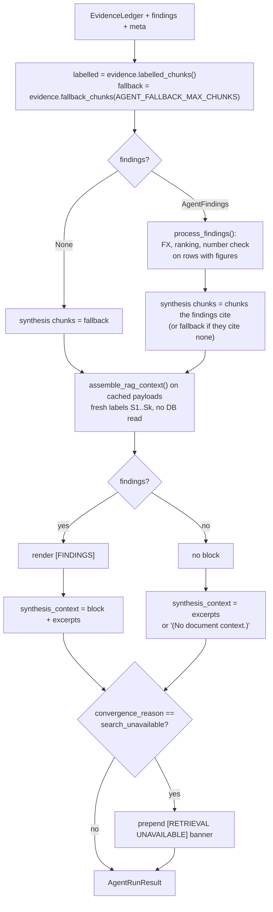

### Step by step

**1. Pick the chunk pools.** `labelled_chunks()` is every chunk the model was shown, best
score first; the [fallback pool](#the-fallback-pool) is up to `AGENT_FALLBACK_MAX_CHUNKS` of
them, picked round-robin across searches. Chunks that were
admitted but never shown (below the top-N cut, or blocked by the injection scan) are in
neither: citing or falling back to text the model never read would let the answer cite text
no reasoning was based on. They also have no cached payload, so they could not be
reassembled anyway.

**2. `process_findings()`.** In `processor.py`. It works on one row per figure of a
supported finding; a run with no figures passes through unchanged and makes no FX call.

- **Target currency.** `requested_currency` from the router if set. Otherwise USD, but only
  when the figures span several currencies **and** the question is `argmin`/`argmax`, in
  which case an `answer_note` discloses the choice. Otherwise no conversion.
- **FX rates.** From `api.frankfurter.dev`. One request per unique `(currency, period_end)`
  pair, run concurrently, 3 s timeout, one retry. A missing or non-ISO `period_end` uses the
  latest rate and the row is marked "approx — date unavailable".
- **FX failure.** For `argmin`/`argmax` the whole comparison is abandoned and the note says
  so. For `list`/`none`, the failed rows stay in their native currency and the note says so.
- **Ranking.** For `argmin`/`argmax`, compares amounts scaled to millions using `unit`, and
  only when every key has exactly one figure; with several metrics or periods per key there
  is no single value to rank, and the note says "not ranked — several figures per entity".
  A figure with no currency or no stated scale is left out of the ranking and named in the
  note.
- `CURRENCY_NORMALIZER_ENABLED=false` turns conversion off.

<a id="number-grounding"></a>**3. Number grounding.** `number_grounding.py` checks whether
each figure's native amount actually appears in the text of its finding's cited excerpts.
Those texts come from `payloads_for` over the cited chunk ids, keyed by `str(UUID)`, so no
DB read. It parses every number in the excerpt (commas, decimals, parentheses for negatives)
and reads it at the nearby scale word ("million", "bn", "k") and at the scale the excerpt
states ("in millions"). The figure's own `unit` stands in only when the excerpt states no
scale, so a wrong unit can't confirm itself. A zero grounds on a nil dash (`| $ - |`, or "$-" in prose). The
match allows 0.5% tolerance, and a figure with no stated unit must appear as printed. The
result is `grounded`, `not_found` or `unverifiable`.

This is advisory only. A `not_found` figure gets
`⚠ UNVERIFIED: value not located in cited excerpt` in the findings block, and the synthesis
prompt tells the answering model to re-read the excerpt before trusting it. Nothing gets
filtered. Enforcing it would bring back the rejection path the design removed, and the
check has false negatives (numbers in charts, numbers in words, European formats). It also
can't tell a right number from a right number in the wrong row or year. See
[number_grounding.md](number_grounding.md) for what it catches and what it misses.

**4. Select evidence.** Keep only the chunks the findings cite. If they cite nothing, use
the [fallback pool](#the-fallback-pool).

**5. Reassemble from cache.** `evidence.payloads_for(...)` returns the sanitized payloads
stored when each chunk was first rendered. No second DB read. `assemble_rag_context` mints a
**new, dense** label set starting at `S1`, ordered by score. See
[section 16](#16-citations-end-to-end) for why the labels change.

**6. Render the block** against the new context, mapping each finding's UUIDs to the new
labels with `RAGContext.ref_for(chunk_id)`. A UUID with no excerpt in the new context is
dropped and counts toward `CITATION_REFS_DROPPED`. Under each finding's figures,
`_change_lines` adds the change between consecutive periods of a metric (plus first to last
for three or more), computed in code, so the answering model copies a change instead of
working one out.

**7. Outage banner.** If the run ended with `search_unavailable`, a `[RETRIEVAL UNAVAILABLE]`
banner goes first. It tells the answering model to say search is temporarily down, and not
to claim the information is missing from the documents.

### The fallback pool

**What it is.** Up to `AGENT_FALLBACK_MAX_CHUNKS` (default 25) of the chunks the tool model
was shown, picked by `EvidenceLedger.fallback_chunks()` round-robin across the run's
searches: every search's first rendered chunk in run order, then every search's second, and
so on. The picked chunks are then sorted by score before relabelling, so `S1` is still the
strongest excerpt (the confidence badge reads `items[0].score`).

The ledger records, for each labelled chunk, which `assign_labels` call labelled it
(`search`, one call per search) and its position in that search's rendered result (`rank`).
Sorting on `(rank, search)` is the round-robin.

Why round-robin by search, not by score:

- **Balance.** A search is one entity and one sub-question, so every entity and every aspect
  gets an excerpt before any gets a second one. A score cut can give all slots to one
  company in a comparison.
- **Comparable ranks only.** Ranks are compared only within one search, which has one query
  and one score scale. Scores from different searches come from different queries, and a
  search whose reranker fell open carries RRF fusion scores (~0.05) instead of
  cross-encoder scores (~0–1), so a global score sort would push those chunks last.

**How big it is.** The cap is a safety net, not a target. Chunks are at most
`CHUNKING_MAX_TOKENS` (900) tokens, so 25 is at most about 22k tokens. Below the cap, which is
most runs, every shown chunk is sent and the order of selection doesn't matter.

**When it is used.** Normally the answering model gets exactly the chunks the findings
cite. The fallback replaces that set only when there is no citation to follow:

| Situation | Why nothing is cited |
|---|---|
| `findings` is `None` | No report was ever attempted and no plan key is open, e.g. the model answered in prose before any keyed search, so `projection()` returns `None`. |
| Findings exist but all are stated negatives | `supported: false` findings cite nothing by design ("the filings do not disclose…"). |
| Findings hold only `unresolved` lines | The run stopped (iteration cap, budget, deadline, convergence) before any report landed, or every positive claim was dropped because none of its refs resolved. Only the "Not resolved: …" lines and the degraded caveat remain. |

A positive finding always cites something: `FindingsLedger.record` drops a
`supported: true` claim whose refs don't resolve. So "cites nothing" never means "a
positive claim with no evidence".

**Why it exists.** Without it, these runs would reach the answering model with no excerpts
at all, even though the agent read relevant text. The answering model could then only
repeat the negatives or the "Not resolved" lines. With the fallback it can say what the
documents do contain near the question, with citations that still work, because the
fallback chunks are reassembled and labelled like any other.

**Why only chunks the model was shown.** Admitted-but-unshown chunks (below the per-search
cut, or blocked by the injection scan) never reached any reasoning step, and they have no
cached payload to reassemble from. Falling back to them would let the answer cite text no
part of the pipeline looked at.

**How it is marked.** The fallback follows the same rule as other degraded paths (a reranker
that falls open, a dead retrieval backend): keep serving, and say so.

- **To the answering model:** `UNCITED_EXCERPTS_NOTICE` goes right before the excerpts
  (after the findings block, if there is one):

  ```text
  [EXCERPTS NOT BACKED BY FINDINGS]
  No finding cites the excerpts below. They are what the search agent read, not conclusions
  it reached. Use only what an excerpt states explicitly, cite it, and do not present it as
  a confirmed finding. A finding marked [not disclosed] still stands.
  ```

- **In Langfuse:** the `agent_loop` span is marked `WARNING` ("synthesis fell back to
  uncited excerpts (no_findings | no_citations)") and gets a `synthesis_fallback` metadata
  entry with the reason, the number of excerpts served and the number the model was shown.

Neither appears when the findings cite at least one chunk, or when there is nothing to fall
back to (the context is then `(No document context.)`).

**What it costs.** No finding vouches for these chunks. The answer is grounded the way a
classic RAG answer is, directly in excerpts, not in claims the agent checked. For an
all-negatives run, the answering model may also read something in them that the agent
judged insufficient, so the block's negatives and the excerpts can pull in different
directions. The notice and the synthesis prompt both settle it toward the block: the prompt
tells the model to treat a `[not disclosed]` finding as a settled negative that answers its
part of the question.

### What the block looks like

One format for every shape. Each finding is a numbered line, its figures indented under it.
Everything after a line's first ` | ` is metadata (citations, FX detail, the grounding
marker), which is what the router's carried-block digest cuts off.

A comparison:

```text
[FINDINGS]
Target currency: USD | Operation: argmax
Answer: Acme Corp (USD 4,210.0M)
FX rates used: EUR->USD@2023-12-31: 1.1050
Note: no target currency specified — compared in USD (findings span EUR, USD)

1. Acme Corp [high confidence] Acme's FY2023 revenue was $4,210M. | evidence: [S1]
   - revenue (FY2023 / 2023-12-31): USD 4,210.0M
2. Globex [high confidence] Globex's FY2023 revenue was €3,500M. | evidence: [S2]
   - revenue (FY2023 / 2023-12-31): USD 3,867.5M | from EUR 3,500.0M | rate: 1.1050
[END FINDINGS]
```

An analytical question. Aspect ids (`A1`, `A4`) are left out: the answering model cited them
as `[A1]` in place of the excerpt refs, which the citation parser can't resolve.

```text
[FINDINGS]

1. [high confidence] Input costs rose 12% YoY in H2 2023, a net $19M headwind. | evidence: [S1] [S2]
2. [not disclosed] The filings do not quantify any FX impact on gross margin.

Conclusion: Margin decline was driven mainly by input cost inflation.
Unresolved: Not resolved: Did pricing actions offset the cost increases?; The search did not fully converge; these findings are partial and may be incomplete.
[END FINDINGS]
```

A finding with figures for two or more periods of one metric gets change lines after them:

```text
1. Acme Corp [high confidence] Acme's revenue rose to $4,210M in FY2023 from $3,980M. | evidence: [S1]
   - revenue (FY2022 / 2022-12-31): USD 3,980.0M
   - revenue (FY2023 / 2023-12-31): USD 4,210.0M
   - change 2022-12-31 → 2023-12-31: up USD 230.0M (+5.8%)
```

A figure with no stated scale renders as `41.2 (scale not stated)`, never as millions, and
gets no change line.

A finding whose company the question named differently gets `(asked as …)` after the entity.
`run_synthesis` takes the map from `DocumentScopeResult.mentions()`:

```text
1. Alcoa Corporation (asked as "PFH") [high confidence] Sales were $12,451M in 2022. | evidence: [S3]
```

Findings are keyed by the company's name, and the question still says "PFH". Before this
label, nothing in the answering model's context linked the two. On a user-picked alias, the
model has no world knowledge to fall back on, so it reported PFH as not found. The prompt
tells it to name both ("PFH (Alcoa Corporation)") and to link a question name to a finding
only through this label. The prompt's own example uses an invented company, because a real
one from the library got copied as a pairing when the label was absent.

### Partial answers

`N/A` applies to one part of the answer, not the whole of it. The answering prompt puts
`N/A` first only when the findings hold nothing the question asks for. When a comparison
has figures for some companies and not others, the answer gives the found ones with
citations, then one `<part>: N/A, not found in the uploaded documents.` line for each
missing one. Before this rule, one missing company of three turned the whole answer into
`N/A` and dropped the two that were found.

---

## 16. Citations end to end

A chunk carries three kinds of identifier over its life. Only one of them is permanent.

| Identifier | Created | Lifetime | Scope |
|---|---|---|---|
| chunk UUID | at ingestion (`chunks.id`, also the Qdrant point id and OpenSearch doc id) | forever | global |
| loop S-label | first time the chunk is rendered in a search result | one agent run | the tool model's transcript |
| synthesis S-label | `run_synthesis` reassembly | one answer | the answering model's context, the UI |

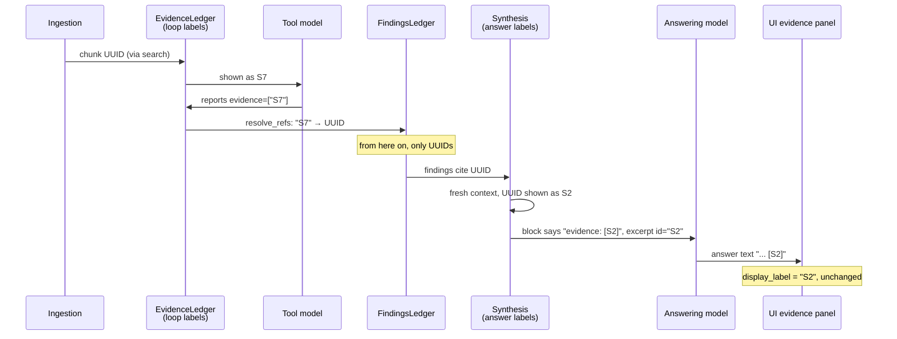

**Label → UUID** happens once, in `_resolve_refs`, before a report touches the ledger. Unknown labels are dropped and logged as `agent_chunk_refs_unresolved`. Every resolved ref is canonical `str(UUID)`, including one the model wrote as a UUID, so finding evidence can be matched against `str(chunk_id)` keys downstream.

**UUID → label** happens once, in `processor._map_refs`, against the fresh synthesis context.

**Why renumber at all?** The findings usually cite a sparse subset of everything retrieved,
say `S3`, `S7` and `S12`. Handing the answering model a dense `S1, S2, S3` is cleaner than a
namespace with holes, and it keeps loop-only labels from leaking into the answer.

**At answer time**, `BracketCitationParser` (`src/services/chat/citation_parser.py`) parses
the streamed answer, strips `[Sn]` markers from the visible text, and emits
`citation_span` events with character offsets. `tasks.py` collects cited labels in order of
first appearance and calls `build_references_list(rag_context, cited_ref_ids)`, which sets
`display_label` to the label itself. If the answer cited nothing, `build_all_references`
lists every excerpt in the context instead. The UI shows exactly those `Sn` labels. There is
no further remapping.

---

## 17. After the agent: answering, persisting, follow-ups

Back in `tasks.py`:

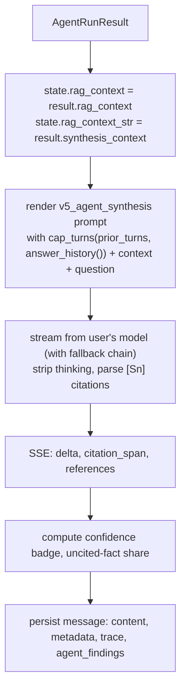

### What gets persisted on the assistant message

| Where | Key | Contents |
|---|---|---|
| `messages.agent_findings` (JSON column) and metadata `agent_findings` | | the served `AgentFindings` (UUID citations). Nothing in the request path reads it back; its readers are the eval and ad-hoc analysis, and rows written before the unified schema keep their old JSON |
| metadata | `agent_findings_sealed` | `meta.sealed` |
| metadata | `retrieved_chunks` | id + score for each chunk in the final context (only the cited ones, not all the loop saw) |
| metadata | `citation_spans`, `references` | parsed citations and evidence-panel entries |
| metadata | `findings_block`, `findings_block_hops`, `findings_block_doc_ids` | saved for follow-ups, only when the run was sealed |
| metadata | `confidence`, `ungrounded_claims`, `degraded_retrieval`, `route` | sent to the UI; `ungrounded_claims` (uncited-fact share above 0) is not shown |
| `trace.guardrails` | | `confidence`, `top_reranker_score`, `num_chunks`, `degraded_retrieval`, `ungrounded_claims`, `uncited_fact_share`, injection signal |
| metadata | `turn_summary` | route, query shape, resolved entities and document count: this turn's line in later turns' [session index](#session-index-router) |
| `trace.agent` | | `iterations`, `tool_calls_total`, `convergence_reason`, `sealed`, FX results, `plan_seeded`, `plan_covered`, `report_calls_total`, `turns_to_first_report`, `unknown_aspect_keys`, `unsearched_negatives`, `uncited_claim_rate`, `search_arg_errors`, `report_parse_failures`, `last_turn_input_tokens` |

Nothing inside the run (`AgentRunState`, ledgers, transcript) is serialized. If a worker dies
mid-loop, Celery's `acks_late` redelivers the task and the loop starts again from scratch.
`CHAT_MAX_ATTEMPTS` (default 2) caps how many times one request is attempted, so a task that
reliably kills its worker doesn't retry forever.

### Follow-up questions without re-searching

A sealed run's findings block is saved on the message. On the next user turn:

1. `tasks.py` finds the most recent assistant message with a saved block and passes it to
   the router as `prior_findings_block`.
2. The router can then choose `direct_answer` for a follow-up such as "show that in EUR" or
   "put it in a table".
3. On that path the block becomes the whole synthesis context, with no excerpts. The
   `v5_agent_synthesis` prompt has a section for this case. It says to answer from the block,
   not to emit `[Sn]` citations (those labels refer to excerpts that aren't present), and to
   say plainly when the block doesn't contain what was asked.

The block is dropped, and the follow-up re-retrieves, when:

- it has been carried more than `FOLLOWUP_MAX_INHERIT_HOPS` times (default 3), or
- the resolved document scope has changed since it was produced.

The answer produced from a carried block is flagged `answer_derived_from_carryover`. When a
later agent run loads history, `agent_history` replaces that answer with a stub, so the
agent never treats restated numbers as evidence. Blocks are capped at 20,000 characters
(`FINDINGS_BLOCK_MAX_CHARS`) so a runaway output can't bloat every later router prompt.

---

## 18. Observability

### Langfuse span tree

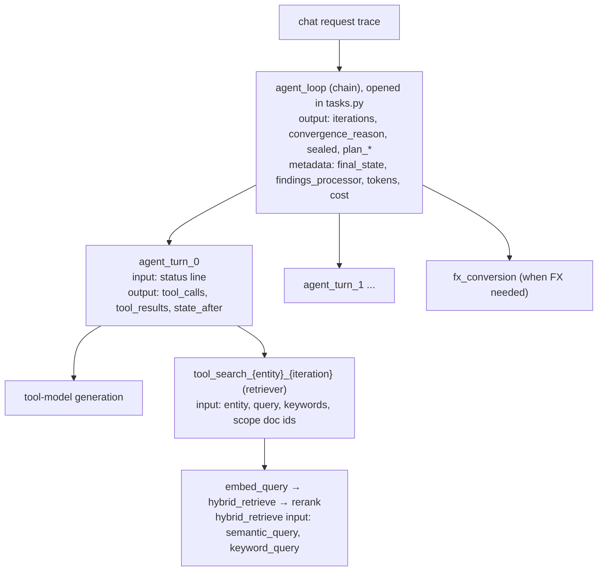

- Each `agent_turn_N` span's **input** is the status line the model saw (coverage before the
  turn). Its **output** has the turn's tool calls, the tool results it appended, and
  `state_after`. You can follow coverage turn by turn without reading raw LLM inputs. Its
  metadata carries the run's spend so far, `token_spend_cumulative` (input tokens) and
  `cost_usd_cumulative` (what the budget checks), and the turn's `new_labels`.
- `final_state` on `agent_loop` is the same view, attached once when the loop exits.
- Both come from one function, `snapshot(state)`: iteration, plan, addressed, open aspects,
  aspect_stats, empty_rounds, `findings` (each recorded key mapped to its finding),
  `findings_screened` (injection-scan flag and block counts), evidence and transcript sizes,
  searched and expected entities. Run-level counters are not repeated
  there; they are on `AgentLoopMeta`, which `tasks.py` puts on the `agent_loop` output.
- Two Langfuse scores per run: `agent_plan_coverage` (`plan_covered / plan_seeded`, only if
  the plan was non-empty) and `agent_uncited_claim_rate`. The request trace also gets
  `uncited_fact_share` (when the answer states a fact and excerpts were shown) and
  `ungrounded_claims`.

The `trace-analysis` Claude skill in this repo pulls a trace from ClickHouse and walks
through these spans turn by turn.

### Prometheus

| Metric | Type | Labels | Meaning |
|---|---|---|---|
| `AGENT_ITERATIONS` | histogram | | turns per run |
| `AGENT_TOOL_CALLS` | counter | `tool`, `status` (`ok`/`error`) | tool calls; no `rejected` status exists |
| `AGENT_TOOL_DURATION` | histogram | `tool` | search latency |
| `AGENT_TOOL_MODEL_DURATION` | histogram | `model`, `turn_kind`, `outcome` | tool-model call latency. `turn_kind` is `search`, `report`, `mixed`, `final`, `none` (prose), or `unknown` for a non-final call that failed before answering. Search and report turns differ 3-5x in latency, so they get separate percentiles |
| `AGENT_TOOL_MODEL_OUTPUT_TOKENS` | counter | `model`, `turn_kind`, `part` (`reasoning`/`visible`) | tool-model output tokens. Reasoning is most of a report turn's latency |
| `LLM_DURATION` | histogram | `model`, `request_type`, `outcome` | LLM call latency. `outcome` is `ok`, `length`, `timeout`, `cancelled` or `error`. Only `agent_tool_call` records the failure outcomes, so calls that never answered still show up in its percentiles |
| `LLM_TOKENS` | counter | `direction`, `model` | tool-model tokens (plus other LLM calls) |
| `LLM_CACHE_HIT_TOKENS`, `LLM_COST` | counter | `model` | cache hits, spend |
| `AGENT_LAST_TURN_INPUT_TOKENS` | histogram | | tool-model input tokens on a run's last call: how large the append-only transcript got |
| `CITATION_REFS_DROPPED` | counter | | finding citations with no excerpt in the synthesis context |

### Database

Each tool-model call writes an `llm_requests` sub-request row (`request_type="agent_tool_call"`)
linked to the parent request, on its own session. A call that answered has tokens and cost,
`status` `completed` or `truncated`, and `request_params` holding `iteration`,
`tool_calls_issued` and `turn_kind`. A call that never answered has `status` `timeout`,
`cancelled` or `failed`, the elapsed `latency_ms`, the error for `failed`, and `budget_s`
in `request_params`. Its tokens are unknown, so the row has none. The parent request is
marked `request_type="chat_agent"`.

### Live UI activity

The loop pushes `activity` events on the request's Redis stream, which the SSE endpoint
forwards to the UI:

- `round_started` per turn (`id="round-N"`, label "Round N+1")
- `tool_call_started` / `tool_call_ended` per search (label = entity, `detail` has chunk
  counts) and per report (label "Recording findings")

`_ended` events refer to the `_started` event's id, so concurrent searches for the same entity
don't get mixed up.

### Reading the instrumentation fields

| Field | Meaning | Healthy looks like |
|---|---|---|
| `plan_seeded` | number of plan items | 3–5 for analytical, = entity count for extraction |
| `plan_covered` | plan items with a grounded finding when the loop stopped | equal to `plan_seeded` |
| `report_calls_total` | report tool calls | > 1 on analytical means incremental reporting is happening |
| `turns_to_first_report` | iteration index of the first report | 1 or 2 |
| `unknown_aspect_keys` | report keys not in the plan | 0; higher means the model isn't copying ids |
| `unsearched_negatives` | stated negatives refused because no earlier turn searched their key | 0; higher means the model is closing aspects it never looked at |
| `uncited_claim_rate` | positive claims dropped by the grounding check ÷ positive claims recorded | 0; counts claims whose citations were missing or didn't resolve, never stated negatives |
| `last_turn_input_tokens` | tool-model input tokens on the run's last call | well under the model's context window; a run nearing it is the cue to build the overflow valve |

---

## 19. Configuration

All read by `get_agent_settings()` in `state.py` on every request (not cached, so env changes
and test overrides apply immediately). Validated by Pydantic.

| Env var | Default | Bound | What it controls |
|---|---|---|---|
| `AGENT_TOOL_MODEL` | `gpt-4o-mini` | must have `tool_calling: true` | Model that runs the loop |
| `AGENT_MAX_ITERATIONS` | 5 | 1–20 | Turn cap, extraction/comparison |
| `AGENT_MAX_ITERATIONS_ANALYTICAL` | 7 | 1–20 | Turn cap, analytical |
| `AGENT_COST_BUDGET_USD` | 0.10 | > 0 | Spend cap for the run, across all models |
| `AGENT_MAX_CONCURRENT_SEARCHES` | 3 | 1–16 | Parallel searches at once |
| `AGENT_MAX_CHUNKS_PER_ENTITY` | 5 | ≥ 1 | Excerpts rendered per search result; synthesis fallback size |
| `AGENT_MAX_EMPTY_ROUNDS` | 1 | ≥ 0 | Consecutive no-progress turns tolerated, both modes |
| `AGENT_DEADLINE_SECONDS` | 180 | > 0 | Whole run |
| `AGENT_TURN_TIMEOUT_CAP_SECONDS` | 120 | > 0 | Ceiling on one tool-model call; the call gets less when the run has less left |
| `AGENT_DEADLINE_RESERVE_SECONDS` | 15 | ≥ 0, < `AGENT_DEADLINE_SECONDS` | Run time no tool-model call is given, so its own timeout fires before the deadline |
| `AGENT_SEARCH_TIMEOUT_SECONDS` | 60 | > 0 | One search (retrieve + rerank) |
| `AGENT_MAX_PLAN_ITEMS` | 6 | ≥ 1 | Max analytical aspects |

History and display settings, read through getters in `src/utils/config.py`:

| Env var | Default | What it controls |
|---|---|---|
| `ROUTER_HISTORY_BUDGET_TOKENS`, `ROUTER_HISTORY_MAX_ANSWER_TOKENS`, `ROUTER_HISTORY_STEP` | 2000, 400, 1 | Router's recent-turn history |
| `ROUTER_SESSION_INDEX_QUESTION_CHARS` | 80 | Question length per session-index line |
| `AGENT_HISTORY_BUDGET_TOKENS`, `AGENT_HISTORY_MAX_ANSWER_TOKENS`, `AGENT_HISTORY_STEP` | 4000, 800, 1 | Tool model's prior-turn history |
| `ANSWER_HISTORY_BUDGET_TOKENS`, `ANSWER_HISTORY_MAX_ANSWER_TOKENS`, `ANSWER_HISTORY_STEP` | 12000, 0 (whole), 5 | Answering model's prior-turn history |
| `AGENT_SHOWN_HEADING_CHARS` | 40 | Heading length in "Already shown above" |

Related settings outside the agent package:

| Env var | Default | Effect |
|---|---|---|
| `CURRENCY_NORMALIZER_ENABLED` | true | FX conversion at synthesis |
| `FOLLOWUP_MAX_INHERIT_HOPS` | 3 | How many follow-ups may reuse one findings block |
| `CHAT_TAIL_MAX_MESSAGES` | 70 | Messages loaded as every model's history source; holds a 30-turn session |
| `VECTOR_SEARCH_TOP_K`, `KEYWORD_SEARCH_TOP_K` | 10 each | Retrieval breadth per search, before fusion and rerank |
| `INJECTION_SCAN_CHUNKS` | true | Injection scan on every excerpt before it is rendered |
| `INJECTION_SCAN_USER_INPUT` | true | Injection scan on the current message and, in `prior_turns`, on every prior question |
| `CHAT_MAX_ATTEMPTS` | 2 | Celery redeliveries of one chat task before it is failed |

---

## 20. Worked example: an analytical question

Query: *"Why did Acme Corp's operating margin decline in FY2023?"*. The router returns
`route="retrieval"`, `query_shape="analytical"`, one entity. Defaults apply: 7 turns,
5 excerpts per search, 6 plan items. This is the conversation's first question, so there
are no prior turns.

### Setup

```text
[system] v6_agent_analytical prompt
[user]   Available document years (use ONLY these in search queries — do not invent fiscal years):
         - Acme Corp: 2023, 2022, 2021

         Question: Why did Acme Corp's operating margin decline in FY2023?
```

`plan = {}`. Both ledgers empty. `render_status` returns `None`, so no status line.

### Turn 0: open three aspects

The model issues three searches in one turn:

```text
search_documents(entity="Acme Corp", query="input cost increases in cost of goods sold H2 2023",
                 keywords="COGS cost of sales raw materials input costs H2 2023",
                 sub_question="Did input costs rise in H2 2023?")
search_documents(entity="Acme Corp", query="pricing pressure and revenue mix 2023",
                 keywords="pricing price increases revenue mix net sales 2023",
                 sub_question="Did pricing actions offset the cost increases?")
search_documents(entity="Acme Corp", query="product mix shift by segment gross margin H2 2023",
                 keywords="product mix segment gross margin H2 2023",
                 sub_question="Did segment mix shift toward lower-margin products?")
```

The loop mints `A1`, `A2`, `A3` and runs the three searches in parallel. Then it folds results
in call order. `A1`'s search returns 3 chunks → `S1–S3`. `A2`'s returns 2 → `S4–S5`. `A3`'s
returns 4 → `S6–S9`.

| | After turn 0 |
|---|---|
| plan | A1, A2, A3 (all open) |
| evidence | 9 chunks, all rendered |
| findings | empty |
| checks | 9 new labels → progress. Continue. |

### Turn 1: follow up, report, open a new thread

The model sees the status `Open: A1 (...), A2 (...), A3 (...)`. It notices A1's result named
"raw material inflation" without a number, and A3's result already gives numbers (hardware
grew from 35% to 41% of revenue).

```text
search_documents(entity="Acme Corp", query="cost bridge reconciling raw material inflation to gross margin H2 2023",
                 keywords="MD&A cost bridge raw material inflation reconciliation H2 2023",
                 sub_question="Did input costs rise in H2 2023?")        # same wording → A1
report_findings(comparison_op=null, conclusion=null, findings=[
    {key: "A3", claim: "Mix shifted toward lower-margin hardware (35% → 41% of revenue).",
     supported: true, evidence: ["S6", "S8"], confidence: "medium"}])
search_documents(entity="Acme Corp", query="foreign exchange impact on gross margin 2023",
                 keywords="foreign exchange currency translation FX gross margin 2023",
                 sub_question="Did FX movements affect gross margin?")    # new → A4
```

Processing:

1. Mint: the first search reuses `A1`. The third mints `A4`.
2. Report folds first: `S6`, `S8` resolve to UUIDs. `A3` is in the plan. It cites evidence,
   grounds, and is recorded.
3. Searches fold: A1 follow-up → `S10–S11`. A4 → `S12`.
4. Tool results appended in call order: search, report, search.

```text
[tool, call_a] [A1] <retrieved_excerpt id="S10" ...>COGS bridge: raw material +$18M, labor +$4M,
               productivity -$3M, net H2 impact $19M (12% YoY)</retrieved_excerpt> <... S11 ...>
[tool, call_b] Recorded A3.
[tool, call_c] [A4] <retrieved_excerpt id="S12" ...>FX translation reduced reported revenue by
               approximately $6M in H2 2023...</retrieved_excerpt>
```

Turn 0's results stay in the transcript as they were, so `S1–S9` are still readable.

| | After turn 1 |
|---|---|
| plan | A1, A2, A3, A4. Addressed: A3. |
| evidence | 12 chunks, all labelled and on screen: S1–S12 |
| findings | A3 |

### Turn 2: a chunk already shown, two more reports

Status line: `Recorded: A3 · Open: A1 (...), A2 (...), A4 (...)`.

```text
search_documents(entity="Acme Corp", query="average selling price realization by product line 2023",
                 keywords="ASP average selling price pricing realization product line 2023",
                 sub_question="Did pricing actions offset the cost increases?")   # A2
report_findings(comparison_op=null, findings=[
    {key: "A1", claim: "Input costs rose 12% YoY in H2 2023, a net $19M headwind.",
     evidence: ["S10", "S11"], confidence: "high", ...},
    {key: "A4", claim: "FX translation cut reported revenue by about $6M in H2 2023.",
     evidence: ["S12"], confidence: "medium", ...}],
  conclusion="Margin fell mainly on input-cost inflation, plus a mix shift and a small FX headwind.")
```

The A2 search returns two chunks. One is the chunk labelled `S6` in turn 0, still on screen.
It isn't rendered again; the result names it with its heading. The other chunk is new and
gets `S13`.

```text
[tool] [A2] <retrieved_excerpt id="S13" ...>Average realized price by product line: Hardware +1.2%,
       Software +4.8%...</retrieved_excerpt>

       Already shown above: S6 Segment Results
[tool] Recorded A1, A4.
```

One new label was shown, so the turn counts as progress. A2 is still open, so the run
continues.

### Turn 3: the last aspect closes

```text
report_findings(comparison_op=null, conclusion=null, findings=[
    {key: "A2", claim: "Pricing only partly offset costs: software prices rose 4.8% but
     hardware, the larger segment, rose 1.2%.", evidence: ["S13"], confidence: "medium", ...}])
```

No searches this turn. `A2` grounds. Every plan key is addressed, so `Stop("covered")`.

### Result

| Field | Value | Why |
|---|---|---|
| `iterations` | 4 | turns 0–3 |
| `tool_calls_total` | 9 | 3 + 3 + 2 + 1 (6 searches, 3 reports) |
| `convergence_reason` | `covered` | |
| `sealed` | true | |
| `plan_seeded` / `plan_covered` | 4 / 4 | |
| `report_calls_total` | 3 | |
| `turns_to_first_report` | 1 | first report was in iteration 1 |
| `unknown_aspect_keys` | 0 | |
| `unsearched_negatives` | 0 | |
| `uncited_claim_rate` | 0.0 | nothing dropped |
| evidence size | 13 chunks | S6 was re-returned, not re-admitted or re-rendered |

No aspect is open, so the projection gets no unresolved lines and is not degraded.

Synthesis narrows 13 chunks to the six the findings cite (the chunks behind S6, S8, S10, S11,
S12, S13). It relabels them `S1–S6` in score order, renders the `[FINDINGS]` block with the
new labels, and appends the six excerpts. `S1–S5`, `S7` and `S9` from the loop never
reach the answering model. `retrieved_chunks` in the persisted metadata lists those six
chunks.

### Variation: what if A2 never settled?

Suppose the model hit the 7-turn cap with A2 still open. The last turn would have allowed
only the report tool and carried a final-turn notice. After the loop:

- `plan_covered = 3`
- A2's `aspect_stats` show 2 searches, 0 errors, so its unresolved line is
  `"Not resolved: Did pricing actions offset the cost increases?"`
- `sealed = False`, so the projection adds the "did not fully converge" caveat
- the findings block is **not** saved for follow-ups

If instead every A2 search had failed with `backend_failed`, the gap would read
`"Could not be checked — document search was unavailable: ..."`.

---

## 21. Worked example: a comparison question

Query: *"Which had higher revenue in FY2023, Acme Corp or Globex?"*.
`query_shape="comparison"`, two entities in scope.

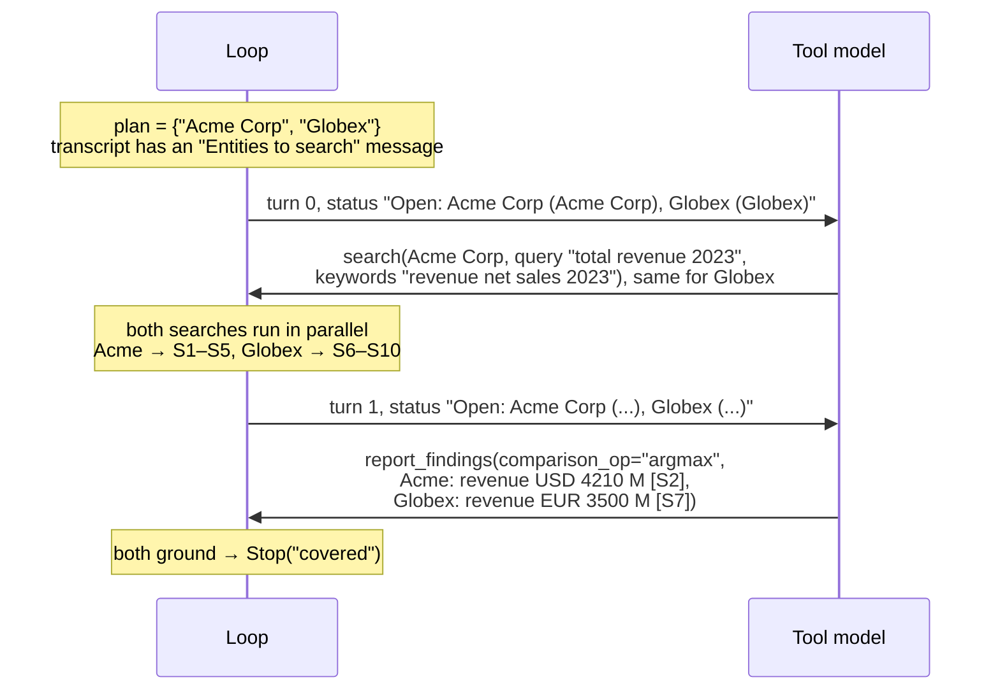

Each search result came back prefixed with its entity key (`[Acme Corp] …`, `[Globex] …`),
and each finding carries one `Figure(metric="revenue", amount=…, unit="M", currency=…,
period_end="2023-12-31", fiscal_label="FY2023")`.

Synthesis then:

1. `process_findings`: currencies are USD and EUR, no requested currency, `argmax` → target
   USD with a note. One FX call for `EUR→USD@2023-12-31`. Each key has one figure, so it
   ranks by amount in millions.
2. Number grounding looks for `4210` in `S2`'s text and `3500` in `S7`'s text, read at the
   scale each excerpt states, or at unit `M` if it states none.
3. Relabels the two cited chunks to `S1`, `S2` and renders the `[FINDINGS]` block shown in
   [section 15](#what-the-block-looks-like).

If Globex's report had cited only a label that didn't resolve, the `Globex` finding would
fail grounding, the plan would stay open, and the model would be told so. If the run then
ended without a fix, the block would carry `Unresolved: Not resolved: Globex`, ranking would
have only Acme's figure to work with, and the answer would say Globex's revenue wasn't
found rather than naming Acme the winner of a one-company contest.

Had the question been *"How did Acme's revenue change from FY2022 to FY2023?"*, the single
finding for `Acme Corp` would carry two figures, one per `period_end`, and a second report
restating either year would replace only that year's row. The block would list a change line
under the two figures, and the answering model would copy it.

---

## 22. Failure modes and how they surface

| What goes wrong | What the loop does | What the user sees |
|---|---|---|
| Model cites a label that doesn't exist | Drops it (`agent_chunk_refs_unresolved` log). If nothing else grounds the finding, the key stays open and the model is told. | Nothing, if the model recovers; otherwise an unresolved line |
| Model reports a key not in the plan | Drops the item, counts `unknown_aspect_keys`, tells the model to use the bracketed id | Nothing, if the model recovers |
| Model states a negative for a key it never searched | Drops the item, counts `unsearched_negatives`, tells the model to search first | Nothing, if the model recovers; otherwise an unresolved line |
| Model claims support but cites nothing | `record` drops it and counts it in `uncited_claim_rate()` | Nothing; key stays open |
| Report JSON doesn't match the schema | Tool result asks for a re-issue; run continues | Nothing, if the model recovers |
| Search args malformed | Error tool result; no backend failure recorded | Nothing, if the model recovers |
| One retrieval backend down | Search still returns results; capability added to `degraded_capabilities` | Degraded-retrieval badge |
| All retrieval backends down | `backend_failed`; if every search in a turn fails, `Stop("search_unavailable")` | Banner-driven "search is temporarily unavailable" answer; "could not be checked" gaps |
| Reranker skipped | `scores_are_rerank = False` | Confidence badge computed on the fusion-score scale |
| Tool-model call hangs | `Stop("timeout")` once the call's budget runs out (at most `AGENT_TURN_TIMEOUT_CAP_SECONDS`) | Partial findings, marked degraded if the plan was open |
| Tool model spends its token cap on reasoning | No tool calls and `finish_reason == "length"`, `Stop("truncated")` | Same as above |
| Tool model returns a provider error | Same turn retried on the fallback model; if the whole chain fails, `Stop("llm_error")` | Nothing if the fallback answers; otherwise partial findings, marked degraded. A failure before anything was gathered fails the request |
| Everything slow | The next turn has no call budget left, or the run deadline cancels a search in flight; stop reason `deadline` | Same as above |
| Excerpt contains an injection attempt | Blocked chunks never rendered; flagged ones rendered with `flagged="true"` | Answering model told to be sceptical of flagged excerpts |
| Prior user turn was a blocked injection | `prior_turns` drops it with its answer, for every model | Nothing |
| Tool model writes an injected instruction into a finding | Blocked text drops the item (key stays open); flagged text is stored behind `[flagged]` | Answering model told to use flagged findings text only where excerpts confirm it |
| FX API down | Comparison abandoned with a note, or failed rows left unconverted | Native values plus an explanation |
| Reported number not in cited excerpt | Figure marked `⚠ UNVERIFIED`; change lines computed from it carry the marker too | Answering model re-checks; may decline to state the number |
| Reported number is a real number from the wrong row or year | Nothing; the figure check matches anywhere in the excerpt | The wrong number, cited |
| Answering model would work out a change or trend | Change lines give it the change, computed in code | The copied change, if the model follows the prompt |
| Answer states a fact without a citation marker | Counted in `uncited_fact_share` | Nothing |
| Document states no scale for a number | `unit: null`; left out of ranking | The number as printed, never assumed to be millions |
| Worker process dies | Celery redelivers; loop starts over | Longer wait |

---

## 23. Design decisions and the reasons behind them

**No terminal tool.** The previous design ended a run when the model called a "finalize"
tool, and a gate module could reject that call and force a retry. Rejection needed retry
budgets, stubbed tool results and forced restatements, and a forced restatement could
silently drop a finding established earlier. Letting the loop decide based on plan coverage
removes all of that. Nothing is ever rejected, so nothing needs to be retried.

**Reports are incremental.** A model that reports each aspect as soon as it settles frees
later turns for the aspects still open. The prompts push for it, and `report_calls_total`
measures whether it happens.

**Ids are minted by the loop.** Discussed in [section 7](#7-the-plan-how-the-loop-knows-when-it-is-done).
Small models are bad at repeating their own free-text labels exactly.

**Only findings close keys.** An open key at the end of the run is rendered as a line at
projection, never written back into the state. Closing a key any other way could end the
run as "covered" with nothing to show for that aspect, and would make coverage depend on
when you read it.

**Stated negatives are findings, not gaps.** They close their aspect and can be overwritten
by later evidence. Free-text gaps did neither. They are accepted only for a key an earlier
turn searched, since a negative has no citation to check.

**Status is computed, not stored.** Recomputed on every call, it can't go stale, doesn't pile
up across turns, and doesn't change earlier messages (which keeps the provider's prompt
cache valid).

**Append-only transcript.** No earlier message is rewritten and nothing is evicted. Every
label the model can cite stays readable, the prompt cache holds across turns, and each chunk
is rendered once per run. The USD budget and the iteration cap bound the run instead.

**Progress is what the model can read.** A turn counts as progress only if it showed a new
label or closed a key, never because it admitted a chunk the model wasn't shown.

**One history function for every model.** All three models' conversation history comes
from `prior_turns`, so the injection scan, the blocked-turn rule and Contract F1 can't be
skipped by one consumer. Each model only chooses its own budget.

**Admit everything, render a few.** The record keeps provenance for every chunk. The model
reads at most five per search.

**The tool model writes its own search queries.** The previous design sent every extraction
search through a second, cheaper model that rewrote the query into a semantic query and a
keyword query. That model saw the query string and the entity's document years. The tool
model also has the conversation and every excerpt from earlier turns. On analytical searches
the rewrite blurred specific causal terms into generic finance words. Where it did run, it
added one LLM call per search, on the critical path. Asking the tool model for `query` and
`keywords` in the same call keeps a separate BM25 query at no extra cost. The prompts carry
what the rewriter used to add: filing vocabulary instead of question vocabulary, filing
synonyms in `keywords`, no company name.

**Grounding is a membership check, number grounding is advisory.** A hard "does the excerpt
really say this?" filter would bring back rejection, and the deterministic number check has
false negatives. So it annotates, and the answering model decides.

**Changes come from code.** The answering model copies a change line's direction word and
amount instead of comparing figures itself, which is where it went wrong before.

**One entry point for production and eval.** They used to have separate copies of the
synthesis sequence, and the copies drifted.

**One findings schema, shapes differ only in config.** Extraction and analytical runs
parse, store, check and render findings the same way. What legitimately differs (search
arguments, whether the report tool offers `figures`, plan seeding, turn cap, prompt) is one
`ShapeConfig`. The analytical report schema is a copy of the extraction one with `figures`
removed, not a second class. A
multi-period, multi-metric or yes/no answer fits the one `Finding` without a third fork, and
a misrouted question lands in the same schema either way.

**Prompt and tool pool chosen together, and the pool is enforced.** Both come from the same
`ShapeConfig`, and dispatch answers any call outside the turn's pool as unavailable.

---

## 24. Known quirks

| Location | Does | Effect |
|---|---|---|
| `context/turns.py`, `Turn.index` | counts positions in the loaded tail | Past 35 turns the tail slides, so the answering model's stepped window can move on every turn |

---

## 25. Quick reference

| Question | Where to look |
|---|---|
| Does this request use the agent? | `tasks.py`, `route == "retrieval" and llm_request.user_id is not None`, and no clarification card or too-broad exit |
| Which documents and companies are in scope? | [scope_resolution.md](scope_resolution.md), `router/scope_resolver.py::resolve_scope` |
| Which prompt, tools and per-shape behaviour? | `state.py::shape_config` |
| What a finding looks like | `src/schemas/agent_findings.py` |
| Budgets and limits | `state.py::AgentSettings` |
| How a search is executed | `loop.py::_execute_search` |
| How S-labels are allocated | `evidence.py::EvidenceLedger.assign_labels` |
| Why a search result says "Already shown above" | `loop.py::fold_searches`, `evidence.py::EvidenceLedger.shown_before` |
| When the run stops | `loop.py::decide`, `run_loop` |
| Why a report didn't record everything | `loop.py::_apply_report`, `findings.py::FindingsLedger.record` |
| What's recorded so far | `findings.py::FindingsLedger` |
| How unresolved lines get their text | `state.py::unresolved_lines` |
| What the answering model gets | `synthesis.py::run_synthesis` |
| FX and ranking | `processor.py::process_findings` |
| The "UNVERIFIED" marker | `number_grounding.py::verify_value`, `processor.py::_render_figure` |
| Change lines in the findings block | `processor.py::_change_lines`, `_render_change` |
| Why a finding says "(asked as …)" | `scope_resolver.py::resolve_scope` (`mentioned_as`), `DocumentScopeResult.mentions`, `processor.py::_render_findings_block` |
| The uncited-fact share | `confidence.py::uncited_fact_share`, called from `tasks.py` |
| Label ↔ UUID | `loop.py::_resolve_refs`, `processor.py::_map_refs`, `RAGContext.ref_for` |
| Follow-up reuse of findings | `tasks.py::_latest_findings_block`, `loop.py::agent_history` |
| What prior conversation each model sees | `context/turns.py::prior_turns`, `cap_turns`, and `router_history()` / `tool_model_history()` / `answer_history()` |
| What's persisted | `tasks.py`, the `citation_meta` / `trace_payload` block |
| Debugging a single run | Langfuse `agent_loop` span, or the `trace-analysis` skill |

### Tests

| Area | File in `tests/unit/` |
|---|---|
| Loop end to end with fakes | `test_agent_loop_smoke.py` |
| Run state, status, snapshots | `test_agent_state.py` |
| Search/report folds and the stop decision | `test_agent_turn_folds.py` |
| Tool schemas | `test_agent_tools.py` |
| EvidenceLedger, render cap, already-shown names | `test_evidence.py`, `test_evidence_cap.py` |
| FindingsLedger, grounding | `test_findings.py` |
| Append-only transcript | `test_transcript.py` |
| Prior turns, budgets, stepped window, session index | `test_turns.py` |
| Synthesis boundary | `test_agent_synthesis.py`, `test_findings_block_isolation.py` |
| FX, rendering and change lines | `test_findings_processor.py` |
| Number grounding | `test_number_grounding.py` |
| Uncited-fact share | `test_confidence.py` |
| Follow-up carryover | `test_followup_hop_cap.py`, `test_router_findings_digest.py` |

`run_loop` takes an `execute_search=` keyword argument, so tests can swap in a fake search
function without touching retrieval.
