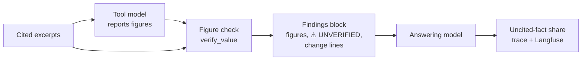

# Number grounding

How the agent path ties the numbers in an answer to the documents: what it checks, what it
computes for the answering model, and what it measures after the answer is written. The code
lives in `src/services/chat/agent/number_grounding.py`, `src/services/chat/agent/processor.py`
and `src/services/chat/confidence.py`. Everything here was checked against that code as of
2026-10-07. If the code and this doc disagree, the code wins, so fix the doc.

It assumes you know the findings block and the synthesis step from
[agent_design.md](agent_design.md#15-synthesis-turning-loop-output-into-answer-context).

## Contents

1. [The short version](#1-the-short-version)
2. [Checking a figure against its excerpts](#2-checking-a-figure-against-its-excerpts)
3. [Change lines](#3-change-lines)
4. [Uncited-fact share](#4-uncited-fact-share)
5. [What it catches and what it doesn't](#5-what-it-catches-and-what-it-doesnt)
6. [Design decisions](#6-design-decisions)
7. [Next steps](#7-next-steps)
8. [Quick reference](#8-quick-reference)

---

## 1. The short version

A number reaches the answer in two hops. The tool model reads an excerpt and reports the
number as a figure in a finding. The answering model reads the findings block and writes the
figure into prose. Either hop can go wrong. Three mechanisms cover them:

| Mechanism | Hop | What it does | Effect |
|---|---|---|---|
| Figure check | excerpt → finding | Looks for each figure's amount in its cited excerpts and marks a miss `⚠ UNVERIFIED` | Changes what the answering model reads |
| Change lines | finding → answer | Computes the change between periods in code and lists it under the figures | Changes what the answering model reads |
| Uncited-fact share | the answer | Counts fact sentences that carry no citation marker | Trace and Langfuse only |



None of them blocks or rewrites anything. The first two only change the answering model's
input, so they work as well as `gpt-4o-mini` follows the synthesis prompt. The third is a
metric nobody sees in the UI.

The main limit: the figure check asks whether a number appears somewhere in the cited
excerpt, not whether it belongs to the right row, column, period or entity. A real number
under the wrong label passes. Nothing checks the answer's numbers against the findings block
either.

---

## 2. Checking a figure against its excerpts

`process_findings` calls `verify_value(amount, unit, texts)` for every figure of a supported
finding. `texts` are the prompt texts (chunk text plus heading trail) of the excerpts the
finding cites, taken from `EvidenceLedger.payloads_for`, so there is no DB read. The check
uses the native amount, never the FX-converted one, because the excerpt states what the
filing states.

For each text, in order:

1. **Nil dashes.** A zero grounds if the text has a table cell holding only a dash, optionally
   after a currency sign (`| $ - |`), or a currency sign and a dash with no digit after it in
   prose ("$68 million, $82 million and $-, respectively"). In US GAAP filings a dash means
   nil. A markdown separator (`|---|`) and a negative amount (`$-5`) don't count.
2. **The text's scale.** The first `in thousands`, `in millions` or `in billions` in the
   text. Only when the text states none does the figure's own unit stand in, so a wrong unit
   can't confirm itself against a table that states its scale.
3. **Every number in the text** is parsed: thousands commas, decimals, parentheses for
   negatives. Each one is tried as printed, at a scale word within 20 characters after it
   ("4.2 billion", "68 m"), and at the text's scale.
4. **A match** is within 0.5%, sign ignored. Filings print a loss as `(1,723)` or as
   "net loss of 1,723", so checking the sign would raise false alarms.

| Result | When | In the findings block |
|---|---|---|
| `grounded` | some number matches | nothing |
| `not_found` | no number matches | `⚠ UNVERIFIED: value not located in cited excerpt` after the figure |
| `unverifiable` | no amount, or no cited text | nothing |

On a chunk reading `(in millions) … | Collaboration revenue | $ 68 | $ 82 | $ - |`, the
figures 68 M, 82 M and 0 M are grounded and 68 B is not found.

The marker is advisory. The synthesis prompt tells the answering model to look for the
number in the excerpts itself. If it finds the number in another format, it uses it and
ignores the marker. If it doesn't, it must not state the value as fact. Whether the model
follows this hasn't been measured.

Formats it doesn't read: numbers written in words, numbers inside charts, space thousands
(`6 976`) and comma decimals (`1.234,5`). Each gives a false `UNVERIFIED`. The last two
appear in under 1% of chunks.

---

## 3. Change lines

Under each finding's figures, `_change_lines` adds one line for every change between periods
of the same metric:

```text
1. Aurora Innovation [high confidence] Collaboration revenue was $68M in 2022, $82M in 2021 and nil in 2020. | evidence: [S1]
   - Collaboration revenue (FY2020 / 2020-12-31): USD 0.0M
   - Collaboration revenue (FY2021 / 2021-12-31): USD 82.0M
   - Collaboration revenue (FY2022 / 2022-12-31): USD 68.0M
   - change 2020-12-31 → 2021-12-31: up USD 82.0M (% change n/m)
   - change 2021-12-31 → 2022-12-31: down USD 14.0M (-17.1%)
   - change 2020-12-31 → 2022-12-31: up USD 68.0M (% change n/m)
```

Without these lines the answering model worked out changes itself. On this exact series it
wrote "a decline over the past three years". The synthesis prompt now says to use the change
lines for any change, growth rate or trend, to take the direction from the line's word, and
never to compute a change itself.

How a line is built:

- **Grouping.** Figures of one finding with the same metric name (trimmed, case-insensitive)
  and currency, sorted by `period_end`.
- **Pairs.** Each consecutive pair, plus first to last when there are three or more periods.
- **Amount.** Native amounts compared in millions and shown in the finer of the two units,
  so 82M against 0.068B reads "down USD 14.0M". FX rates don't move it.
- **Direction.** `up`, `down`, or `unchanged` when the change rounds to 0.0.
- **Percentage.** Only for figures with a currency. For a margin or a ratio a relative change
  would be misread as percentage points, so those show the difference alone (`up 0.9`).
  `% change n/m` means the base was zero or negative.
- **Marker.** `⚠ UNVERIFIED: computed from an unverified figure` when either figure failed
  the check.

When there is no change line:

| Case | Why |
|---|---|
| A figure has no ISO `period_end` | It can't be ordered |
| A figure has no stated scale | It can't be compared |
| Two figures of a metric share a `period_end` | A 10-Q's "three months ended" and "nine months ended" end on the same date, and without the duration there is no safe pairing. The whole metric gets no lines |
| The periods are in different findings | Common in analytical runs, where each aspect is its own finding |

Gaps:

- An annual and a quarterly figure with different end dates are paired anyway. `Figure` has
  no period-length field to tell them apart.
- For a change no line covers, the prompt lets the model compute it and state both figures.
  That arithmetic is unchecked.
- This only works if the model copies the line. There is no eval of that yet.
- No finding, no change lines. When the loop ends without recording one (a tool-model
  timeout, for example), the answering model reads raw excerpts and works out the trend
  itself again.

---

## 4. Uncited-fact share

`uncited_fact_share(text, spans)` runs in `tasks.py` after the answer has streamed. It returns
the share of fact-bearing sentences with no citation marker after them in their block, or
`None` when the answer states no fact. It is skipped when no excerpts were shown: on a
carried-over findings block the prompt forbids citations.

- **Sentence.** Ends at `.`, `!` or `?` before whitespace, or at a line break. `$4.2` and
  `15.5%` stay whole. "vs.", "e.g." and "i.e." don't end a sentence; "Inc." does.
- **Fact.** Money, a percentage, a decimal, or a number of three or more digits. A year on
  its own isn't one. Headings and lead-in lines ending in ":" are skipped.
- **Block.** A prose paragraph is one block; each list item and table row is its own. A
  marker covers the sentences before it in the same block. One `[S1]` closing a paragraph
  covers the paragraph, but one `[S1]` at the end of a list leaves every earlier item
  uncited.

It goes to `trace.guardrails.uncited_fact_share` and a Langfuse `NUMERIC` score of the same
name. `ungrounded_claims` (share above 0) goes into the message metadata, the SSE `metadata`
event and a `BOOLEAN` score. The UI receives `ungrounded_claims` but doesn't show it.

This measures citation compliance: whether the model put a marker where the prompt asks for
one. It doesn't check that the cited excerpt says what the sentence says. On recent traffic
it flagged 9 of 83 answers that state a fact (median 0, 90th percentile 0.11), measured
while a year before a comma ("In 2020,") still counted as a fact, so the true rate is lower. Of the numbers in
cited sentences, 71% appear in the cited excerpt, 10% appear only in a different excerpt
(probably a wrong citation) and 19% appear in no excerpt. All of them count as cited. A low
share doesn't mean the numbers are right.

---

## 5. What it catches and what it doesn't

| Error | Example | Figure check | Change lines | Uncited-fact share |
|---|---|---|---|---|
| Invented or misread amount in a finding | 3,600 for a 3,867.5 cell | 95–97% caught | No | No |
| Wrong scale in a finding | 68 B for `$ 68` in a millions table | 97% caught when the excerpt states its scale, which about a quarter of numeric tables do; never otherwise | No | No |
| Right number, wrong label | the 2021 value given as 2022, or another row's value | Not caught | No | No |
| Wrong direction word | "declined" for nil → 82 → 68 | No | Prevents it, if the model copies the line | No |
| Change computed wrong | −12% where the line says −17.1% | No | Prevents it, for periods in one finding | No |
| Answer miscopies a finding's figure | finding says 68.0M, answer says 86M | No | No | No |
| Fact sentence without a citation | three figures, one `[S1]` at the end of the list | No | No | Flagged |
| Citation to the wrong excerpt | `[S2]` on a number only S5 states | No | No | No |
| Unsupported qualitative claim | "the filings disclose no acquisitions" | No | No | No |

The catch rates come from errors injected into real cells of 1,321 table chunks.

Known looseness: a number matches anywhere in the cited excerpt, and a zero matches any nil dash
in it (about 40% of table chunks have a dash cell). Known false alarms: the formats listed in
[section 2](#2-checking-a-figure-against-its-excerpts).

---

## 6. Design decisions

**Advisory, not a filter.** The figure check has false negatives, so dropping a figure on a
miss would drop correct ones. It also would bring back the rejection path the agent design
removed. The marker hands the decision to the answering model, which can read the excerpt.

**The excerpt's scale beats the finding's.** If the finding's unit were always tried, a
wrong unit would confirm itself: 68 B matched `$ 68` because "B" was one of the scales
tried.

**Changes come from code, as words.** The answering model copies a word like `down` more
reliably than it reads a sign or compares two numbers. This is the small version of a wider
rule in financial QA: the model chooses what to say, code produces the numbers.

**Skip rather than guess.** A metric with two figures on one date, or a figure without a
scale, gets no change line. A missing line lets the model fall back to the figures; a wrong
line would be copied.

**No check on the answer's numbers.** A check that matched every number in the answer
against the excerpts and the findings block was built and dropped. It flagged 43% of
answers, and at least 70% of its flags were correct numbers: values from tables that state
no scale, and arithmetic the answer showed. Change lines remove the reason for most of that
arithmetic instead.

**The uncited share is a metric, not the badge.** The confidence badge reports retrieval
strength. Citation compliance is a different question, and its value isn't known well enough
to show users.

---

## 7. Next steps

- **Table scale at ingestion.** Only about 1,000 of 4,561 table chunks state a scale in the
  text the check reads. A per-document default won't work, since 14 of 35 documents state
  more than one scale. Carrying each table's scale from its caption into the chunk would
  extend the wrong-scale check and help the tool model read the scale right.
- **Cell-level check.** Ingestion stores `docling.json` per document with every table's cell
  grid, and table chunks keep `doc_item_refs` into it. Matching a figure's metric to a row
  label and its period to a column header would catch wrong-label errors, which no string
  match can.
- **Measure first.** The eval should count numeric errors by kind (wrong label, wrong scale,
  miscomputed, wrong direction). It isn't known yet which of them is common.

---

## 8. Quick reference

| Question | Where to look |
|---|---|
| How a figure is checked | `number_grounding.py::verify_value` |
| Where the check is called | `processor.py::process_findings` (texts from `synthesis.py::run_synthesis`) |
| The `UNVERIFIED` marker on a figure | `processor.py::_render_figure` |
| How change lines are built | `processor.py::_change_lines`, `_render_change` |
| How the answering model is told to use them | `prompts/system_v5_agent_synthesis.yaml`, "Figures" |
| The uncited-fact share | `confidence.py::uncited_fact_share`, called from `tasks.py` |
| Where the share is recorded | `tasks.py`, `trace.guardrails` and the Langfuse scores |

### Tests

| Area | File in `tests/unit/` |
|---|---|
| Figure check: scale, nil cells, formats | `test_number_grounding.py` |
| Change lines and the findings block | `test_findings_processor.py` |
| Uncited-fact share | `test_confidence.py` |
