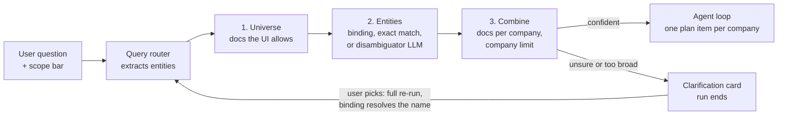
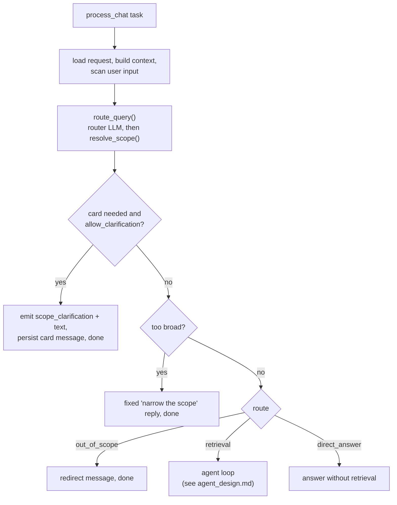
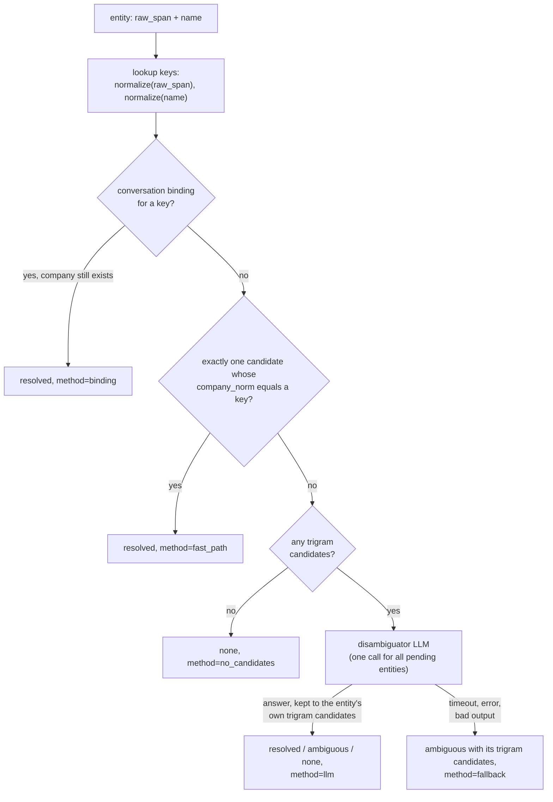
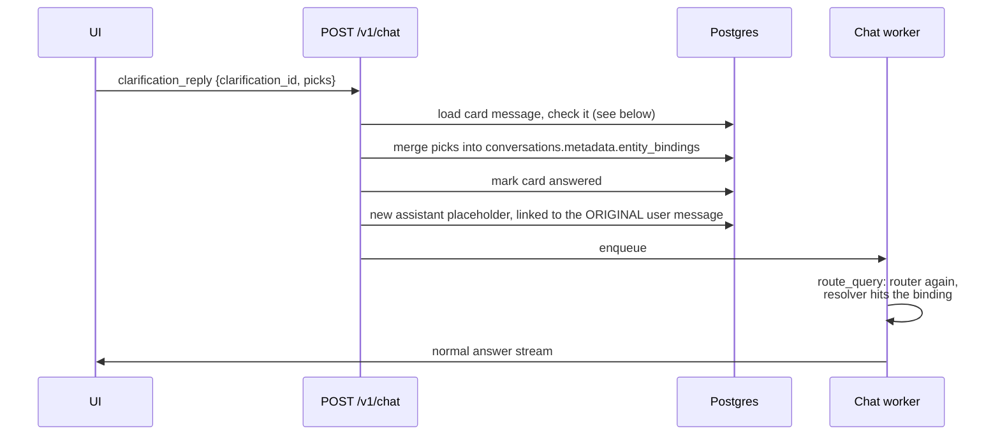
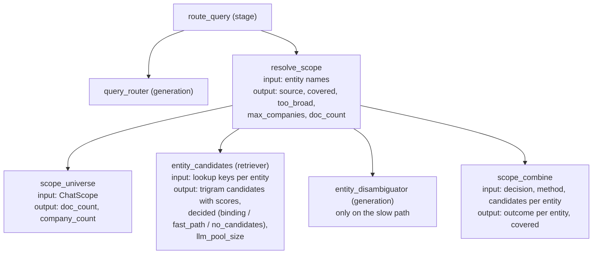

# Scope resolution

How a chat question gets narrowed to the right documents before the agent runs: which
companies the question names, which of the user's documents belong to them, and what
happens when the system can't tell. The code lives in `src/services/router/`, with the
clarification card spread across the chat worker, the chat API and the UI. Everything here
was checked against that code as of 2026-10-07. If the code and this doc disagree, the code
wins, so fix the doc.

Read sections 1 to 4 first. They set up the vocabulary. Sections 5 to 9 walk through the
three steps and the card in pipeline order, and section 13 follows one question through all
of it. The rest is reference.

## Contents

1. [The short version](#1-the-short-version)
2. [Where it sits in the chat pipeline](#2-where-it-sits-in-the-chat-pipeline)
3. [The files](#3-the-files)
4. [What a company is](#4-what-a-company-is)
5. [Step 1: the universe](#5-step-1-the-universe)
6. [Step 2: resolving entities](#6-step-2-resolving-entities)
7. [Step 3: combining entities with the universe](#7-step-3-combining-entities-with-the-universe)
8. [The clarification card](#8-the-clarification-card)
9. [Answering a card](#9-answering-a-card)
10. [With clarification off: eval and API clients](#10-with-clarification-off-eval-and-api-clients)
11. [Observability](#11-observability)
12. [Configuration](#12-configuration)
13. [Worked example: "aurora's revenue"](#13-worked-example-auroras-revenue)
14. [Worked example: the other cards](#14-worked-example-the-other-cards)
15. [Failure modes and how they surface](#15-failure-modes-and-how-they-surface)
16. [Design decisions and the reasons behind them](#16-design-decisions-and-the-reasons-behind-them)
17. [Known quirks](#17-known-quirks)
18. [Quick reference](#18-quick-reference)

---

## 1. The short version

The router extracts the companies a question names. Scope resolution turns them into
document IDs in three steps:

1. **Universe.** The documents the UI scope bar allows: everything, a metadata filter, or a
   hand-picked selection. Plain SQL.
2. **Entities.** Each company the question names is matched against *all* of the user's
   companies, not just the universe. A saved answer from earlier in the conversation wins.
   Then a single exact name match. Everything else goes to one small LLM call, the
   disambiguator, which picks by ID among the companies whose names are close to the one
   in the question. A name close to none of them is "not found" without the LLM.
3. **Combine.** Each resolved company keeps its documents inside the universe. A question
   that names no company covers every company in the universe. More than
   `SCOPE_MAX_COMPANIES` covered companies (default 5) is too broad.

When step 2 or 3 can't give a confident answer, the run stops before the agent and the user
gets a **clarification card** in the chat: "which Aurora?", "no document for Tesla",
"RWE isn't in your selection", or "this covers 12 companies, pick up to 5". A click re-runs
the same question, and the pick is remembered for the rest of the conversation.



Three rules carry the design:

1. **A retrieval question always gets an explicit list of document IDs.** Scope resolution
   never returns "no filter" for a retrieval question, and an empty list means "search
   nothing", never "search everything".
2. **The system asks instead of guessing.** A wrong company is worse than a question. The
   disambiguator has an explicit `ambiguous` answer, and the card shows it.
3. **The user's own companies are the only answers.** The disambiguator picks from a
   per-request enum of the user's companies, and the card offers only those, so neither can
   name a company the user doesn't have.

---

## 2. Where it sits in the chat pipeline

The chat worker (`process_chat` in `src/services/chat/tasks.py`) calls `route_query()`.
The router LLM returns a `RouterOutput`. For `route == "retrieval"`, `route_query` then
calls `resolve_scope()` and returns both. It does this on the router's fallback route too,
when the router call failed, so the UI scope still applies; only entity narrowing is lost.



The router supplies one thing scope resolution needs, the entity list:

```python
class ExtractedEntity(BaseModel):
    name: str          # the router's best expansion: "MSFT" -> "Microsoft Corporation"
    entity_type: str   # "company", "person", "product", ...
    raw_span: str      # the exact text from the question: "MSFT"
```

The router prompt (`prompts/query_router_v5.yaml`) asks for an expansion, not a legal name.
Tickers and former names get expanded ("Facebook" becomes "Meta Platforms"). A name shared
by several companies stays as written: a bare "Aurora" stays "Aurora". The router never sees
the user's documents, so it can't know which Aurora they have, and guessing a legal suffix
would only send matching the wrong way.

Scope resolution returns a `DocumentScopeResult`:

| Field | Type | Meaning |
|---|---|---|
| `doc_ids` | `list[UUID]` | Every document the agent may search. `[]` means search nothing. |
| `source` | `explicit`, `filtered`, `all`, `entity_resolved`, `unresolved` | Without entities: which UI scope produced the universe. With entities: whether any of them resolved. |
| `per_entity_doc_ids` | `dict[str, list[UUID]]` | Covered company display name to its documents. An unresolved entity appears under the router's name with `[]`. |
| `unresolved_entities` | `list[str]` | Router names that matched nothing in the universe |
| `entity_manifest` | `list[EntityManifestItem]` | Per covered company, each document's name and year |
| `clarifications` | `list[EntityClarification]` | Company entities the card should ask about |
| `too_broad_count` | `int` or `None` | Set only above the company limit: how many companies the question covers |

`None` for `doc_ids` still exists in the type, as the retrievers' "no filter" contract for
callers that build a result themselves. `resolve_scope` never returns it.

### How the agent uses the result

The agent (see [agent_design.md](agent_design.md)) reads three fields:

- **`per_entity_doc_ids`** filters each search. `search_documents(entity="Aurora Innovation, Inc.")`
  searches only that company's documents. An entity with `[]` returns a tool error instead
  of searching: `'Tesla' did not match any document in your library.`
- **The plan.** For extraction and comparison questions, every key of `per_entity_doc_ids`
  becomes a plan item the agent must search, with unresolved ones labelled
  "(not found in your documents)".
- **`entity_manifest`** gives each company's available years, so the agent doesn't invent
  fiscal years: `- Aurora Innovation, Inc. (available years: 2022, 2021)`.

Keys are the company's display name as stored on its documents, not the router's guess, so
the plan, the manifest and the search filter all use the same string.

---

## 3. The files

```
src/services/router/
├── router.py            route_query(): router LLM, then _with_scope() -> resolve_scope()
├── scope_resolver.py    resolve_scope(): universe, entities, combine, company limit;
│                        scope_outcome()
├── entity_resolver.py   resolve_entities(): bindings, fast path, candidate pool,
│                        disambiguator, fallback
├── disambiguator.py     disambiguate(): the one LLM call, per-request enum schema
└── company_name.py      normalize_company(): the one name normalizer

src/repository/
├── document_repository.py      get_scope_docs, find_company_candidates, list_companies,
│                               find_by_metadata_filters
└── conversation_repository.py  get_entity_bindings, merge_entity_bindings

src/schemas/query_router.py     CompanyCandidate, EntityClarification, DocumentScopeResult
src/schemas/chat.py             ChatEnqueueRequest.allow_clarification / clarification_reply
src/services/chat/tasks.py      card trigger, early exit, card persistence
src/services/chat/events.py     build_scope_clarification_event, clarification_text,
                                too_broad_response
src/api/routers/chat.py         POST /v1/chat: _apply_clarification_reply
src/services/context/conversation_history.py   keeps cards out of history

prompts/query_router_v5.yaml          entity extraction rules
prompts/entity_disambiguator_v1.yaml  disambiguator rules

src/ui/components/ClarificationCard.tsx   the card
src/ui/App.tsx                            rendering, reply, scope-bar narrowing
src/ui/services/api.ts                    scope_clarification event, clarification_reply

scripts/backfill_company_norm.py      fills documents.company_norm
```

---

## 4. What a company is

A company is a distinct `documents.company_norm` among the user's ready documents. It is the
user-entered `metadata.company` passed through `normalize_company()`. The upload endpoint
sets it, and the resolver applies the same function to every name from a question, so both
sides always agree.

```python
normalize_company("Blue Apron Holdings, Inc.")             # "blue apron"
normalize_company("Microsoft Corporation (scanned 10p)")   # "microsoft"
normalize_company("Poste Italiane S.p.A.")                 # "poste italiane"
```

The normalizer lowercases, folds accents, drops bracketed text, joins dotted abbreviations
("S.p.A." becomes "spa"), turns other punctuation into spaces, then strips trailing
corporate suffixes until none is left. It never strips the last word, so "Group" alone stays
"group". It does not remove industry words: "Capital One Financial" stays whole. The
disambiguator handles generic words.

Two spellings that normalize the same are one company. "Microsoft Corporation" and
"Microsoft Corporation (scanned 10p)" are both `microsoft`. The display name is the
alphabetically first `metadata.company` among the company's documents.

Documents uploaded without a company form one group, "Documents without a company". It
counts toward the company limit and gets one plan item, but no question can name it.

Schema, in `01_create_app_tables.sh`:

```sql
ALTER TABLE documents ADD COLUMN IF NOT EXISTS company_norm text;
CREATE INDEX IF NOT EXISTS documents_company_norm_trgm
  ON documents USING gin (company_norm gin_trgm_ops);    -- trigram candidate lookup
CREATE INDEX IF NOT EXISTS documents_user_company_norm
  ON documents (user_id, company_norm);                  -- exact match, catalogue
```

Changing the normalizer changes the stored keys. Update the snapshot in
`tests/unit/test_company_name.py`, then rerun the backfill against every environment:

```bash
.venv/bin/python -m scripts.backfill_company_norm --dry-run
.venv/bin/python -m scripts.backfill_company_norm
```

The script only writes rows whose value changed, so it's safe to rerun.

---

## 5. Step 1: the universe

`_universe()` in `scope_resolver.py` turns the UI's `ChatScope` into a document list. It
needs no LLM, so it runs even when the router failed.

| UI mode | Universe | `source` |
|---|---|---|
| `selectedDocs` / `thisDoc`, with documents picked | Those documents | `explicit` |
| `selectedDocs` / `thisDoc`, nothing picked | All documents | `all` |
| `filteredByMetadata` | `find_by_metadata_filters` on company, year and type | `filtered` |
| `allDocs`, or no scope | All of the user's ready documents | `all` |

All four end in `get_scope_docs()`, which returns `(id, company_norm, company, year)` per
ready document, oldest upload first. `_by_company()` groups the result by `company_norm`.

A filter that matches nothing gives an empty universe. A question with no entities then
covers no companies and gets `doc_ids=[]`, and the agent finds nothing, which is correct:
the user asked to search nothing.

---

## 6. Step 2: resolving entities

`resolve_entities()` in `entity_resolver.py` turns each name in the question into one of
the user's companies, or into "not found". It matches against **all** of the user's
companies, not only the universe. Otherwise a company the user filtered out would look the
same as a company they don't have, and the card couldn't tell them apart.

### SQL finds, the LLM chooses

Matching has two stages, and each does one job.

1. **Finding.** A pg_trgm query returns every company whose stored name is close to a name
   from the question. The thresholds are loose, so the right company is almost always in
   the list, often next to a few wrong ones.
2. **Choosing.** When the list doesn't settle it, the disambiguator LLM reads the question
   and picks among those candidates. No string score can do this part. The model knows
   that "Aurora's self-driving revenue" means Aurora Innovation, and that "energy" doesn't
   name Elixir Energy.

The LLM never finds a company by itself. A company the SQL didn't return can't be the
answer, whatever the model says, and a name with no candidates is "not found" without an
LLM call.

World knowledge still gets in, earlier. The router expands names before scope resolution
runs ("MSFT" becomes "Microsoft Corporation"), and the expansion is one of the lookup
strings. "MSFT" matches nothing in SQL, but "microsoft" does. A router guess has to match a
stored name to count.

The boundary is there because the LLM used to see the user's whole company list, and it
matched abbreviations it didn't know by shared letters: "PFH" to Pashabank, "UKBS" to
unibank. Every correct match it made was already among the trigram candidates. Section 16
has the trade-off.

### The path of one entity

Each entity gets an `EntityResolution`:

```python
class EntityResolution(Disambiguation):
    decision: Literal["resolved", "ambiguous", "none"]
    candidates: list[CompanyCandidate]   # most likely first; the first one is the pick
    method: Literal["binding", "fast_path", "llm", "fallback", "no_candidates"]
    outside_scope: Literal["include", "exclude"] | None   # only from a binding
```



| `method` | Meaning | LLM call |
|---|---|---|
| `binding` | The user answered a card for this name earlier in the conversation | no |
| `fast_path` | Exactly one company's stored name equals a lookup key | no |
| `no_candidates` | SQL found no company close to the name | no |
| `llm` | The disambiguator chose among the entity's candidates | yes |
| `fallback` | The disambiguator call failed, so the card offers the trigram candidates | yes, failed |

### Lookup keys

Each entity has up to two keys: `normalize_company(raw_span)`, the name as typed, and
`normalize_company(name)`, the router's expansion. Duplicates are dropped. "MSFT" expanded
to "Microsoft Corporation" gives `["msft", "microsoft"]`. A bare "aurora" gives
`["aurora"]`.

### Candidates

One SQL query, `find_company_candidates()`, finds candidate companies for every key of every
entity at once:

```sql
SELECT k.key, c.*
FROM unnest(CAST(:keys AS text[])) AS k(key)
CROSS JOIN LATERAL (
    SELECT company_norm,
           min(metadata->>'company') AS display_name,
           array_agg(id) AS doc_ids,
           ... years, titles ...,
           greatest(max(similarity(company_norm, k.key)),
                    max(strict_word_similarity(k.key, company_norm))) AS score
    FROM documents
    WHERE user_id = :user_id AND status = 'ready'
      AND (company_norm = k.key
           OR k.key <<% company_norm      -- whole words of the stored name
           OR k.key % company_norm)       -- whole-string similarity
    GROUP BY company_norm
    ORDER BY score DESC
    LIMIT :limit
) c
```

- `GROUP BY company_norm` turns documents into companies, each with its document IDs,
  years and titles.
- `%` catches typos in full names ("aurora inovation"). `<<%` catches a short name that is
  a whole word of a longer one ("aurora" in "aurora innovation"). The GIN index serves both.
- The thresholds are loose (`ENTITY_CANDIDATE_SIM_THRESHOLD=0.2`,
  `ENTITY_CANDIDATE_WORD_THRESHOLD=0.25`), set per transaction with `set_config(..., true)`
  so they're safe under pgbouncer transaction pooling.
- The thresholds decide what can be found at all. A company below them is never offered
  to the LLM. If real names start getting "not found", loosen them. The LLM sorts out the
  extra wrong candidates.

### Bindings first

If the conversation has a binding for any of the entity's keys (section 9), the bound
`company_norm` is added to the lookup, and the entity resolves to that company with
`method="binding"`. No LLM call. If the bound company no longer has ready documents, the
binding is skipped and the entity goes through the normal path.

### The fast path

Exactly one candidate whose `company_norm` equals one of the keys resolves the entity with
`method="fast_path"`. Full names, names typed as stored, and names picked from the scope
bar's company dropdown all land here. Two exact matches (two keys hitting two different
companies) go to the LLM.

### No candidates

An entity with no trigram candidate becomes `none` with `method="no_candidates"`, and the
LLM never sees it. "Tesla" in a library without Tesla ends here, and so does an
abbreviation nothing resembles, like "PFH". With clarification on, the user gets the
"no document" card.

### The disambiguator

Every entity left is "pending". `disambiguate()` in `disambiguator.py` makes one call for
all of them, on `ENTITY_DISAMBIGUATOR_MODEL` (default `gpt-4o-mini`) at the router's
temperature (0). The system prompt is `prompts/entity_disambiguator_v1.yaml`. The
companies offered are the trigram candidates of all pending entities merged, one entry per
company at its best score, best first. The user message lists entities and companies by
short ID:

```text
Question: aurora's revenue in recent years, trend

Entities:
E1: span "aurora", expanded name "Aurora"

Companies:
C1: Aurora Cannabis Inc. | years: 2025 | titles: Aurora Cannabis Annual Report 2025
C2: Aurora Innovation, Inc. | years: 2021, 2022 | titles: Aurora Innovation Form 10-K 2021; ...
```

Each company line has its years and up to `ENTITY_DISAMBIGUATOR_MAX_TITLES` (3) document
titles, the first ones alphabetically. They help when the name alone doesn't settle it.

The response schema is built per request. Entity and company IDs are enums, so the model
can only name entities and companies that exist in this request:

```json
{"entities": [{"entity": "E1",
               "decision": "resolved | ambiguous | none",
               "candidates": ["C2", "C1"]}]}
```

The prompt's rules, in short:

- **resolved**: the entity clearly names one company.
- **ambiguous**: two or more fit and the question doesn't settle it. Every plausible ID,
  most likely first.
- **none**: no listed company is the entity.
- Use the whole question ("Aurora's self-driving revenue" is Aurora Innovation) and world
  knowledge (tickers, former names, "the Italian postal company").
- Tolerate typos ("auorra").
- Sharing letters isn't a match: an unrecognized abbreviation names no company.
- The companies listed may have been found for another entity; decide each on its own.
- A shared generic word isn't a match: "energy" doesn't name "Elixir Energy Limited".
- A confident wrong pick is worse than asking.

`_map()` turns IDs back into `CompanyCandidate`s. An entity the model left out, or answered
with no valid IDs, becomes `none`.

The input is a few hundred tokens and grows with the number of candidates, at most
`ENTITY_MAX_CANDIDATES` companies per key. The call only happens on the slow path, which
bindings and the fast path keep rare in long conversations.

### Each answer stays within its own candidates

All pending entities share one list of companies, so the model can answer one entity with
a company that only another entity's keys found. In "compare aurora with mosaic", both
names are pending, and the model could answer "aurora" with Mosaic Brands. `_from_llm()`
in the resolver keeps each answer to the entity's own candidates and drops the rest,
logging `entity_disambiguator_pick_outside_candidates`. An answer with nothing left becomes
`none`, method `llm`.

### Fallback

On a timeout (`ENTITY_DISAMBIGUATOR_TIMEOUT`, 8 s), a provider error, a missing model or
prompt, or output that doesn't parse, `disambiguate()` returns `None`. Each pending entity
then becomes `ambiguous` with its own trigram candidates, best score first
(`method="fallback"`). With clarification on, the card offers those candidates. A failed
call never resolves anything.

---

## 7. Step 3: combining entities with the universe

The combine loop in `resolve_scope()` decides, per entity, what it covers.

| Resolution | Pick has documents in the universe? | Result | Card? |
|---|---|---|---|
| `resolved` | yes | Covered: its universe documents | no |
| `resolved` | no | Unresolved, outcome `outside_scope` | yes |
| `resolved` from a binding with `include` | no | Covered: **all** its documents, ignoring the UI scope | no |
| `resolved` from a binding with `exclude` | no | Unresolved | no, already answered |
| `ambiguous` | yes (top candidate) | Covered: the top candidate's universe documents | yes, `ambiguous` |
| `ambiguous` | no | Unresolved, outcome `outside_scope` | yes |
| `none` | | Unresolved, outcome `none` | yes |
| No entities in the question | | Every company in the universe is covered | only if too broad |

Notes on the table:

- An ambiguous entity covers its top candidate *and* asks. With clarification on, the card
  ends the run, so the provisional pick never reaches the agent. With clarification off
  (section 10), the run goes ahead on it.
- Only `entity_type == "company"` gets a card. A person or product that resolves to nothing
  stays in `unresolved_entities` with the "not found" label and no question.
- `source` is `entity_resolved` if anything is covered, else `unresolved`. Without entities
  it stays the universe's source.

### The company limit

The agent is built for a handful of companies per question. With many more, it either
burns its budget on the plan or answers from the top hits of a few companies in an answer
that reads as complete. So:

| Covered companies | Result |
|---|---|
| 1 to `SCOPE_MAX_COMPANIES` | `doc_ids`, `per_entity_doc_ids` (unresolved names with `[]`) and `entity_manifest` for the covered companies |
| More | `doc_ids=[]`, `too_broad_count` set, no per-entity map. The run stops before the agent. |

The limit applies in every UI mode, All documents included. "Which company had the highest
margin?" over a 4-company library searches all 4. Over 12 companies it asks the user to
narrow it. `get_scope_max_companies()` refuses a value above `AGENT_MAX_PLAN_ITEMS`, because
each covered company is a plan item.

### `scope_outcome`

`scope_outcome()` reduces the result to one label, stored on `llm_requests.scope_outcome`.
In order of precedence:

| Value | When |
|---|---|
| `too_broad` | `too_broad_count` is set |
| `clarification` | the card was shown (set by `tasks.py`, which is the only place that knows) |
| `unresolved` | some entity is in `unresolved_entities` |
| `resolved` | the question named entities and all resolved |
| `no_entities` | the question named none |

---

## 8. The clarification card

### When it shows

`tasks.py` builds a card right after `route_query`, when all of these hold:

- the route is `retrieval`, so `scope_result` exists;
- the request allows clarification (`allow_clarification`, default true);
- `scope_result.clarifications` is non-empty, or `too_broad_count` is set.

### What happens

The run ends instead of pausing. A Celery task waiting for a human would hold a worker slot
for an unbounded time under `acks_late`. The worker:

1. builds the payload with `build_scope_clarification_event()`;
2. sets `scope_outcome` to `clarification` (or keeps `too_broad`);
3. skips the agent and synthesis;
4. emits a `scope_clarification` SSE event, then a `delta` with the card as plain text from
   `clarification_text()`, then `usage`;
5. persists the assistant message with the text as content and this metadata:

```json
{"kind": "clarification",
 "clarification": { ...the event payload... },
 "user_message_id": "<the question's message id>"}
```

The plain text makes the card readable anywhere the UI's card component isn't: copy, API
clients, the message list of an old client. The metadata lets the UI rebuild the card after
a reload, and tells a reply which question to re-run.

### The payload

```json
{
  "clarification_id": "<the card's assistant message id>",
  "outcome": "entities",
  "named_companies": true,
  "unresolved": [
    {"raw_span": "aurora",
     "outcome": "ambiguous",
     "candidates": [{"company": "Aurora Innovation, Inc.", "years": [2021, 2022], "doc_count": 2},
                    {"company": "Aurora Cannabis Inc.", "years": [2025], "doc_count": 1}]}
  ],
  "resolved": [],
  "covered_count": null,
  "max_companies": 5
}
```

| Field | Meaning |
|---|---|
| `outcome` | `too_broad` or `entities` |
| `named_companies` | whether the router found any entity; picks the too-broad variant |
| `unresolved` | one entry per clarification, with its outcome and candidates, most likely first |
| `resolved` | companies the question named that resolved for sure. Shown as "Already matched". The top candidate an ambiguous entity covers provisionally is left out. |
| `covered_count` | `too_broad_count` |

### The variants

| Outcome | Text | The card offers |
|---|---|---|
| `ambiguous` | I couldn't tell which company you mean by "aurora". | A button per candidate ("Aurora Innovation, Inc. · 2021, 2022"), plus an "Another company…" dropdown of all the user's companies |
| `none` | I found no document for "Tesla". | The dropdown and an "Upload a document" button |
| `outside_scope` | RWE AG isn't in your current selection. | `[Include RWE AG]` `[Keep selection]` |
| `too_broad`, companies named | I can compare up to 5 companies per question. Split it into smaller questions. | Nothing. The user rephrases. |
| `too_broad`, none named | This covers 12 companies. I can analyse up to 5 at once — pick which ones. | `[Narrow scope]`, which switches the scope bar to Filtered, and `[Ask again]`, enabled once the bar's company filter holds 1 to `max_companies` companies |

A multi-entity question gets one card. It asks only about the entities that need it, and
sends the reply once every one has a pick.

The dropdown lists companies from `/v1/documents/filter-options`, the same source as the
scope bar's company filter. There is no "search all documents" option. Searching everything
under one company name is the unfiltered search this design removes.

### Cards and conversation history

A card is not part of the conversation the models see. The chat worker doesn't append it
to the Redis history tail, and `_fetch_from_db` in `conversation_history.py` filters out
messages with `kind == "clarification"`. Every model then reads the question followed by
its real answer, as if the card had never been there.

---

## 9. Answering a card

### Entity cards: a reply re-runs the question



There is no shortcut from a pick to the agent. The re-run is an ordinary `process_chat`
task: the router LLM call again, then all three scope steps. Only the name the user
answered gets cheaper, because its binding resolves it in step 2 without the
disambiguator. Running everything again is deliberate:

- **Nothing from the first run is kept.** Its router output and scope result were never
  stored, and the resolver needs the entity list, so the router has to run again.
  Documents may also have changed between the card and the click.
- **The rest of the question still needs resolving.** In "compare aurora with RWE", the
  card only settled "aurora". RWE goes through the normal path again.
- **The combine step applies the pick.** "Include" pulls in a company's documents from
  outside the selection, and the company limit is checked again.

The cost is one extra router call (about $0.0005) and a few SQL queries.

The request:

```json
{
  "conversation_id": "...", "content": "aurora's revenue in recent years, trend",
  "client_msg_id": "...", "client_request_id": "...", "model": "...", "params": {},
  "metadata": {"scope": {...}},
  "clarification_reply": {
    "clarification_id": "<card message id>",
    "picks": [{"raw_span": "aurora", "company": "Aurora Innovation, Inc."}]
  }
}
```

A pick carries either `company` (a display name) or `include_outside_scope` (true or false,
for an `outside_scope` entity). With a reply, the API creates no user message, and it
ignores `content` and `client_msg_id`. The new `llm_requests` row and placeholder point at
the card's `user_message_id`. The worker reads the question and its UI scope from that
message, so the re-run uses the scope the question was first asked under.

Conversation naming runs on the conversation's first real answer: the request whose
history has no earlier assistant message. Cards are never in history, so a card in front
doesn't count. The answer can then land past seq 2: at seq 3 after a card reply, or at seq 4
after a too-broad card and **Ask again**, which adds a second user message.

`_apply_clarification_reply()` checks the reply before anything is written:

| Check | Response |
|---|---|
| Card exists, is in this conversation, has `kind == "clarification"` | 404 |
| Card not answered yet | 409 |
| Card is the latest message in the conversation | 409. The re-run reads history up to the original question, so only the last card can be answered. |
| Every pick's `raw_span` is on the card | 422 |
| `include_outside_scope` only on an `outside_scope` entry that has a candidate | 422 |
| The pick has a choice | 422 |
| The chosen company normalizes to one of the user's companies | 422 |

### Bindings

Picks become bindings in `conversations.metadata.entity_bindings`, keyed by the normalized
span:

```json
{"entity_bindings": {
   "aurora": {"company_norm": "aurora innovation"},
   "rwe":    {"company_norm": "rwe", "outside_scope": "include"}}}
```

`merge_entity_bindings()` merges in one `UPDATE ... jsonb_set(...)` statement, so two
quick replies can't overwrite each other. The resolver reads bindings before candidate
generation (section 6), so "aurora" means Aurora Innovation for the rest of the
conversation with no further LLM call. A binding never changes the scope bar.

### The too-broad card: narrow the scope instead

The too-broad card doesn't go through the reply path, and it has no picker of its own. The
user picks companies where scope is always set, in the scope bar:

1. **Narrow scope** switches the scope bar to Filtered. Its company filter is a multi-select
   dropdown, so a comparison can keep several companies.
2. The card counts the companies in that filter ("2 of up to 5 companies picked in the scope
   bar"). **Ask again** turns on at 1 to `max_companies`.
3. **Ask again** sends the question as a normal request with the current scope, as a new
   user message. Once a newer message exists, the card disables itself.

Narrowing the scope is what the user is doing here, so the scope bar is the right place for
it. A long company list stays in a closed dropdown instead of filling the chat, and the bar
shows afterwards exactly what was searched.

### In the UI

`App.tsx` renders `ClarificationCard` under the card's text for any message with
`clarification` set: live from the `scope_clarification` event, or after a reload from the
message metadata (`toUiMessage` maps `kind == "clarification"`). The card is disabled once
answered, when it isn't the last message, or while a response is in flight. Cards get no
copy and feedback row. A reply calls `handleSendMessage(question, reply)`, which appends
only the new assistant placeholder. The too-broad card's **Ask again** calls
`handleSendMessage(question)`, an ordinary send.

---

## 10. With clarification off: eval and API clients

`allow_clarification: false` on `POST /v1/chat` turns the card off for one request. The
API stores it on the assistant placeholder's metadata, where the worker reads it. Then:

- an ambiguous entity runs on its top candidate;
- a `none` or `outside_scope` entity stays in the plan as "not found in your documents",
  and a search on it returns that as a tool error, so the answer says the company wasn't
  found instead of leaving it out;
- a too-broad question ends with the fixed `too_broad_response()` text and no agent run.

The offline eval (`src/eval/pipeline_agent.py`) calls `route_query` directly, so it never
shows a card. It records `scope_outcome` per case, stops on `too_broad` the same way, and
`run_agent` prints the counts under "SCOPE OUTCOMES".

---

## 11. Observability

### Langfuse span tree



- `scope_combine` and `entity_candidates` only appear when the question names an entity.
- Candidate lists go through `cap_list`, so a large library can't bloat a trace.
- A disambiguator failure marks the current span `WARNING` with the reason, and
  `scope_combine`'s input shows `method: "fallback"`.
- The trace root's output reads `route: "clarification"` when a card ended the run.

### Postgres

| Where | What |
|---|---|
| `llm_requests.scope_outcome` | one label per request (section 7) |
| `llm_requests` sub-request, `request_type="entity_disambiguator"` | every disambiguator call with tokens, cost and latency. Failed calls too, with `status="failed"` and `error_code` (`TimeoutError`, ...). |
| `messages.metadata` with `kind="clarification"` | every card, its payload, and `answered: true` once replied to |
| `conversations.metadata.entity_bindings` | the conversation's picks |

Outcome rates over the last week:

```sql
SELECT scope_outcome, count(*),
       round(100.0 * count(*) / sum(count(*)) OVER (), 1) AS pct
FROM llm_requests
WHERE scope_outcome IS NOT NULL AND created_at > now() - interval '7 days'
GROUP BY scope_outcome ORDER BY 2 DESC;
```

Read the `clarification` share as matcher quality: if it climbs past a few percent of
retrieval questions, the disambiguator prompt or the candidate thresholds need work, not
more questions. Read `too_broad` separately. It measures the agent's per-question company
limit, not matching.

Disambiguator health:

```sql
SELECT status, error_code, count(*), round(avg(latency_ms)) AS avg_ms
FROM llm_requests
WHERE request_type = 'entity_disambiguator' AND created_at > now() - interval '7 days'
GROUP BY 1, 2;
```

### Logs

`pipeline.clarification`, `pipeline.too_broad`, `entity_disambiguator_failed`,
`entity_disambiguator_unparseable`, `entity_disambiguator_unavailable`, and the
`rag_route` line with `scope_source` and the per-entity document IDs.

---

## 12. Configuration

Read through getters in `src/utils/config.py` on every call.

| Env var | Default | What it controls |
|---|---|---|
| `QUERY_ROUTER_PROMPT_VERSION` | `v5` | Router prompt; v5 has the expansion rules for `name` |
| `ENTITY_MAX_CANDIDATES` | 20 | Trigram candidates per lookup key |
| `ENTITY_CANDIDATE_SIM_THRESHOLD` | 0.2 | `%` threshold (whole-string similarity) |
| `ENTITY_CANDIDATE_WORD_THRESHOLD` | 0.25 | `<<%` threshold (strict word similarity) |
| `ENTITY_DISAMBIGUATOR_MODEL` | `gpt-4o-mini` | Disambiguator model |
| `ENTITY_DISAMBIGUATOR_PROMPT_VERSION` | `v1` | Disambiguator prompt |
| `ENTITY_DISAMBIGUATOR_TIMEOUT` | 8.0 | Seconds before the call falls back |
| `ENTITY_DISAMBIGUATOR_MAX_TOKENS` | 400 | Output cap |
| `ENTITY_DISAMBIGUATOR_MAX_TITLES` | 3 | Document titles per company in the prompt |
| `SCOPE_MAX_COMPANIES` | 5 | Most companies one question may cover. Must not exceed `AGENT_MAX_PLAN_ITEMS`. |

`ROUTER_TEMPERATURE` (0.0) applies to the disambiguator too.

---

## 13. Worked example: "aurora's revenue"

A three-turn conversation. The user's library, all ready:

| Document | `metadata.company` | `company_norm` | Year |
|---|---|---|---|
| d1 | Aurora Innovation, Inc. | `aurora innovation` | 2021 |
| d2 | Aurora Innovation, Inc. | `aurora innovation` | 2022 |
| d3 | Aurora Cannabis Inc. | `aurora cannabis` | 2025 |
| d4 | RWE AG | `rwe` | 2023 |
| d5 | Poste Italiane | `poste italiane` | 2023 |

Five documents, four companies. The scope bar is on All documents.

### Turn 1: "aurora's revenue in recent years, trend"

**Router.** `route="retrieval"`, `query_shape="comparison"`, one entity:

```json
{"name": "Aurora", "entity_type": "company", "raw_span": "aurora"}
```

v5 leaves "Aurora" alone instead of guessing "Aurora Innovation, Inc.".

**Universe.** All documents: d1 to d5, four companies, `source="all"`.

**Entities.**

1. Keys: `normalize_company("aurora")` and `normalize_company("Aurora")` are both
   `aurora`, so one key.
2. No conversation bindings yet.
3. `find_company_candidates(["aurora"])`: `aurora` is a whole word of both
   `aurora innovation` and `aurora cannabis`, so `<<%` matches both at
   `strict_word_similarity = 1.0`. Neither equals `aurora`, so there is no fast path.
4. The entity is pending. The pool is its two trigram candidates: C1 Aurora Cannabis Inc.,
   C2 Aurora Innovation, Inc. Poste Italiane and RWE AG aren't sent.
5. The disambiguator sees the question, `E1: span "aurora", expanded name "Aurora"` and the
   two companies with their years and titles. Nothing in "revenue in recent years, trend"
   tells the two Auroras apart, so it answers:

```json
{"entities": [{"entity": "E1", "decision": "ambiguous", "candidates": ["C2", "C1"]}]}
```

6. `_map` turns that into `ambiguous`, candidates `[Aurora Innovation, Inc., Aurora Cannabis Inc.]`,
   `method="llm"`.

**Combine.** The top candidate, Aurora Innovation, has d1 and d2 in the universe, so it is
provisionally covered. The decision is `ambiguous`, and "aurora" is a company, so a
clarification is added:

```python
EntityClarification(entity="Aurora", raw_span="aurora", outcome="ambiguous",
                    candidates=[<Aurora Innovation, Inc.>, <Aurora Cannabis Inc.>])
```

One covered company, under the limit of 5. The result:

```python
DocumentScopeResult(
    doc_ids=[d1, d2], source="entity_resolved",
    per_entity_doc_ids={"Aurora Innovation, Inc.": [d1, d2]},
    unresolved_entities=[],
    entity_manifest=[...Aurora Innovation, years 2021 and 2022...],
    clarifications=[<the clarification above>],
    too_broad_count=None,
)
```

**Worker.** `clarifications` is non-empty and clarification is allowed, so:

- `scope_outcome = "clarification"`;
- the agent doesn't run;
- the stream carries `scope_clarification` with the payload from section 8 (`resolved: []`,
  because Aurora Innovation is only a guess), then the delta
  `I couldn't tell which company you mean by "aurora".`, then `usage`;
- the assistant message is saved with `kind: "clarification"` and the question's
  `user_message_id`.

**UI.**

```text
I couldn't tell which company you mean by "aurora".

"aurora"
[Aurora Innovation, Inc. · 2021, 2022]  [Aurora Cannabis Inc. · 2025]  [Another company… v]
```

**Trace.**

```
route_query
├─ query_router            entities: [Aurora]
└─ resolve_scope           source entity_resolved, covered [Aurora Innovation, Inc.], too_broad false
   ├─ scope_universe       doc_count 5, company_count 4
   ├─ entity_candidates    Aurora: [Aurora Innovation, Inc. (1.00), Aurora Cannabis Inc. (1.00)]
   │                       decided {}, llm_pool_size 2
   ├─ entity_disambiguator ambiguous [C2, C1]
   └─ scope_combine        Aurora: "ambiguous: Aurora Innovation, Inc."
```

Cost so far: one router call and one disambiguator call. No agent turns.

### The click

The user clicks **Aurora Innovation, Inc. · 2021, 2022**. The UI posts:

```json
{"clarification_reply": {"clarification_id": "<card id>",
                         "picks": [{"raw_span": "aurora", "company": "Aurora Innovation, Inc."}]}}
```

The API checks the card (right conversation, unanswered, latest message), checks that
"aurora" is on it, and checks that `normalize_company("Aurora Innovation, Inc.")`, which is
`aurora innovation`, is one of the user's companies. Then it writes:

```json
{"entity_bindings": {"aurora": {"company_norm": "aurora innovation"}}}
```

It marks the card `answered: true`, creates a new assistant placeholder linked to the
turn-1 user message, and enqueues. The chat shows no second copy of the question.

### Turn 1, re-run

The worker loads the original question and its scope. The router returns the same entity.
History doesn't include the card, so the router sees the conversation as it was.

**Entities.** Key `aurora` has a binding. `aurora innovation` joins the lookup, comes back
as an exact candidate, and the entity resolves with `method="binding"`. No disambiguator
call; `entity_candidates` shows `decided: {"Aurora": "binding"}`.

**Combine.** Resolved, d1 and d2 in the universe, no clarification:

```python
DocumentScopeResult(
    doc_ids=[d1, d2], source="entity_resolved",
    per_entity_doc_ids={"Aurora Innovation, Inc.": [d1, d2]},
    entity_manifest=[EntityManifestItem(entity_name="Aurora Innovation, Inc.", doc_summaries=[
        {"doc_id": "d1", "name": "Aurora Innovation, Inc.", "year": 2021},
        {"doc_id": "d2", "name": "Aurora Innovation, Inc.", "year": 2022}])],
)
```

`scope_outcome = "resolved"`. The agent starts with one plan item:

```text
Entities to search (you MUST call search_documents for each before report_findings).
Use ONLY the listed years in your search queries — do not guess or invent fiscal years:
- Aurora Innovation, Inc. (available years: 2022, 2021)
```

Its searches are filtered to d1 and d2. The answer streams under the card, which now shows
as answered.

### Turn 2: "and aurora's debt?"

The router extracts "aurora" again. The binding resolves it before any candidate logic:
no disambiguator, no card. The agent searches d1 and d2. The `scope_outcome` is `resolved`.

### Turn 3: "compare aurora with RWE"

Two entities. "aurora" resolves by binding. "RWE" normalizes to `rwe`, which equals
`company_norm` exactly, so it takes the fast path. Two covered companies, both resolved,
no LLM call for either. `per_entity_doc_ids` is
`{"Aurora Innovation, Inc.": [d1, d2], "RWE AG": [d4]}`, and the agent's plan has two items.

---

## 14. Worked example: the other cards

Same library as section 13.

### Outside the selection

The user picks only d4 (RWE) in the scope bar and asks *"how does Poste's margin compare?"*.

- Universe: d4. `source="explicit"`.
- "Poste" normalizes to `poste`. It is a whole word of `poste italiane`, a trigram
  candidate but not an exact match, so it goes to the disambiguator, which answers
  `resolved: C1` (Poste Italiane).
- Combine: Poste Italiane has no documents in the universe, so it is unresolved with
  outcome `outside_scope`. Nothing is covered, `source="unresolved"`.
- Card: *"Poste Italiane isn't in your current selection."* `[Include Poste Italiane]`
  `[Keep selection]`.

**Include** writes `{"poste": {"company_norm": "poste italiane", "outside_scope": "include"}}`.
On the re-run, the binding resolves Poste, finds no documents in the universe, sees
`include`, and covers all of Poste's documents (d5) anyway. The scope bar still shows d4.

**Keep selection** writes `"outside_scope": "exclude"`. The re-run leaves Poste unresolved
without asking again. The agent sees Poste as "not found in your documents" and the answer
says so.

### No match

*"What was Tesla's revenue?"*. Keys `tesla`. No trigram candidate, so the entity is
`none` with `method="no_candidates"`, and no LLM call is made. The card: *"I found no document for "Tesla"."*, the company dropdown, and an upload button.
Picking a company from the dropdown binds "tesla" to it for this conversation, which is
useful when the user knows the company under a different name.

### Too broad

The user's library grows to 12 companies. On All documents they ask *"which company had the
highest operating margin?"*.

- No entities, so every company in the universe is covered: 12, above the limit of 5.
- `doc_ids=[]`, `too_broad_count=12`, `scope_outcome="too_broad"`.
- Card: *"This covers 12 companies. I can analyse up to 5 at once — pick which ones."* with
  **Narrow scope** and a disabled **Ask again**.

The user clicks **Narrow scope**, and the scope bar switches to Filtered. In its company
dropdown they tick RWE AG and Poste Italiane. The card now reads "2 of up to 5 companies
picked in the scope bar", and **Ask again** turns on. Clicking it sends the question again
as a new message with that filter. The universe is now d4 and d5, two companies are
covered, and the agent compares them.

If the question had named 7 companies instead, the card would be text only: *"I can compare
up to 5 companies per question. Split it into smaller questions."*

### Router failure

The router call times out. `route_query` falls back to `route="retrieval"` with no
entities, and still calls `resolve_scope`. The universe applies, and every company in it is
covered. On a small library the agent searches them all. Above the limit, the user gets the
too-broad card.

---

## 15. Failure modes and how they surface

| What goes wrong | What the code does | What the user sees |
|---|---|---|
| Router guesses a wrong expansion | Both `raw_span` and `name` are looked up, and the disambiguator sees both | Usually nothing |
| Typo in a short name ("auorra") | Trigrams usually still match; a typo below the thresholds gets no candidate | Usually nothing; otherwise a "no document" card, answered from the dropdown |
| Router leaves a ticker or former name unexpanded ("MSFT" as "MSFT") | No key matches, so no candidate and no LLM call | A "no document" card, answered from the dropdown |
| Disambiguator names a company the entity's keys didn't match ("PFH" for Pashabank) | `_from_llm` drops the pick; the entity becomes `none`; `entity_disambiguator_pick_outside_candidates` log | A "no document" card |
| Disambiguator times out or errors | `fallback`: ambiguous with the trigram candidates; failed sub-request row; span `WARNING` | The card with the trigram candidates, or "no document" if there were none |
| Disambiguator returns unparseable JSON | Same fallback | Same |
| Disambiguator picks the wrong company with confidence | Nothing catches it | A wrong-company answer. Find it in the `entity_disambiguator` generation of the trace. |
| Bound company deleted later | Binding skipped; normal resolution | Possibly a new card |
| Reply to an old card | 409 | Error in the chat |
| Two replies to one card | The UI disables the card after the first pick. A second reply that arrives after the first committed gets 409. Bindings merge in one statement, so a race loses neither write. | Normally one answer |
| Reply picks a company the user doesn't have | 422 | Error in the chat |
| Too many companies with clarification off | Fixed `too_broad_response` text, no agent run | "This question covers 12 companies..." |
| Filter matches no documents | Empty universe, `doc_ids=[]`; searches return nothing without querying the stores | An answer saying the documents don't cover it |

---

## 16. Design decisions and the reasons behind them

**Candidates from SQL, the decision from an LLM.** No string score separates the cases
that matter. "aurora" against "aurora innovation" scores 0.39 on whole-string similarity
and 1.0 on word similarity. "energy" against "elixir energy" scores 1.0 on word similarity
too, and is wrong. A typo in a short name breaks every trigram function. So pg_trgm only
finds candidates, with loose thresholds, and an LLM that reads the question picks. It can
use context ("self-driving"), tickers, renames, and knows a generic word isn't a name.

**IDs and enums, not names.** The disambiguator answers with `C2`, constrained by a
per-request enum. It can't misspell a company or invent one, and mapping back is a dict
lookup.

**Only trigram candidates reach the LLM.** Shown the user's whole catalogue, the model
matched unknown abbreviations by shared letters ("PFH" to Pashabank, "UKBS" to unibank),
and naming its basis didn't stop it. Every legitimate match seen so far was already among
the trigram candidates, because the router's expansion is a lookup key and covers tickers
and former names. A name close to no company gets no LLM call, so the model can't invent a
match for it. The cost is recall below the trigram thresholds, such as a badly mangled short
name or an expansion the router missed. Those get a "no document" card instead of a wrong
company, and one pick from the dropdown binds the name.

**An explicit `ambiguous`.** Without it, the model would pick one Aurora with confidence
half the time. A wrong-company answer looks plausible and costs the user's trust. A question
costs one click.

**Resolve against all companies, then combine with the universe.** Only then can the card
say "RWE isn't in your selection" instead of "no RWE document". Every UI mode differs only
in the universe it produces, and there are no mode-specific rules.

**A hard company limit.** Top-k retrieval over 80 companies covers a few of them and reads
as complete. A limit with a question is honest. Lifting it needs a per-company fan-out.

**End the run, don't pause it.** A paused Celery task holds a worker slot for as long as
the user takes. Ending the run and re-running the same question on reply needs no resume
protocol.

**Re-run the original message, from the start.** The reply reuses the card's
`user_message_id`, so the chat never shows the question twice, and the card stays out of
history, so later turns read as question and answer. The re-run goes through the router
and all three steps instead of jumping to the agent. Skipping ahead would mean storing the
first run's scope and keeping it valid until the click, and it would still leave the
question's other names unresolved (section 9).

**Bindings per conversation, not per user.** "aurora" can mean a different company in a
different conversation. A new conversation may ask again, but only when the user really
owns two Auroras.

**Bindings never touch the scope bar.** A pick says what a name means, not what to search.
Only the too-broad card leads to the scope bar, because there narrowing the scope is the
user's intent, and the user picks the companies in the bar itself.

**No "search all documents" button.** Searching everything under one company name is the
unfiltered search this design exists to remove.

**One normalizer, stored.** The same Python function writes `company_norm` at upload and
normalizes query names, so the two sides can't drift.

---

## 17. Known quirks

| Location | Does | Effect |
|---|---|---|
| `events.py`, `resolved` in the payload | leaves out the top candidate of every ambiguous entity | A question that names "Aurora Innovation" explicitly *and* an ambiguous "aurora" whose top guess is the same company won't list it under "Already matched". It is still searched. |
| `loop.py`, the not-found tool error | says "did not match any document in your library" | Also used for an `outside_scope` entity the user chose to keep out, which is in the library, just not selected |
| `find_by_metadata_filters`, company filter | matches `metadata.company ILIKE '%name%'` | A filter on a company whose name is contained in another stored name also matches the other company's documents |
| `list_companies`, `array_agg(DISTINCT extracted_title)` | sorts titles alphabetically | The disambiguator's 3 titles per company are the first 3 alphabetically, not the newest |

---

## 18. Quick reference

| Question | Where to look |
|---|---|
| Which documents does a UI mode allow? | `scope_resolver.py::_universe` |
| How is a company name normalized? | `company_name.py::normalize_company` |
| Why did an entity resolve the way it did? | `entity_resolver.py::resolve_entities`; Langfuse `entity_candidates` and `scope_combine` |
| What did the disambiguator see and answer? | Langfuse `entity_disambiguator` generation; `disambiguator.py::_user_message` |
| When is a request too broad? | `scope_resolver.py::resolve_scope`, `get_scope_max_companies()` |
| When does the card show? | `tasks.py`, right after `route_query` |
| What's in the card? | `events.py::build_scope_clarification_event`, `clarification_text` |
| How is a reply checked and bound? | `api/routers/chat.py::_apply_clarification_reply` |
| Where are picks stored? | `conversations.metadata.entity_bindings`, `conversation_repository.py` |
| Why isn't the card in history? | `conversation_history.py::_fetch_from_db`, the early exit in `tasks.py` |
| How does the UI render and answer it? | `ClarificationCard.tsx`, `App.tsx::handleSendMessage` |
| Outcome rates | `llm_requests.scope_outcome` |

### Tests

| Area | File |
|---|---|
| Normalizer snapshot | `tests/unit/test_company_name.py` |
| Bindings, fast path, pool, fallback | `tests/unit/test_entity_resolver.py` |
| Disambiguator schema, ID mapping, sub-request logging, timeout | `tests/unit/test_disambiguator.py` |
| Universe, combine table, company limit, card triggers | `tests/unit/test_scope_resolver.py` |
| Card payload and text | `tests/unit/test_scope_clarification.py` |
| Scope on the router's fallback route | `tests/unit/test_router_route_query.py` |
| Candidate SQL against real Postgres | `tests/integration/test_company_candidates.py` |
| Question, card, reply, answer, follow-up with no card | `tests/integration/test_chat_full_flow.py::test_clarification_card_reply_and_binding` |
| Disambiguator quality with the real LLM | `src/eval/run_entity_resolution.py` on `src/eval/fixtures/entity_resolution_eval.json` |

```bash
.venv/bin/python -m src.eval.run_entity_resolution --user-id <uuid>
```
